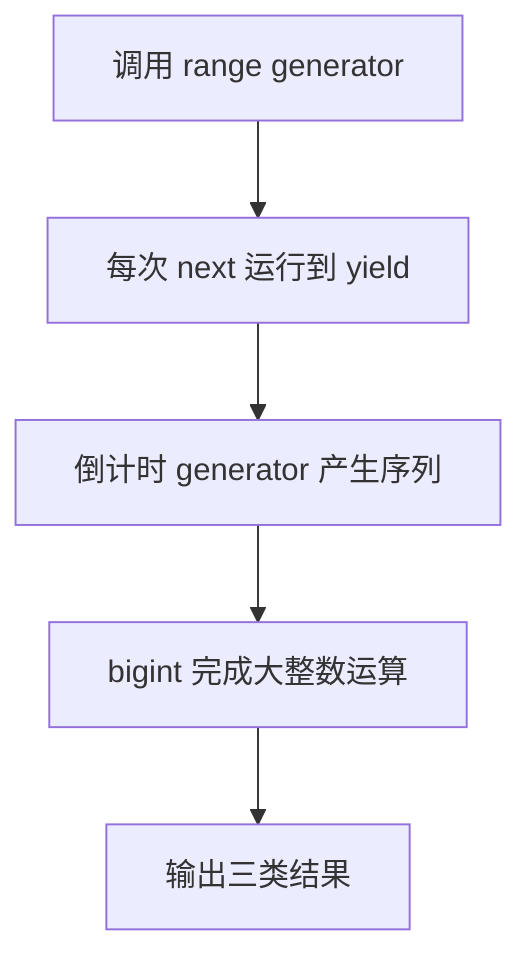

# Day 31（选修）｜迭代协议、生成器与 `bigint`

数组能被 `for...of` 和展开语法消费，是因为它实现了迭代协议。生成器让按需产生序列更简洁；`bigint` 则用于普通 number 无法精确表示的超大整数。

建议用时：60–90 分钟。

## 今天会学到

- 区分 iterable 与 iterator；
- 理解 `[Symbol.iterator]()`、`next()` 和 IteratorResult；
- 用 `function*`、`yield` 惰性产生值；
- 安全计算并序列化 bigint。

## 核心讲解

可迭代对象提供 `[Symbol.iterator]()`，它返回迭代器；迭代器的 `next()` 每次返回 `{ done, value }`。生成器自动管理这套状态，每次执行到 `yield` 暂停，下次请求再继续。

生成器默认是一次消费的迭代器；要重新遍历就重新调用生成器函数。小数据且需要多次 map/filter 时，数组通常更直观。

bigint 字面量以 `n` 结尾，不能与 number 直接混算。原生 `JSON.stringify` 不支持 bigint，进入 JSON 前通常转换成字符串，并在读取边界明确转换回来。

## 函数变量追踪

generator 调用先返回迭代器，不立刻跑完整函数。每次 next() 从上次暂停位置继续；yield 暂时把值交出，return 才永久结束。

## Example 代码流程图

运行 `example.ts` 前先沿图预测执行顺序；运行后再把每个节点对应到代码行。



## 独立练习导航

本日共有 2 道独立练习。每道题都有单独目录、说明、作答文件和解题结构提示；题目之间不共享代码。

| 目录 | 场景 | 类型 |
| --- | --- | --- |
| [practice01](./practice01/README.md) | Day 31 · 迭代器、生成器与 bigint 独立综合题 | 主任务 |
| [practice02](./practice02/README.md) | 数字序列生成器 | 闭卷迁移 |

右击任意练习目录中的 `practice.ts` 即可单独检查；命令行也可运行 `npm run beginner -- day31 practice02`。

## 常见错误

- 混淆 iterable 与 iterator；
- 手写迭代器第一次就少 1；
- 把 yield 当普通 return；
- 写 `currentId + 1`；
- 直接 `JSON.stringify(nextId)`。

### 错误代码示例

```ts
function* countdown(start: number): Generator<number> {
  let current = start;
  while (current >= 1) {
    current -= 1;
    yield current; // ❌ 先递减再 yield，第一次少 1，最后还会产出 0。
  }
}

const nextId = 9_007_199_254_740_993n + 1;
// ❌ bigint 不能和 number 直接混算。
JSON.stringify({ id: nextId }); // ❌ 原生 JSON 不能直接序列化 bigint。
```

### 正确写法

```ts
function* countdown(start: number): Generator<number, void, unknown> {
  for (let current = start; current >= 1; current -= 1) {
    yield current; // ✅ 先交出当前值，下一轮再递减。
  }
}

const nextId = 9_007_199_254_740_993n + 1n; // ✅ 两边都是 bigint。
const json = JSON.stringify({ id: nextId.toString() });
// ✅ 进入 JSON 边界前明确转为字符串，读取时再按约定恢复。
```

## 拓展思考（不要求写代码）

如果序列没有终点，哪些消费方式仍可能安全，哪些写法（例如直接展开成数组）会导致程序无法结束？

## 官方资料

- [Iterators and Generators](https://www.typescriptlang.org/docs/handbook/iterators-and-generators.html)
- [Symbols 与 Symbol.iterator](https://www.typescriptlang.org/docs/handbook/symbols.html#symboliterator)
- [BigInt](https://www.typescriptlang.org/docs/handbook/release-notes/typescript-3-2.html#bigint)
