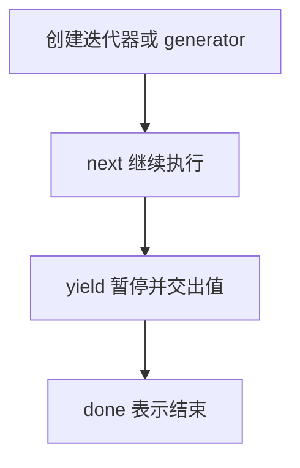

# DAY31 · Practice 01：Day 31 · 迭代器、生成器与 bigint 独立综合题

[返回当天课程](../README.md)

这是一道完整、独立的主练习。不要导入其他 practice 文件夹中的代码。

## 代码流程图



从零完成“惰性序列与大整数”程序。

必须名称：`evenNumbers`、`createCountdown`、`currentId`、`nextId`、`jsonText`。

需求：

1. `evenNumbers(start, end)` 是 `Generator<number, void, unknown>`，逐个检查闭区间，只 yield 偶数；用 1 到 6。
2. `createCountdown(start)` 返回 `Iterable<number>`，内部手写 `[Symbol.iterator]` 和 `next()`；第一次产出 start，到 1 后结束；用 3。
3. `currentId` 为 `9_007_199_254_740_993n`，用 bigint 的 1 递增。
4. 把 nextId 转成字符串后放入 `{ id }` 再 JSON.stringify。

精确输出：

```text
偶数: 2, 4, 6
倒计时: 3, 2, 1
下一个编号: 9007199254740994
JSON: {"id":"9007199254740994"}
```

限制：不使用 `any`；偶数生成器不能先创建完整结果数组；不能混合 number 与 bigint 运算，也不能直接 stringify bigint。

完成标准：右击运行 `practice.ts` 后输出完全一致；能画出 iterable → iterator → next → result 的关系，并解释惰性执行。

## 本题易漏语法

generator 写 function* name()，暂停点写 yield value;；yield 与结束函数的 return 不同。

## 文件

- 在 `practice.ts` 中独立作答。
- 独立完成后，再查看 `solution.ts` 的 TODO 代码骨架与 `SOLUTION.md` 的解题结构；两者都不提供完整答案。
