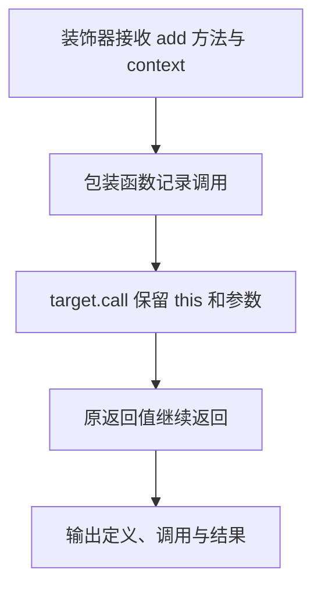

# Day 32（选修）｜现代装饰器、Mixin 与组合

装饰器可在类定义时观察、包装或替换类及成员，常用于框架注册、日志和验证。这里严格使用 TypeScript 5+ 的 ECMAScript 标准装饰器语义，不开启旧版 `experimentalDecorators`。

建议用时：60–90 分钟。

## 今天会学到

- 使用标准装饰器签名 `(value, context)`；
- 保留方法的 `this`、参数元组和返回类型；
- 从 `ClassDecoratorContext` 读取类名；
- 写一个不使用 any 的对象 Mixin；
- 在横切功能、Mixin 与普通组合之间做选择。

## 核心讲解

标准方法装饰器的第一个参数是原方法，第二个是 context。包装函数必须保持相同 `This`、`Args`、`Return`，并用 `target.call(this, ...args)` 调用原方法。旧教程中的 `(target, key, descriptor)` 属于 legacy 语义，不能直接混用。

类装饰器同样接收类值和 context。本练习只读取类名，不替换类。对象 Mixin 用交叉类型保留原对象能力并增加 tag；`Object.assign` 会修改传入对象，这一点必须明确。

许多可替换依赖用普通组合更清楚：把 Formatter 作为构造器参数注入服务，依赖来源显式，也容易测试。

## 函数变量追踪

装饰器包装后，实例通过 this 进入包装函数，实参收集进 args 再转交 target；target 的 return 值必须原样返回。漏掉任一环都会破坏签名或行为。

## Example 代码流程图

运行 `example.ts` 前先沿图预测执行顺序；运行后再把每个节点对应到代码行。



## 独立练习导航

本日共有 2 道独立练习。每道题都有单独目录、说明、作答文件和解题结构提示；题目之间不共享代码。

| 目录 | 场景 | 类型 |
| --- | --- | --- |
| [practice01](./practice01/README.md) | Day 32 · 标准装饰器、Mixin 与组合独立综合题 | 主任务 |
| [practice02](./practice02/README.md) | 计算器方法日志 | 闭卷迁移 |

右击任意练习目录中的 `practice.ts` 即可单独检查；命令行也可运行 `npm run beginner -- day32 practice02`。

## 常见错误

- 从旧文章复制三参数装饰器；
- 包装方法时忘记传递 this；
- 用 any[] 放弃参数检查；
- 认为装饰器会自动把新增属性加入实例类型；
- 普通依赖也用装饰器隐藏起来。

### 错误代码示例

```ts
function logged(
  target: object,
  key: string,
  descriptor: PropertyDescriptor,
): void {
  // ❌ 这是旧版三参数装饰器签名，不能直接用于标准装饰器配置。
  console.log(key, descriptor.value);
}

function badWrapper(target: (...args: any[]) => any) {
  // ❌ any[] 丢掉签名；箭头函数也不会取得实例调用时的 this。
  return (...args: any[]) => target(...args);
}
```

### 正确写法

```ts
function logged<This, Args extends unknown[], Return>(
  target: (this: This, ...args: Args) => Return,
  context: ClassMethodDecoratorContext<
    This,
    (this: This, ...args: Args) => Return
  >,
): (this: This, ...args: Args) => Return {
  const name = String(context.name);

  return function (this: This, ...args: Args): Return {
    console.log(`调用: ${name}`);
    // ✅ 普通 function 接住实例 this，并把参数和返回值原样转交。
    return target.call(this, ...args);
  };
}
```

## 拓展思考（不要求写代码）

如果 `total` 改成返回 Promise 的异步方法，当前装饰器会保留什么？若还要在异步完成后记录结果，包装器应在哪一步等待，又会怎样影响 Return 的类型设计？

## 官方资料

- [TypeScript 5.0：Decorators](https://www.typescriptlang.org/docs/handbook/release-notes/typescript-5-0.html#decorators)
- [Writing Well-Typed Decorators](https://www.typescriptlang.org/docs/handbook/release-notes/typescript-5-0.html#writing-well-typed-decorators)
- [旧版 Decorators 页面（仅用于辨认 legacy）](https://www.typescriptlang.org/docs/handbook/decorators)
