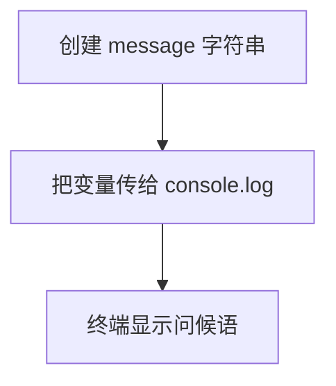

# Day 00：准备环境并运行第一段 TypeScript

预计用时：60–75 分钟。

今天只做一件事：亲手写一小段代码，然后让它在终端里显示结果。你会完整走一遍“打开文件 → 输入代码 → 保存 → 运行 → 看结果 → 修改”的过程。以后每天练习，走的都是这条路。

## 完成后你会做到

- 知道 VS Code 用来编辑文件，Node.js 用来运行程序。
- 知道 npm 负责项目依赖和预设工具。
- 知道 `.ts` 是 TypeScript 源文件。
- 能区分“类型检查”和“程序运行”。
- 能独立写出并运行一个最小程序。

## 先认清四个工具

这四个名字经常一起出现，但它们做的事不同：

| 工具 | 你用它做什么 |
| --- | --- |
| VS Code | 打开、阅读和修改代码文件 |
| TypeScript | 在运行前检查一些容易发现的类型错误 |
| Node.js | 真正执行程序 |
| npm | 安装项目需要的工具，并运行项目预先写好的命令 |

### VS Code

你在 VS Code 中输入代码。改完以后先按 `Ctrl + S`：终端运行的是已经保存到文件里的内容，不是编辑器里还没保存的内容。

### Node.js 与 npm

Node.js 负责执行程序。npm 不负责执行 TypeScript 语法，它会读取项目的 `package.json`，找到并调用项目已经准备好的命令。

### TypeScript

TypeScript 会先检查代码，例如“本来应该放数字的位置却放了文字”。检查没有报错后，程序再交给 Node.js 执行。

请记住这条顺序：

```text
编写 .ts 文件 → 保存 → TypeScript 检查 → 运行 → 核对输出
```

类型检查通过，只能说明 TypeScript 没发现它认识的类型问题。它不会判断问候语有没有拼错，也不知道感叹号是不是题目要求的标点。

## 为什么要这样设计

TypeScript 的类型主要用于开发阶段检查；程序真正运行时，不会拿这些类型标注替你判断业务对错。如果“检查代码”和“运行代码”混在一起，出错时就很难判断是类型没有通过、源文件没有被正确处理，还是运行环境没有找到文件。因此本项目把 TypeScript 检查和 Node.js 执行分成两步，各自负责一段明确的工作。

TypeScript 替你检查一部分类型问题，项目的运行工具再把源文件交给 Node.js 执行并显示输出。你仍要决定变量里保存什么、程序要输出什么，以及项目采用哪份 TypeScript 配置。工具能确认程序“可以被检查和运行”，却不知道输出是否符合真实需求。

类型检查也不是万能测试。文件路径、外部数据和业务结果仍可能在运行时出错，所以“编译通过”只说明通过了这一层检查，不等于程序一定正确。

## 阅读完整示例

打开 `example.ts`。先看声明变量的那一行，再看输出的那一行：

| 代码片段 | 这里表示什么 |
| --- | --- |
| `const` | 创建变量；这个变量之后不能重新赋值 |
| `message` | 给这份数据起的名字 |
| 双引号中的文字 | 真正保存的数据，类型是字符串 |
| `console.log` | 把圆括号里的值显示在终端；完整调用写成 `console.log(...)` |
| `;` | 这一条语句写完了 |

按照项目首页说明，右击 `example.ts` 运行。你应看到：

```text
Hello from the Day 00 example!
```

可以临时修改示例中的文字，保存并再次运行，确认“源代码改变，输出也会改变”。实验结束后恢复原内容。

## Example 实际输出

运行 `example.ts` 后，终端会按下面的顺序显示。先用代码推测结果，再逐行对照：

```text
Hello from the Day 00 example!
```

## Example 代码流程图

运行 `example.ts` 前先沿图预测执行顺序；运行后再把每个节点对应到代码行。



## 独立练习导航

本日共有 1 道独立练习。每道题都有单独目录、说明、作答文件和解题结构提示；题目之间不共享代码。

| 目录 | 场景 | 类型 |
| --- | --- | --- |
| [practice01](./practice01/README.md) | Day 00：第一段完整程序 | 主任务 |

右击任意练习目录中的 `practice.ts` 即可单独检查；命令行也可运行 `npm run beginner -- day00 practice01`。

## 常见故障

输出没有变化时，先按 `Ctrl + S` 再运行。提示找不到文件时，确认打开的是 `beginner/day00/practice01/practice.ts`。输出看起来差不多却没有通过时，从第一个字符开始比较：英文大小写、空格、逗号、问号和感叹号都算内容。

### 错误代码示例

```ts
const message = "hello, Typescript?";

// ❌ 类型虽然是 string，但大小写和结尾标点都不符合要求。
console.log(message);
```

### 正确写法

```ts
const message = "Hello, TypeScript!";

// ✅ 程序会逐字符输出变量中的准确内容。
console.log(message);
```

## 面试时怎么回答

**问：TypeScript 和 JavaScript 到底是什么关系？TypeScript 能保证程序运行时不出错吗？**

可以先说它解决的问题：JavaScript 中有些类型混用要到运行时才会报错，还有一些不会报错，却会算出意外结果；TypeScript 的编译器和编辑器能提前提示这类“类型对不上”的问题，并把参数、返回值和对象结构变成可检查的契约。接着说边界：类型标注只参与检查，生成 JavaScript 后会被删除，真正执行代码的仍是浏览器或 Node.js。

例如下面的类型标注会在生成 JavaScript 时消失，但程序仍输出 `3`：

```ts
const total: number = 3;
console.log(total);
```

新版 Node.js 可以直接执行只含“可擦除类型语法”的 `.ts` 文件，但那一步只是把类型拿掉：它不会替你做类型检查，也会忽略 `tsconfig.json` 中依赖转换的配置，部分 TypeScript 语法仍不能直接运行。本课程因此仍把 `tsc --noEmit` 的检查与运行步骤分开；“Node 能打开这个文件”不能替代“TypeScript 已检查这个项目”。

因此“通过 TypeScript 检查”不等于“业务一定正确”：折扣公式写错、接口返回脏数据、文件不存在，仍要靠运行时校验、测试和错误处理发现。这比只回答“TypeScript 是 JavaScript 的超集”更完整。

## 拓展思考（不要求写代码）

如果程序通过了 TypeScript 类型检查，却把感叹号误写成问号，为什么 TypeScript 不会替你发现这个错误？

## 解题结构提示

代码目录中的 `solution.ts` 与题目文档目录中的 `SOLUTION.md` 只提供带 TODO 的结构提示，不提供完整答案。

独立完成并核对输出后，再通过对应练习文档的“文件位置”链接查看 `solution.ts` 与 `SOLUTION.md`。结构提示用于复盘，不是可复制答案。

## 官方资料

- [TypeScript Handbook：TypeScript 是什么](https://www.typescriptlang.org/docs/handbook/intro.html)
- [TypeScript Handbook：The Basics](https://www.typescriptlang.org/docs/handbook/2/basic-types.html)
- [Node.js：运行 TypeScript 与类型擦除](https://nodejs.org/api/typescript.html)
