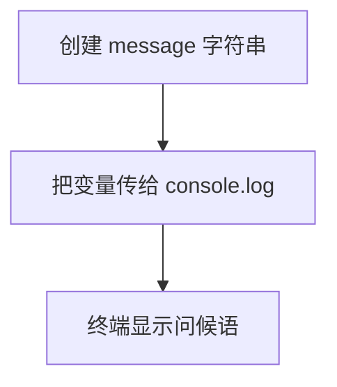

# Day 00：准备环境并运行第一段 TypeScript

预计用时：60–75 分钟。

今天的重点不是背语法，而是建立一条可靠的学习路径：阅读题目、从空文件输入代码、保存、运行、核对结果、根据错误修正。

## 完成后你会做到

- 知道 VS Code 用来编辑文件，Node.js 用来运行程序。
- 知道 npm 负责项目依赖和预设工具。
- 知道 `.ts` 是 TypeScript 源文件。
- 能区分“类型检查”和“程序运行”。
- 能独立写出并运行一个最小程序。

## 四个工具分别做什么

### VS Code

你在 VS Code 中阅读和修改代码。修改后先按 `Ctrl + S` 保存；没有保存的内容不会进入下一次运行。

### Node.js 与 npm

Node.js 让 JavaScript 程序可以在终端运行。npm 会读取项目的 `package.json`，安装依赖并调用项目准备好的学习工具。

### TypeScript

TypeScript 会在程序运行前检查类型。检查通过后，真正执行的仍是 JavaScript 行为。

请记住这条顺序：

```text
编写 .ts 文件 → 保存 → TypeScript 检查 → 运行 → 核对输出
```

类型检查通过，只代表没有发现当前规则能够识别的类型问题，并不代表文字、标点或业务结果一定正确。

## 阅读完整示例

打开 `example.ts`，从上到下观察：

- `const` 创建一个不需要重新赋值的变量。
- `message` 是变量名。
- 双引号包住一段字符串。
- `console.log` 把值显示出来。
- 分号表示一条语句结束。

按照项目首页说明，右击 `example.ts` 运行。你应看到：

```text
Hello from the Day 00 example!
```

可以临时修改示例中的文字，保存并再次运行，确认“源代码改变，输出也会改变”。实验结束后恢复原内容。

## Example 代码流程图

运行 `example.ts` 前先沿图预测执行顺序；运行后再把每个节点对应到代码行。



## 独立练习导航

本日共有 1 道独立练习。每道题都有单独目录、说明、作答文件和解题结构提示；题目之间不共享代码。

| 目录 | 场景 | 类型 |
| --- | --- | --- |
| [practice01](./practice01/README.md) | Day 00：第一段完整程序 | 主任务 |

右击任意练习目录中的 `practice.ts` 即可单独检查；命令行也可运行 `npm run beginner -- day00 practice01`。

## 常见故障

输出没有变化时，先确认已经保存文件。找不到文件时，确认打开的是 `beginner/day00/practice01/practice.ts`。看起来相同却不通过时，逐字符比较英文标点、大小写与空格。

### 错误代码示例

```ts
const message = "hello, Typescript?";

// ❌ 类型虽然是 string，但大小写和结尾标点都不符合要求。
console.log(message);
```

### 正确写法

```ts
const message = "Hello, TypeScript!";

// ✅ 程序会逐字符输出变量中的准确内容。
console.log(message);
```

## 拓展思考（不要求写代码）

如果程序通过了 TypeScript 类型检查，却把感叹号误写成问号，为什么 TypeScript 不会替你发现这个错误？

## 解题结构提示

代码目录中的 `solution.ts` 与题目文档目录中的 `SOLUTION.md` 只提供带 TODO 的结构提示，不提供完整答案。

独立完成并核对输出后，再通过对应练习文档的“文件位置”链接查看 `solution.ts` 与 `SOLUTION.md`。结构提示用于复盘，不是可复制答案。

## 官方资料

- [TypeScript Handbook：TypeScript 是什么](https://www.typescriptlang.org/docs/handbook/intro.html)
- [TypeScript Handbook：The Basics](https://www.typescriptlang.org/docs/handbook/2/basic-types.html)
