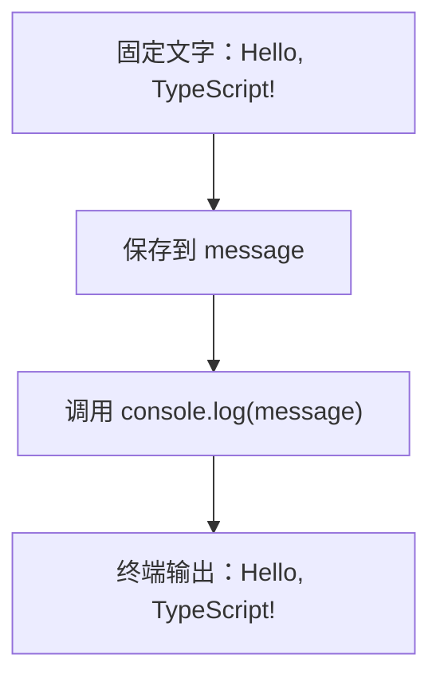

# DAY00 · Practice 01：第一段完整程序

[返回当天课程](../README.md)

## 文件位置

- 作答文件：[practice.ts](../../../day00/practice01/practice.ts)
- 完整参考答案代码：[solution.ts](../../../day00/practice01/solution.ts)
- 方案说明：[SOLUTION.md](./SOLUTION.md)

## 场景背景

你刚开始维护一份 TypeScript 学习日志，需要先写一个最小可运行的欢迎程序。当前输入是一句固定欢迎语，程序应把它保存在变量中并输出到终端，作为确认开发环境正常的第一条记录。

这是一道完整、独立的主练习。不要导入其他 practice 文件夹中的代码。

## 数据流

先沿变量名看数据怎样分叉和汇合；`──>` 表示值被交给下一步。

```text
"Hello, TypeScript!"
   │
   └── 赋值 ──> message
                    │
                    └── console.log(message) ──> 终端输出
```

打开 `practice.ts`。文件中只有说明注释；请从下一行开始亲手输入完整程序。

需求：

1. 声明一个名为 `message` 的变量。
2. 让它保存字符串 `"Hello, TypeScript!"`。
3. 使用 `console.log` 输出这个变量。

精确期望输出：

```text
Hello, TypeScript!
```

限制：

- 不要把输出拆成多行。
- 大小写、英文逗号、空格和感叹号必须完全一致。
- 输出必须来自变量 `message`。
- 不要修改 `example.ts` 或检查文件来让练习通过。

完成标准：

- 代码由你从变量声明开始完整输入。
- 保存后没有 TypeScript 错误。
- 右击运行 `practice.ts`，实际输出与期望输出完全一致。

## 本题易漏语法

console.log(message); 中函数名后是圆括号，参数在括号内，语句以分号结束。

## 代码流程图



## 起始代码

这道入门题没有判断或循环，固定数据和输出位置已经给出。请亲手输入一遍，重点留意引号、圆括号和分号。

```ts
const message = "Hello, TypeScript!";

console.log(message);
```

## 写完后自检

- 如果欢迎语改成 `"Hello, Lin!"`，哪一处输入需要变化，终端会显示什么？
- 这道题为什么要求先保存到 `message`，而不是把文字直接写进 `console.log`？
- `=`、引号、圆括号和分号在这一行程序里各负责什么？

## 文件

- 在 `practice.ts` 中独立作答。
- 建议先在 `practice.ts` 独立作答；完成后再查看 `solution.ts` 完整答案和 `SOLUTION.md` 调用说明。
