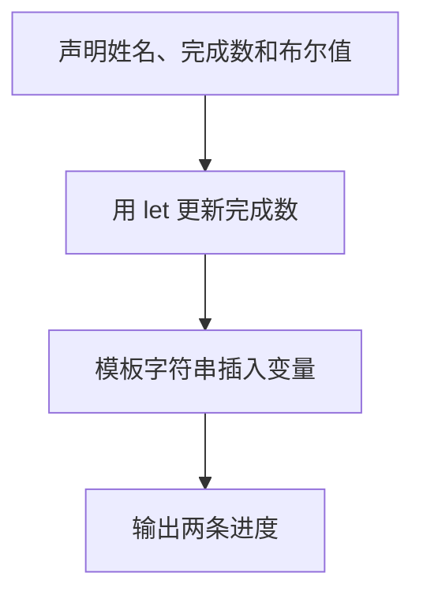

# Day 01：值、变量和三个最常用的类型

预计用时：75–90 分钟。

程序会先把数据记下来，后面再读取或修改。例如姓名是 `"Lin"`，完成课数是 `2`，“是不是初学者”是 `true`。变量负责给数据起名字，类型负责说明这个位置能放哪一类数据。

## 完成后你会做到

- 区分值、变量名和类型。
- 使用 `const` 保存不需要重新赋值的数据。
- 使用 `let` 保存会变化的数据。
- 认识 `string`、`number`、`boolean`。
- 理解类型标注和类型推断。
- 使用模板字符串组合输出。

## 值、变量名与类型

阅读这一行：

```ts
const courseName = "TypeScript";
```

可以把这一行从右往左读：

| 部分 | 含义 |
| --- | --- |
| `"TypeScript"` | 真正保存的值 |
| `=` | 把右侧的值交给左侧变量 |
| `courseName` | 以后读取这个值时使用的名字 |
| `const` | 这个变量之后不能重新赋值 |

`"TypeScript"` 属于文字，所以它的类型是 `string`。

三个最常用的基础类型是：

- `string`：文字，例如 `"Lin"`。
- `number`：数字，例如 `2` 或 `0.5`。
- `boolean`：只有不带引号的 `true` 和 `false`。

带引号的 `"2"` 是字符串，不是数字；带引号的 `"true"` 也是字符串，不是布尔值。

## `const`、`let` 与赋值

先问自己一句：“这个变量之后会不会换成另一个值？”不会就用 `const`，会就用 `let`：

```ts
let completedLessons = 0;
completedLessons = completedLessons + 1;
```

第二行不是在说“左边等于右边”。程序按这个顺序做：

| 步骤 | `completedLessons` 的值 |
| --- | --- |
| 声明完成 | `0` |
| 读取旧值 | 取出 `0` |
| 计算 `0 + 1` | 得到 `1` |
| 把结果赋回变量 | 变量变成 `1` |

如果这里使用 `const`，最后一步会被 TypeScript 拦住，因为 `const` 变量不能换成另一个值。

## 类型标注与类型推断

下面两种写法都能得到字符串类型：

```ts
const learnerName: string = "Lin";
const courseName = "TypeScript";
```

第一行在变量名后明确写了 `: string`，这叫类型标注。第二行没有写，TypeScript 看到右侧是文字，也能判断它是 `string`，这叫类型推断。

初始值已经很清楚时，可以让 TypeScript 推断。基础类型名称固定写成小写 `string`、`number`、`boolean`。

## 模板字符串

反引号创建模板字符串。`${...}` 不是普通文字：程序会先取出花括号里的变量值，再把它放进整段文字中。

```ts
const summary = `课程: ${courseName}`;
```

如果 `courseName` 是 `"TypeScript"`，`summary` 最后就是 `"课程: TypeScript"`。反引号不是单引号，它通常位于键盘左上角、数字 1 左侧。

## 阅读完整示例

打开并右击运行 `example.ts`。先预测 `completedLessons` 增加前后的值，再对照输出。可以临时把数字赋值改成字符串，观察 TypeScript 怎样在运行前指出错误；实验后撤销并保存。

## Example 实际输出

运行 `example.ts` 后，终端会按下面的顺序显示。先用代码推测结果，再逐行对照：

```text
Ada completed 1 lesson. Beginner: true
Zoran completed 2 and Lesson Beginner is: true
```

## Example 代码流程图

运行 `example.ts` 前先沿图预测执行顺序；运行后再把每个节点对应到代码行。



## 独立练习导航

本日共有 2 道独立练习。每道题都有单独目录、说明、作答文件和解题结构提示；题目之间不共享代码。

| 目录 | 场景 | 类型 |
| --- | --- | --- |
| [practice01](./practice01/README.md) | Day 01：学习档案 | 主任务 |
| [practice02](./practice02/README.md) | 学习进度卡 | 闭卷迁移 |

右击任意练习目录中的 `practice.ts` 即可单独检查；命令行也可运行 `npm run beginner -- day01 practice02`。

## 常见错误

模板字符串中插入变量的通用形式是 `${变量名}`。如果 `${completedLessons}` 原样出现在终端，先检查外层是不是反引号。看到 `"true"` 时要注意：引号会让它变成文字，不再是布尔值。变量需要从 0 更新到 1，就不能用 `const`。

### 错误代码示例

```ts
const completedLessons = 0;
completedLessons = completedLessons + 1; // ❌ const 变量不能重新赋值。

const isBeginner = "true"; // ❌ 这是 string，不是 boolean。
console.log("已完成: ${completedLessons}"); // ❌ 普通引号不会插入变量。
```

### 正确写法

```ts
let completedLessons = 0;
completedLessons = completedLessons + 1; // ✅ 会变化的绑定使用 let。

const isBeginner = true; // ✅ 布尔值不加引号。
console.log(`已完成: ${completedLessons}`); // ✅ 模板字符串使用反引号。
```

## 拓展思考（不要求写代码）

如果课程名称也要在程序运行过程中从 `"TypeScript"` 改成 `"JavaScript"`，应只把哪一个变量从 `const` 改成 `let`，为什么其他变量不需要跟着改变？

## 解题结构提示

代码目录中的 `solution.ts` 与题目文档目录中的 `SOLUTION.md` 只提供带 TODO 的结构提示，不提供完整答案。

完成后再通过对应练习文档的“文件位置”链接查看 `solution.ts` 与 `SOLUTION.md`。先比较自己的变量选择和更新过程，再比较输出格式。

## 官方资料

- [Everyday Types：基础类型与类型推断](https://www.typescriptlang.org/docs/handbook/2/everyday-types.html)
- [The Basics：静态类型检查](https://www.typescriptlang.org/docs/handbook/2/basic-types.html)
