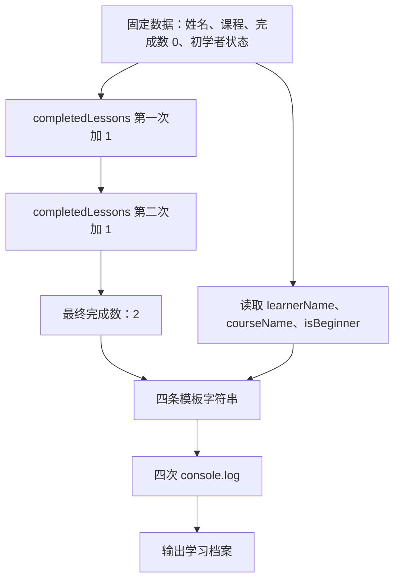

# DAY01 · Practice 01：学习档案

[返回当天课程](../README.md)

## 文件位置

- 作答文件：[practice.ts](../../../day01/practice01/practice.ts)
- 完整参考答案代码：[solution.ts](../../../day01/practice01/solution.ts)
- 方案说明：[SOLUTION.md](./SOLUTION.md)

## 场景背景

你正在制作个人学习首页，需要展示学习者 Lin 的基础档案。系统已有课程名称、初始完成数和“是否为初学者”等数据，并会连续记录两次课程完成动作。目标是生成一张四行学习档案，让使用者快速确认当前课程进度。

这是一道完整、独立的主练习。不要导入其他 practice 文件夹中的代码。

## 数据流

先沿变量名看数据怎样分叉和汇合；`──>` 表示值被交给下一步。

```text
learnerName ───────┐
courseName ────────┼──> 模板字符串 ──> 学习档案输出
isBeginner ────────┤
completedLessons ──┘
        │
        └── + 1 ──> 更新后的 completedLessons ──> 进度输出
```

请在 `practice.ts` 的说明注释后，从第一条变量声明开始完成“学习档案”。

固定数据和名称：

- `learnerName` 保存字符串 `"Lin"`。
- `courseName` 保存字符串 `"TypeScript"`。
- `completedLessons` 从数字 `0` 开始。
- `isBeginner` 保存布尔值 `true`。

程序要求：

1. 对不需要重新赋值的数据使用 `const`。
2. 对 `completedLessons` 使用 `let`，并用“旧值加 1”的方式连续更新两次。
3. 使用变量和模板字符串输出四行，不要把最终结果整行写死。

精确期望输出：

```text
学习者: Lin
课程: TypeScript
已完成: 2
初学者: true
```

限制：

- `true` 不得加引号。
- 数字 `0`、`1`、`2` 不得写成字符串。
- 不得直接声明 `completedLessons = 2`。
- 除要求的四行外不要产生其他输出。

完成标准：

- 能解释四个变量各自的类型。
- 能说明为什么只有 `completedLessons` 使用 `let`。
- 右击运行 `practice.ts` 后，四行输出完全一致。

## 本题易漏语法

声明用 const name = value; 或 let count = value;。冒号连接名称与类型，等号才赋值；模板字符串用反引号。

## 代码流程图



## 起始代码

固定数据和输出位置已提供。你只需要完成两次“读取旧值、加 1、写回”的更新。

```ts
const learnerName = "Lin";
const courseName = "TypeScript";
let completedLessons = 0;
const isBeginner = true;

// TODO：连续更新 completedLessons 两次，每次在旧值上加 1。

console.log(`学习者: ${learnerName}`);
console.log(`课程: ${courseName}`);
console.log(`已完成: ${completedLessons}`);
console.log(`初学者: ${isBeginner}`);
```

## 写完后自检

- 如果 `completedLessons` 从 5 开始，仍连续增加两次，第三行应显示多少？
- 为什么完成数使用 `let`，而姓名、课程和初学者状态使用 `const`？
- 如果把 `true` 写成 `"true"`，值的类型发生了什么变化？

## 文件

- 在 `practice.ts` 中独立作答。
- 建议先在 `practice.ts` 独立作答；完成后再查看 `solution.ts` 完整答案和 `SOLUTION.md` 调用说明。
