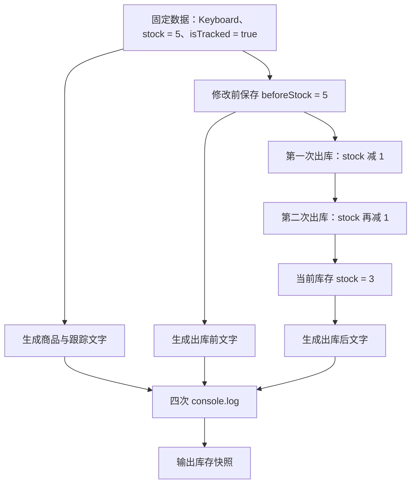

# DAY01 · Practice 02：键盘库存快照

[返回当天课程](../README.md)

## 文件位置

- 作答文件：[practice.ts](../../../day01/practice02/practice.ts)
- 完整参考答案代码：[solution.ts](../../../day01/practice02/solution.ts)
- 方案说明：[SOLUTION.md](./SOLUTION.md)

## 场景背景

仓库里原有 5 把键盘，今天连续发出了 2 把。页面既要显示现在还剩多少，也要保留出库前的库存，方便值班人员核对这次操作有没有改对。

变量为什么要分成 `beforeStock` 和 `stock`？因为一个数字变量只能表示某一个时刻的值。直接修改 `stock` 后，旧的 5 就不在 `stock` 里了，所以要在修改前把它复制给另一个变量。这份数字快照不会跟着 `stock` 一起变化。

## 数据流

```text
productName = "Keyboard" ──────────────────────────────> productLine

stock = 5 ──> beforeStock（修改前快照）──> beforeLine
    │
    └── 减 1 ──> 减 1 ──> stock = 3 ──> afterLine

isTracked = true ──────────────────────────────────────> trackingLine

四条 line ──> console.log ──> 四行输出
```

## 需要完成

- 使用 `productName = "Keyboard"`、`stock = 5` 和 `isTracked = true`。
- 在改变 `stock` 前，把当时的库存保存到 `beforeStock`。
- 模拟两次出库：每次都让 `stock` 减少 1，并把结果存回 `stock`。
- 用模板字符串分别生成四行文字；不要把完整输出直接写进 `console.log`。
- 本题独立运行，不导入 `practice01` 或其他练习。

## 为什么这里同时需要 `const` 和 `let`

- `productName`、`isTracked` 和 `beforeStock` 创建后不会再改，用 `const` 能防止之后误赋值。
- `stock` 代表“当前库存”，出库后必须改变，所以用 `let`。
- `const beforeStock = stock` 保存的是当时的数字 5，不是让两个变量永久绑定在一起。

## 精确期望输出

```text
商品: Keyboard
出库前库存: 5
出库后库存: 3
启用库存跟踪: true
```

## 和 Practice 01 的区别

Practice 01 用多种变量描述一份学习档案，重点是给数据命名并输出。这里追踪的是同一个库存值在两个时刻的状态：先保存快照，再连续修改当前值，代码顺序会直接影响结果。

## 代码流程图



## 起始代码

固定数据、快照位置和输出调用都已提供。请完成两次库存更新与四条模板字符串。

```ts
const productName: string = "Keyboard";
let stock: number = 5;
const isTracked: boolean = true;

const beforeStock = stock;
// TODO：让 stock 连续减少两次，每次减少 1。

const productLine = ""; // TODO：替换为商品模板字符串。
const beforeLine = ""; // TODO：替换为出库前库存模板字符串。
const afterLine = ""; // TODO：替换为出库后库存模板字符串。
const trackingLine = ""; // TODO：替换为库存跟踪模板字符串。

console.log(productLine);
console.log(beforeLine);
console.log(afterLine);
console.log(trackingLine);
```

## 写完后自检

- 如果初始库存改成 1，仍连续出库两次，`beforeStock` 和最终 `stock` 分别会是多少？
- 为什么要在第一次减库存之前保存 `beforeStock`，而不能在两次出库之后再保存？
- 为什么 `stock` 适合用 `let`，而不是每次另写一个互不相关的固定数字？

## 文件

建议先在上方链接的 `practice.ts` 独立作答；完成后再查看 `solution.ts` 完整答案和 `SOLUTION.md` 调用说明。
