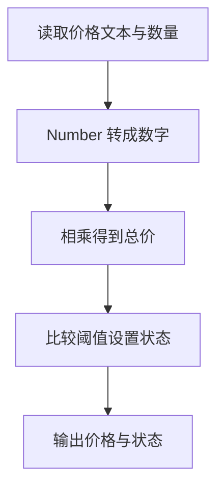

# Day 02：运算、显式转换和条件判断

预计用时：75–90 分钟。

输入框里看见的 `3`，程序收到的可能是文字 `"3"`。文字 `"3"` 加数字 `2` 会得到 `"32"`，不是 `5`。今天先认清数据的实际类型，再按“转换 → 计算 → 判断”的顺序处理。

## 完成后你会做到

- 使用 `+`、`-`、`*`、`/` 完成数字运算。
- 解释为什么 `"3" + 2` 得到字符串 `"32"`。
- 使用 `Number(...)` 把数字文本显式转换为数字。
- 使用比较运算得到布尔值。
- 使用 `if` 根据条件更新程序状态。
- 理解类型正确不等于业务逻辑一定正确。

## 数字运算与字符串拼接

`+` 有两种常见工作方式：两边都是数字时做加法；只要有一边是字符串，就可能把两边接成一段文字。

```ts
3 + 2;      // 5
"3" + 2;    // "32"
```

逐个看结果：

| 表达式 | 程序看到的类型 | 结果 |
| --- | --- | --- |
| `3 + 2` | 数字加数字 | 数字 `5` |
| `"3" + 2` | 字符串参与 `+` | 字符串 `"32"` |

`-`、`*`、`/` 分别表示减、乘、除。括号告诉程序先算哪一部分；刚开始宁可多写一层清楚的括号，也不要靠猜测执行顺序。

## 先转换，再计算

```ts
const countText = "3";
const count = Number(countText);
const total = count + 2;
```

这三行按顺序发生：

| 步骤 | 值 | 类型 |
| --- | --- | --- |
| 读取 `countText` | `"3"` | `string` |
| 执行 `Number(countText)` | `3` | `number` |
| 执行 `count + 2` | `5` | `number` |

如果写成 `Number("3" + 2)`，程序会先算括号里面：`"3" + 2` 得到 `"32"`，然后才把 `"32"` 转成数字 `32`。类型最后虽然是 `number`，数量却算错了。

在变量后写 `: number`，是在声明“这里必须是数字”，TypeScript 会检查右侧能不能赋给 `number`；写 `as number` 是类型断言，表示请编译器暂时按数字看待这个值。两种写法都不会在运行时把文字变成数字；真正转换仍要调用 `Number(...)`。

## 比较与 `if`

比较就是让程序回答“是”或“不是”，结果类型是 `boolean`：

- `>`、`<`：大于、小于。
- `>=`、`<=`：包含边界的大于等于、小于等于。
- `===`、`!==`：严格相等、严格不等。

`if` 会先检查圆括号里的结果。结果是 `true`，才执行花括号里的代码；结果是 `false`，就跳过：

```ts
let status = "Keep learning";

if (total >= 5) {
  status = "Goal reached";
}
```

开始时 `status` 是 `"Keep learning"`。如果 `total >= 5` 成立，它才会改成 `"Goal reached"`，所以这里要用可以重新赋值的 `let`。

## 为什么要这样设计

表单、网址参数和很多外部输入拿到的都是文字。若直接把 `"3"` 和 `2` 相加，`+` 可能按字符串拼接处理，结果会变成 `"32"`，后面的目标判断也会跟着出错。显式写 `Number(...)` 是在代码中说明：“从这里开始，我希望把这段文字当成数字计算。”

`Number` 负责执行转换，比较运算负责产生 `true` 或 `false`，`if` 再根据这个布尔结果选择要执行的代码。你仍要决定什么输入可以转换、目标边界是否包含等号，以及每个分支应该产生什么状态；这些都是题目或业务规则，不是语法能替你决定的。

转换也有边界：无法转换的文字会得到 `NaN`，不会自动变成一个可靠数字。真实程序通常还要检查转换结果；本日固定输入合法，先专注练习“转换、计算、判断”这条数据流。

## 阅读完整示例

打开并右击运行 `example.ts`。按照“文字单价 → 数字单价 → 总价 → 比较 → 状态”的顺序逐行跟踪。可以临时改变判断阈值，先预测状态，再运行验证并恢复。

## Example 实际输出

运行 `example.ts` 后，终端会按下面的顺序显示。先用代码推测结果，再逐行对照：

```text
Total price: 24
Status: Large order
```

## Example 代码流程图

运行 `example.ts` 前先沿图预测执行顺序；运行后再把每个节点对应到代码行。



## 独立练习导航

本日共有 2 道独立练习。每道题都有单独目录、说明、作答文件和解题结构提示；题目之间不共享代码。

| 目录 | 场景 | 类型 |
| --- | --- | --- |
| [practice01](./practice01/README.md) | Day 02：课程计划统计器 | 主任务 |
| [practice02](./practice02/README.md) | 批量订单金额 | 闭卷迁移 |

右击任意练习目录中的 `practice.ts` 即可单独检查；命令行也可运行 `npm run beginner -- day02 practice02`。

## 常见错误

删除 `Number` 后，文字可能又和数字拼在一起。`const value: number = ...` 中的 `: number` 只是在告诉 TypeScript“这里应该是数字”，它不会替你把文字变成数字。状态没有更新时，先打印或手算 `total`，再检查比较符号和边界。

### 错误代码示例

```ts
const completedText = "3";
const plannedLessons = 2;

const totalLessons = completedText + plannedLessons;
// ❌ 字符串参与 + 运算，结果是 "32"，不是数字 5。

const converted: number = completedText;
// ❌ 类型标注只提出要求，不能把 string 自动转换成 number。
```

### 正确写法

```ts
const completedText = "3";
const plannedLessons = 2;

const completed = Number(completedText); // ✅ 先在运行时转换。
const totalLessons = completed + plannedLessons; // ✅ 3 + 2 得到数字 5。
```

## 面试时怎么回答

**问：`Number(value)` 和 `value as number` 有什么不同？**

`Number(value)` 会在程序运行时真正尝试转换数据。`Number("12")` 的结果是数字 `12`，而 `Number("abc")` 的结果是 `NaN`，所以转换后仍可能需要检查。类型断言 `value as number` 不转换、不验证，也不会改变控制台里的值；它只是告诉 TypeScript“先相信我把类型判断对了”。

例如某个外部值运行时其实是字符串 `"12"`，强行断言成 `number` 后，它在运行时仍是字符串。继续做 `value + 1`，可能得到字符串 `"121"`，不是数字 `13`。因此接口数据、表单输入和 JSON 应先转换或校验，再让类型系统接手。面试时若只说“`as` 可以转换类型”，这正是容易答错的地方。

## 拓展思考（不要求写代码）

为什么 `Number(completedText + plannedLessons)` 最终也是 `number` 类型，TypeScript 却无法仅凭类型判断结果 32 不符合课程总数的业务含义？

## 解题结构提示

代码目录中的 `solution.ts` 与题目文档目录中的 `SOLUTION.md` 只提供带 TODO 的结构提示，不提供完整答案。

完成后再通过对应练习文档的“文件位置”链接查看 `solution.ts` 与 `SOLUTION.md`，重点比较括号放置位置和实际执行顺序。

## 官方资料

- [The Basics：静态类型检查与运行时行为](https://www.typescriptlang.org/docs/handbook/2/basic-types.html)
- [MDN：Number 转换](https://developer.mozilla.org/docs/Web/JavaScript/Reference/Global_Objects/Number)
- [MDN：Addition 运算符](https://developer.mozilla.org/docs/Web/JavaScript/Reference/Operators/Addition)
