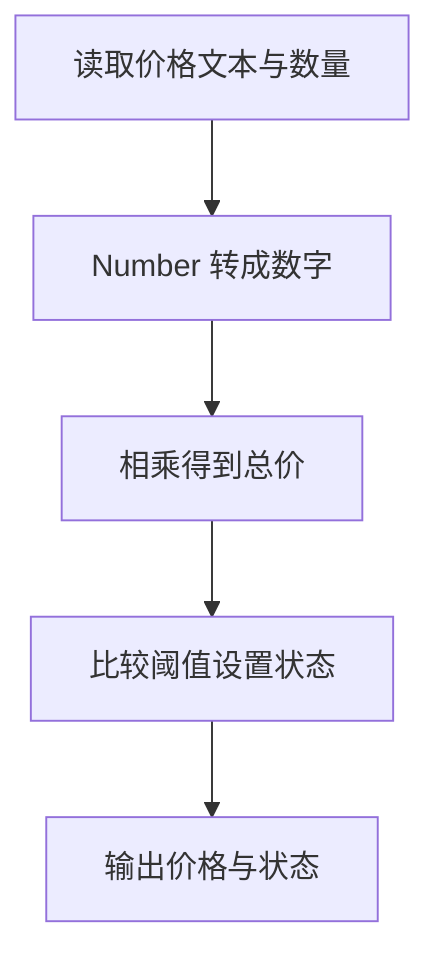

# Day 02：运算、显式转换和条件判断

预计用时：75–90 分钟。

来自输入框、网址或文件的数字经常先以文字形式出现。字符串 `"3"` 如果直接参与 `+`，可能产生拼接而不是加法。今天会建立“先转换、再计算、后判断”的顺序。

## 完成后你会做到

- 使用 `+`、`-`、`*`、`/` 完成数字运算。
- 解释为什么 `"3" + 2` 得到字符串 `"32"`。
- 使用 `Number(...)` 把数字文本显式转换为数字。
- 使用比较运算得到布尔值。
- 使用 `if` 根据条件更新程序状态。
- 理解类型正确不等于业务逻辑一定正确。

## 数字运算与字符串拼接

两个数字使用 `+` 时执行加法，只要一侧是字符串，就可能先转换为文字并拼接：

```ts
3 + 2;      // 5
"3" + 2;    // "32"
```

`-`、`*`、`/` 分别表示减、乘、除。括号可以明确计算顺序；初学阶段应优先写出清楚的括号。

## 先转换，再计算

```ts
const countText = "3";
const count = Number(countText);
const total = count + 2;
```

这里先把 `"3"` 转换成数字 `3`，再得到 `5`。如果写成 `Number("3" + 2)`，括号内部会先拼成 `"32"`，最后得到数字 `32`。最终类型虽然也是 `number`，业务结果却错了。

类型标注和类型断言都不会转换运行时的值；真正的转换必须调用 `Number(...)`。

## 比较与 `if`

比较表达式产生 `boolean`：

- `>`、`<`：大于、小于。
- `>=`、`<=`：包含边界的大于等于、小于等于。
- `===`、`!==`：严格相等、严格不等。

`if` 只在条件为 `true` 时执行花括号中的代码：

```ts
let status = "Keep learning";

if (total >= 5) {
  status = "Goal reached";
}
```

`status` 使用 `let`，因为满足条件时它会被重新赋值。

## 阅读完整示例

打开并右击运行 `example.ts`。按照“文字单价 → 数字单价 → 总价 → 比较 → 状态”的顺序逐行跟踪。可以临时改变判断阈值，先预测状态，再运行验证并恢复。

## Example 代码流程图

运行 `example.ts` 前先沿图预测执行顺序；运行后再把每个节点对应到代码行。



## 独立练习导航

本日共有 2 道独立练习。每道题都有单独目录、说明、作答文件和解题结构提示；题目之间不共享代码。

| 目录 | 场景 | 类型 |
| --- | --- | --- |
| [practice01](./practice01/README.md) | Day 02：课程计划统计器 | 主任务 |
| [practice02](./practice02/README.md) | 批量订单金额 | 闭卷迁移 |

右击任意练习目录中的 `practice.ts` 即可单独检查；命令行也可运行 `npm run beginner -- day02 practice02`。

## 常见错误

删除 `Number` 会再次发生拼接；把 `: number` 写在变量后只是在声明期望类型，不会转换值；若状态没有更新，应先检查总数是否真的是 5。

### 错误代码示例

```ts
const completedText = "3";
const plannedLessons = 2;

const totalLessons = completedText + plannedLessons;
// ❌ 字符串参与 + 运算，结果是 "32"，不是数字 5。

const converted: number = completedText;
// ❌ 类型标注只提出要求，不能把 string 自动转换成 number。
```

### 正确写法

```ts
const completedText = "3";
const plannedLessons = 2;

const completed = Number(completedText); // ✅ 先在运行时转换。
const totalLessons = completed + plannedLessons; // ✅ 3 + 2 得到数字 5。
```

## 拓展思考（不要求写代码）

为什么 `Number(completedText + plannedLessons)` 最终也是 `number` 类型，TypeScript 却无法仅凭类型判断结果 32 不符合课程总数的业务含义？

## 解题结构提示

代码目录中的 `solution.ts` 与题目文档目录中的 `SOLUTION.md` 只提供带 TODO 的结构提示，不提供完整答案。

完成后再通过对应练习文档的“文件位置”链接查看 `solution.ts` 与 `SOLUTION.md`，重点比较括号放置位置和实际执行顺序。

## 官方资料

- [The Basics：静态类型检查与运行时行为](https://www.typescriptlang.org/docs/handbook/2/basic-types.html)
- [MDN：Number 转换](https://developer.mozilla.org/docs/Web/JavaScript/Reference/Global_Objects/Number)
- [MDN：Addition 运算符](https://developer.mozilla.org/docs/Web/JavaScript/Reference/Operators/Addition)
