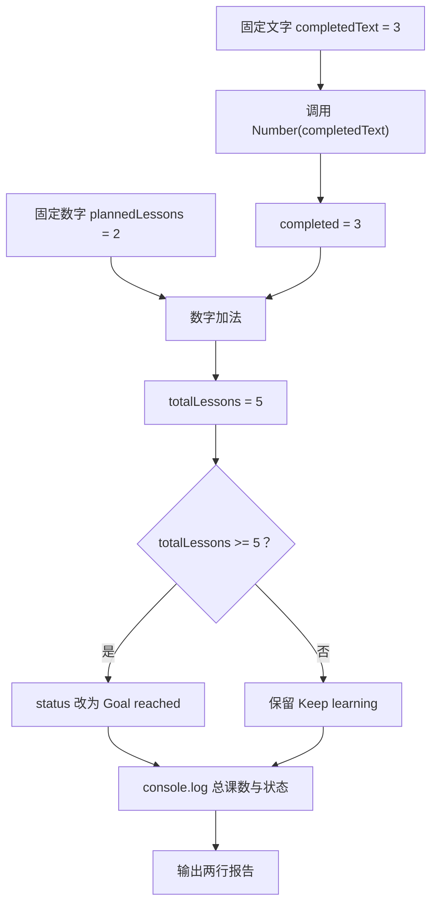

# DAY02 · Practice 01：课程计划统计器

[返回当天课程](../README.md)

## 文件位置

- 作答文件：[practice.ts](../../../day02/practice01/practice.ts)
- 完整参考答案代码：[solution.ts](../../../day02/practice01/solution.ts)
- 方案说明：[SOLUTION.md](./SOLUTION.md)

## 场景背景

课程后台从表单收到已完成课数 `"3"`，但表单数据是文本；系统中另有数字形式的计划课数。你需要把两类输入整理成可以计算的数据，再判断本轮学习是否达到目标。最终产物是一份包含总课数和学习状态的两行报告。

这是一道完整、独立的主练习。不要导入其他 practice 文件夹中的代码。

## 数据流

先沿变量名看数据怎样分叉和汇合；`──>` 表示值被交给下一步。

```text
completedText
   │
   └── Number(...) ──> completed ──┐
plannedLessons ────────────────────┼──> 加法 ──> totalLessons
                                  │                 │
                                  │                 ├── 比较目标 ──> reachedGoal
                                  │                 └── if ──> status
                                  └────────────────────────────> 输出
```

在 `practice.ts` 中从零完成一个课程计划统计器。

固定数据和名称：

- `completedText` 保存字符串 `"3"`。
- `plannedLessons` 保存数字 `2`。
- `totalLessons` 保存转换并相加后的结果。
- `status` 初始保存 `"Keep learning"`。

程序要求：

1. 只对 `completedText` 调用 `Number(...)`，再与 `plannedLessons` 做数字加法。
2. 当 `totalLessons >= 5` 时，用 `if` 把 `status` 更新为 `"Goal reached"`。
3. 使用变量输出总课数和最终状态。

精确期望输出：

```text
Total lessons: 5
Status: Goal reached
```

限制：

- 不得把 `completedText` 的初始值改成数字。
- 不得写 `Number(completedText + plannedLessons)`。
- 不得把数字 5 或最终状态直接写进输出语句。
- 不得通过降低判断阈值来迁就错误结果。

完成标准：

- 能解释转换与加法的执行顺序。
- `totalLessons` 的运行时值是数字 5。
- 右击运行 `practice.ts`，两行输出完全一致。

## 本题易漏语法

转换写 Number(text)；if (条件) { ... } 的花括号后不加分号，内部赋值语句要加。

## 代码流程图



## 起始代码

固定输入、默认状态和输出调用已提供。请完成转换、加法和目标判断。

```ts
const completedText = "3";
const plannedLessons = 2;

const completed = 0; // TODO：替换为 completedText 的数字转换结果。
const totalLessons = 0; // TODO：替换为数字加法结果。
let status = "Keep learning";
const reachedGoal = false; // TODO：替换为“总课数是否达到 5”的比较结果。
if (reachedGoal) {
  // TODO：达到目标时更新 status。
}

console.log(`Total lessons: ${totalLessons}`);
console.log(`Status: ${status}`);
```

## 写完后自检

- 如果 `completedText` 改成 `"2"`，总课数和状态分别会是什么？
- 如果先执行 `completedText + plannedLessons`，再把结果交给 `Number`，中间值为什么会改变业务结果？
- 为什么这里需要运行时的 `Number(...)`，写类型标注或 `as number` 不能代替它？

## 文件

- 在 `practice.ts` 中独立作答。
- 建议先在 `practice.ts` 独立作答；完成后再查看 `solution.ts` 完整答案和 `SOLUTION.md` 调用说明。
