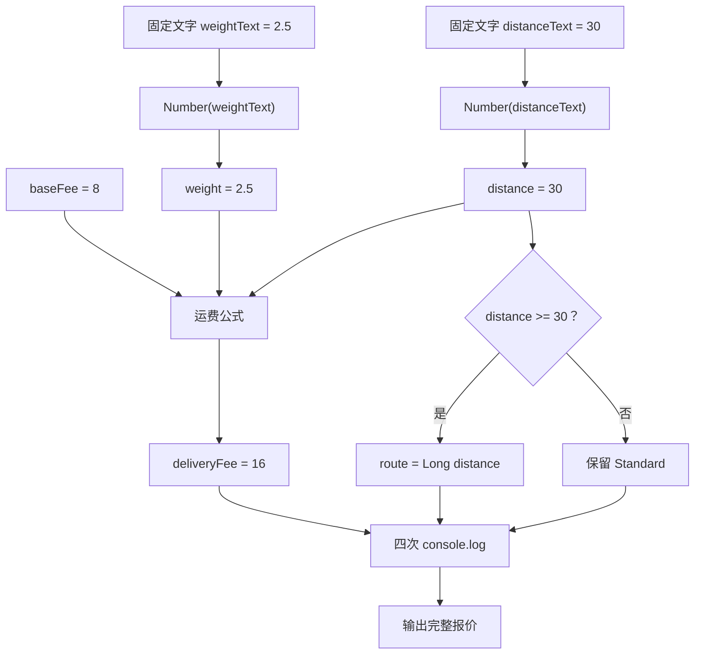

# DAY02 · Practice 02：同城配送报价

[返回当天课程](../README.md)

## 文件位置

- 作答文件：[practice.ts](../../../day02/practice02/practice.ts)
- 完整参考答案代码：[solution.ts](../../../day02/practice02/solution.ts)
- 方案说明：[SOLUTION.md](./SOLUTION.md)

## 场景背景

配送下单页收到包裹重量 `"2.5"` 和配送距离 `"30"`。浏览器表单交来的内容通常是字符串，即使用户输入的是数字。报价程序必须先把两项文本变成真正的数字，才能计算运费，并判断这单要走标准路线还是长距离路线。

运费由三部分组成：基础费 8 元、每千克 2 元的重量费，以及每 10 千米 1 元的里程费。30 千米是长距离路线的起点，刚好 30 也算长距离。

## 数据流

```text
weightText = "2.5" ──> Number(...) ──> weight ──> × 2 ──┐
                                                        │
distanceText = "30" ──> Number(...) ──> distance ──> ÷ 10 ──┤
                                          │             │
baseFee = 8 ─────────────────────────────────────────────┴──> deliveryFee
                                          │
                                          └── >= 30 ──> route

weight + distance + deliveryFee + route ──> 四行输出
```

## 需要完成

- 固定使用 `weightText = "2.5"`、`distanceText = "30"` 和 `baseFee = 8`。
- 分别调用 `Number(...)`，得到数字 `weight` 和 `distance`。
- 使用 `baseFee + weight * 2 + distance / 10` 计算 `deliveryFee`。
- `route` 默认是 `"Standard"`；当 `distance >= 30` 时改成 `"Long distance"`。
- 输出必须读取变量，不要直接打印写死的结果。
- 本题独立运行，不导入 `practice01` 或其他练习。

## 为什么必须先转换

`"2.5"` 和 `"30"` 看起来像数字，但运行时仍是字符串。加号同时承担数字相加和字符串拼接两种工作；如果数据类型没有先统一，某一步很容易得到拼接结果。显式转换后，后面的乘法、除法、加法和比较都在处理 `number`，代码意图也更清楚。

## 精确期望输出

```text
Weight: 2.5 kg
Distance: 30 km
Fee: 16
Route: Long distance
```

## 和 Practice 01 的区别

Practice 01 的业务输入是一项课程文本和一个已有数字，输出重点是学习目标状态。这里同时接收重量、距离两项外部文本：两个转换结果汇入同一个费用公式，距离还会单独进入路线边界分支。

## 代码流程图



## 起始代码

固定表单数据、费用常量、默认路线和输出调用已提供。请完成两次转换、费用公式和路线判断。

```ts
const weightText = "2.5";
const distanceText = "30";
const baseFee = 8;

const weight = 0; // TODO：替换为 weightText 的数字转换结果。
const distance = 0; // TODO：替换为 distanceText 的数字转换结果。
const deliveryFee = 0; // TODO：替换为完整运费公式。
let route = "Standard";
if (false) {
  // TODO：把 false 换成距离边界判断，并在命中时更新 route。
}

console.log(`Weight: ${weight} kg`);
console.log(`Distance: ${distance} km`);
console.log(`Fee: ${deliveryFee}`);
console.log(`Route: ${route}`);
```

## 写完后自检

- 如果距离文本改成 `"29"`，费用和路线各会怎样变化？
- 如果 `weightText` 是 `"2.5kg"`，`Number(...)` 会产生什么值，后续运费会受到什么影响？
- 为什么应在入口处分别转换两个字符串，而不是依赖乘法或除法顺便完成隐式转换？

## 文件

建议先在上方链接的 `practice.ts` 独立作答；完成后再查看 `solution.ts` 完整答案和 `SOLUTION.md` 调用说明。
