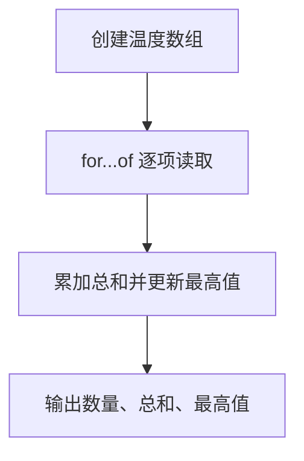

# Day 03：数组、索引和循环

预计用时：75–90 分钟。

变量可以保存一个值，数组可以保存一组同类值。今天会让程序依次处理每个学习时长，计算记录数量、总时长和最长一次学习。

## 完成后你会做到

- 使用数组保存一组同类值。
- 看懂 `number[]` 和 `string[]`。
- 理解数组索引从 0 开始。
- 使用 `.length` 获取项目数量。
- 使用 `for...of` 依次读取元素。
- 使用累加变量计算总计。
- 使用 `if` 在循环中更新最大值。

## 数组与类型

数组使用方括号，元素之间用逗号分隔：

```ts
const studyMinutes: number[] = [30, 45, 60];
```

`number[]` 表示数组中的每一项都应是数字。字符串数组写成 `string[]`。字符串 `"45"` 不能放进 `number[]`。

## 索引与长度

数组第一项的索引是 0：

```text
值：    30   45   60
索引：   0    1    2
```

三项数组的 `.length` 是 3，最后索引是 2。长度表示项目数量，不等于最后索引。

## `for...of` 逐项处理

```ts
for (const minutes of studyMinutes) {
  console.log(minutes);
}
```

每一轮中，`minutes` 都是当前元素的值。`of` 取得元素；不要误写成主要取得键名的 `in`。

## 累加与最大值

总计从 0 开始，每轮把旧总计和当前值相加：

```ts
let totalMinutes = 0;

for (const minutes of studyMinutes) {
  totalMinutes = totalMinutes + minutes;
}
```

最长记录也需要保存“到目前为止最大的值”。只有当前值更大时才更新：

```ts
if (minutes > longestSession) {
  longestSession = minutes;
}
```

如果不使用条件、每轮都直接赋值，最后得到的只是最后一项，不一定是最大值。

## 阅读完整示例

打开并右击运行 `example.ts`。用纸逐轮记录 `temperature`、`totalTemperature` 与 `highestTemperature` 的变化。临时增加一个温度后先计算预期，再运行验证并恢复。

## Example 代码流程图

运行 `example.ts` 前先沿图预测执行顺序；运行后再把每个节点对应到代码行。



## 独立练习导航

本日共有 2 道独立练习。每道题都有单独目录、说明、作答文件和解题结构提示；题目之间不共享代码。

| 目录 | 场景 | 类型 |
| --- | --- | --- |
| [practice01](./practice01/README.md) | Day 03：学习时长报告 | 主任务 |
| [practice02](./practice02/README.md) | 温度观测报告 | 闭卷迁移 |

右击任意练习目录中的 `practice.ts` 即可单独检查；命令行也可运行 `npm run beginner -- day03 practice02`。

## 常见错误

`totalMinutes = minutes` 会丢掉旧总计；每轮都给 `longestSession` 赋值只会保留最后一项；`.length` 是数量而不是最后索引。

### 错误代码示例

```ts
const studyMinutes = [30, 45, 20];
let totalMinutes = 0;
let longestSession = 0;

for (const minutes of studyMinutes) {
  totalMinutes = minutes; // ❌ 覆盖旧总计，最终只剩 20。
  longestSession = minutes; // ❌ 无条件覆盖，得到的是最后一项。
}

console.log(studyMinutes[studyMinutes.length]); // ❌ 越界，结果是 undefined。
```

### 正确写法

```ts
const studyMinutes = [30, 45, 20];
let totalMinutes = 0;
let longestSession = 0;

for (const minutes of studyMinutes) {
  totalMinutes = totalMinutes + minutes; // ✅ 旧总计加上当前项。

  if (minutes > longestSession) {
    longestSession = minutes; // ✅ 只在当前项更大时更新。
  }
}

console.log(studyMinutes[studyMinutes.length - 1]); // ✅ 最后索引是数量减 1。
```

## 拓展思考（不要求写代码）

如果同样的“找最大值”程序处理的是全为负数的冬季温度，`longestSession` 这种从 0 开始的初始化方式为什么会得到错误结果，初始值更适合从哪里取得？

## 解题结构提示

代码目录中的 `solution.ts` 与题目文档目录中的 `SOLUTION.md` 只提供带 TODO 的结构提示，不提供完整答案。

完成后再通过对应练习文档的“文件位置”链接查看 `solution.ts` 与 `SOLUTION.md`，重点对照循环每一轮如何更新状态。

## 官方资料

- [Everyday Types：数组](https://www.typescriptlang.org/docs/handbook/2/everyday-types.html#arrays)
- [MDN：Array](https://developer.mozilla.org/docs/Web/JavaScript/Reference/Global_Objects/Array)
- [MDN：for...of](https://developer.mozilla.org/docs/Web/JavaScript/Reference/Statements/for...of)
