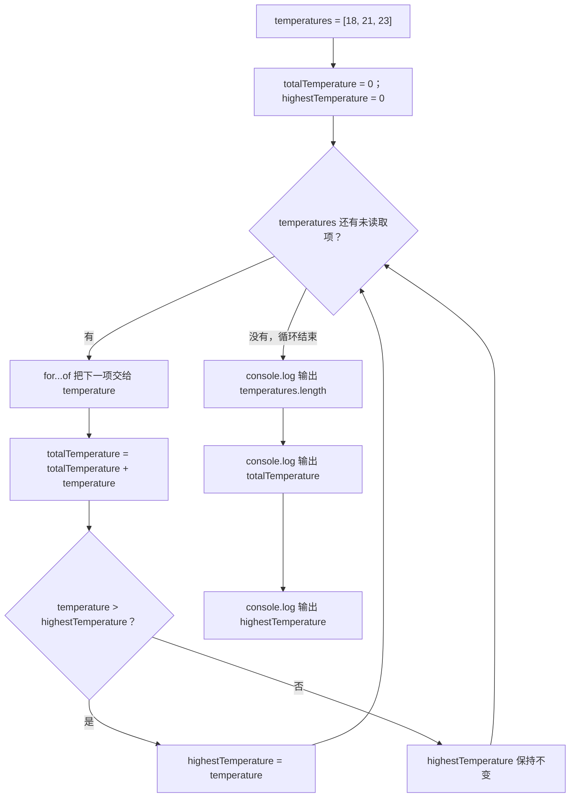

# Day 03：数组、索引和循环

预计用时：75–90 分钟。

一周有多次学习记录时，不必声明 `mondayMinutes`、`tuesdayMinutes` 等许多变量。数组可以把 `[30, 45, 60]` 这组数据放在一起，循环再一项一项处理它们。

## 写 Example 前先认识这些写法

**数组的 `.length`：读取当前有几项**

数组提供 `length` 属性。点号左边是要查看的数组，右边是属性名；它直接得到一个数字，不需要圆括号：

```ts
const minutes = [30, 45, 60];

console.log(minutes.length);
console.log([].length);
```

实际输出：

```text
3
0
```

- `length` 返回项数，不是最后一项的索引。三项数组的最后索引是 `length - 1`，也就是 2。
- 空数组的长度是 0。
- 不要写成 `minutes.length()`：`length` 是属性，不是函数。
- 拼写是全小写 `length`；`lenght` 是常见笔误。

## 完成后你会做到

- 使用数组保存一组同类值。
- 看懂 `number[]` 和 `string[]`。
- 理解数组索引从 0 开始。
- 使用 `.length` 获取项目数量。
- 使用 `for...of` 依次读取元素。
- 使用累加变量计算总计。
- 使用 `if` 在循环中更新最大值。

## 数组与类型

数组使用方括号 `[]`，每个值之间用逗号分开：

```ts
const studyMinutes: number[] = [30, 45, 60];
```

这一行可以拆成几部分：

| 部分 | 含义 |
| --- | --- |
| `studyMinutes` | 数组的变量名 |
| `number[]` | 数组中的每一项都应是数字 |
| `[30, 45, 60]` | 三个实际数据 |
| `,` | 分隔相邻两项 |

字符串数组写成 `string[]`。`"45"` 外面有引号，所以它是字符串，不能放进 `number[]`。

## 索引与长度

数组第一项的索引是 0：

```text
值：    30   45   60
索引：   0    1    2
```

程序从 0 开始编号，所以三项数组的编号是 0、1、2。`.length` 是“有几项”，这里是 3；最后索引则是 `3 - 1`，也就是 2。

## `for...of` 逐项处理

```ts
for (const minutes of studyMinutes) {
  console.log(minutes);
}
```

循环会自动走三轮。`minutes` 只是“当前这一轮拿到的值”。这里使用的是 `for...of`，依次得到 `30`、`45`、`60`；不要和 `for...in` 混淆，后者用于数组时得到的是 `"0"`、`"1"`、`"2"` 这类键名：

| 轮次 | 当前的 `minutes` |
| --- | --- |
| 第 1 轮 | `30` |
| 第 2 轮 | `45` |
| 第 3 轮 | `60` |

`of` 取得数组中的值。这里不要写成 `in`，因为 `in` 主要得到的是 0、1、2 这些键名。

## 累加与最大值

总计从 0 开始。每一轮都保留旧总计，再加上当前值：

```ts
let totalMinutes = 0;

for (const minutes of studyMinutes) {
  totalMinutes = totalMinutes + minutes;
}
```

以 `[30, 45, 60]` 为例，总计依次从 `0` 变成 `30`、`75`、`135`。若每轮只写 `totalMinutes = minutes`，旧总计会被覆盖。

最长记录保存的是“到这一轮为止见过的最大值”。只有当前值更大时才更新：

```ts
if (minutes > longestSession) {
  longestSession = minutes;
}
```

例如 `[30, 60, 45]` 的最大值是 60，但最后一项是 45。不使用 `if`、每轮都直接赋值，最后得到的只会是 45。

## 为什么要这样设计

当数据从三项变成三百项时，为每一项复制一遍加法和比较代码既费力又容易漏项。数组把同一类数据按顺序放在一起，`for...of` 再把“逐项取出”这件重复工作交给运行时；你只需写每一项到来后要做的处理。

循环负责按顺序把当前项交给局部变量，数组的 `.length` 负责报告项数。你仍要决定哪些统计量要保留、初始值是什么，以及每轮何时更新它们。累加变量保存到目前为止的总和，最大值变量保存到目前为止见过的最大值。

初始值会影响结果。用 `0` 作为最大值只适合本日这些非负数据；如果数组可能全是负数或为空，就要重新设计初始值和空数组处理，不能照搬同一写法。

## 阅读完整示例

打开并右击运行 `example.ts`。用纸逐轮记录 `temperature`、`totalTemperature` 与 `highestTemperature` 的变化。临时增加一个温度后先计算预期，再运行验证并恢复。

## Example 实际输出

运行 `example.ts` 后，终端会按下面的顺序显示。先用代码推测结果，再逐行对照：

```text
Readings: 3
Total: 62
Highest: 23
```

## Example 代码流程图

运行 `example.ts` 前先沿图预测执行顺序；运行后再把每个节点对应到代码行。



## 官方手册扩展阅读（可选）

完成当天教程后，如想继续确认概念，只选 [Day 03 对应的 1 篇官方阅读](../OFFICIAL-READING.md#day-03) 即可。它不是练习前置，不需要先读完才能作答。

## 独立练习导航

本日共有 2 道独立练习。每道题都有单独目录、说明、作答文件和解题结构提示；题目之间不共享代码。

| 目录 | 场景 | 类型 |
| --- | --- | --- |
| [practice01](./practice01/README.md) | Day 03：学习时长报告 | 主任务 |
| [practice02](./practice02/README.md) | 慢任务位置报告 | 独立迁移 |

右击任意练习目录中的 `practice.ts` 即可单独检查；命令行也可运行 `npm run beginner -- day03 practice02`。

## 常见错误

总计不对时，看等号右侧有没有旧的 `totalMinutes`。最大值不对时，看更新前有没有比较。读取最后一项时使用 `.length - 1`，因为 `.length` 是数量，不是最后一个索引。

### 错误代码示例

```ts
const studyMinutes = [30, 45, 20];
let totalMinutes = 0;
let longestSession = 0;

for (const minutes of studyMinutes) {
  totalMinutes = minutes; // ❌ 覆盖旧总计，最终只剩 20。
  longestSession = minutes; // ❌ 无条件覆盖，得到的是最后一项。
}

console.log(studyMinutes[studyMinutes.length]); // ❌ 越界，结果是 undefined。
```

### 正确写法

```ts
const studyMinutes = [30, 45, 20];
let totalMinutes = 0;
let longestSession = 0;

for (const minutes of studyMinutes) {
  totalMinutes = totalMinutes + minutes; // ✅ 旧总计加上当前项。

  if (minutes > longestSession) {
    longestSession = minutes; // ✅ 只在当前项更大时更新。
  }
}

console.log(studyMinutes[studyMinutes.length - 1]); // ✅ 最后索引是数量减 1。
```

## 面试时怎么回答

**问：`number[]`、`Array<number>` 和元组有什么区别？**

`number[]` 与 `Array<number>` 都表示“任意长度、每一项都是数字”的数组，只是写法不同。例如 `[10, 20].length` 输出 `2`，循环时可以逐项处理。元组则用位置表达不同含义，例如 `[string, number]` 可以表示“第 0 项是姓名，第 1 项是分数”；它适合长度和位置含义固定的数据，不是普通数组的另一种漂亮写法。

还要说明数组索引的现实边界：类型写成 `number[]` 并不能证明第 0 项一定存在。空数组 `const scores: number[] = []` 读取 `scores[0]`，运行时会得到 `undefined`。开启 `noUncheckedIndexedAccess` 后，TypeScript 会把这类读取提醒为 `number | undefined`。因此要先检查长度，或设计一个能明确表示“可能没有结果”的返回类型。

## 拓展思考（不要求写代码）

如果同样的“找最大值”程序处理的是全为负数的冬季温度，`longestSession` 这种从 0 开始的初始化方式为什么会得到错误结果，初始值更适合从哪里取得？

## 解题结构提示

代码目录中的 `solution.ts` 与题目文档目录中的 `SOLUTION.md` 只提供带 TODO 的结构提示，不提供完整答案。

完成后再通过对应练习文档的“文件位置”链接查看 `solution.ts` 与 `SOLUTION.md`，重点对照循环每一轮如何更新状态。
