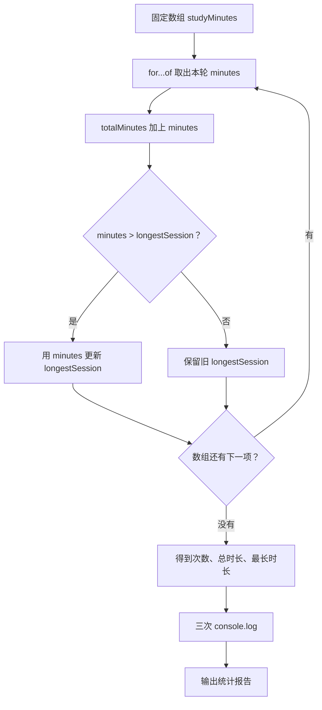

# DAY03 · Practice 01：学习时长报告

[返回当天课程](../README.md)

## 文件位置

- 作答文件：[practice.ts](../../../day03/practice01/practice.ts)
- 完整参考答案代码：[solution.ts](../../../day03/practice01/solution.ts)
- 方案说明：[SOLUTION.md](./SOLUTION.md)

## 场景背景

学习应用记录了同一天四次专注学习的时长，数据为 `[30, 45, 60, 20]` 分钟。你要为学习者生成当日统计，既要知道一共学习了几次，也要汇总总时长并找出最长的一次。最终报告将用于学习首页的“今日回顾”区域。

这是一道完整、独立的主练习。不要导入其他 practice 文件夹中的代码。

## 数据流

先沿变量名看数据怎样分叉和汇合；`──>` 表示值被交给下一步。

```text
studyMinutes
   │
   └── for...of 每轮取出 minutes
          ├── 累加 ──> totalMinutes
          └── 比较并更新 ──> longestSession

数组长度 + totalMinutes + longestSession ──> 统计输出
```

在 `practice.ts` 中从零完成“学习时长报告”。

固定数据和名称：

- `studyMinutes` 是数字数组 `[30, 45, 60, 20]`。
- `totalMinutes` 是从 0 开始的累加变量。
- `longestSession` 是从 0 开始的最长记录。
- 循环中的当前元素命名为 `minutes`。

程序要求：

1. 使用一个 `for...of` 循环处理整个数组。
2. 每轮把 `minutes` 累加到 `totalMinutes`。
3. 只有 `minutes > longestSession` 时才更新最长记录。
4. 使用 `.length`、总计变量和最长变量生成三行输出。

精确期望输出：

```text
Sessions: 4
Total minutes: 155
Longest session: 60
```

限制：

- 不得手工把四个数字逐个相加。
- 不得把 4、155 或 60 直接写进输出。
- 不得使用尚未学习的 `reduce`、`Math.max`。
- 循环必须使用 `for...of`。

完成标准：

- 能手工说明四轮中两个统计变量的变化。
- 修改数组内容后，统计会随数据自动变化。
- 右击运行 `practice.ts` 后，三行输出完全一致。

## 本题易漏语法

数组值用 []，项目用逗号；for (const item of items) { ... } 中圆括号是循环头，花括号是循环体。

## 代码流程图



## 起始代码

固定数组、统计变量和输出调用已提供。请亲手完成循环、累加、比较和更新。

```ts
const studyMinutes: number[] = [30, 45, 60, 20];
let totalMinutes = 0;
let longestSession = 0;

for (const minutes of studyMinutes) {
  // TODO：把 minutes 累加到 totalMinutes。
  const isLonger = false; // TODO：替换为本轮时长与最长记录的比较结果。
  if (isLonger) {
    // TODO：更新 longestSession。
  }
}

console.log(`Sessions: ${studyMinutes.length}`);
console.log(`Total minutes: ${totalMinutes}`);
console.log(`Longest session: ${longestSession}`);
```

## 写完后自检

- 如果数组末尾再加入一次 90 分钟的记录，次数、总时长和最长时长会怎样变化？
- 为什么 `totalMinutes` 与 `longestSession` 要在循环外声明，不能在每一轮重新设为 0？
- 这里为什么用 `for...of` 直接取得时长，而不是手写四次加法？

## 文件

- 在 `practice.ts` 中独立作答。
- 建议先在 `practice.ts` 独立作答；完成后再查看 `solution.ts` 完整答案和 `SOLUTION.md` 调用说明。
