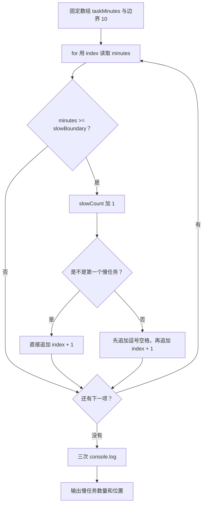

# DAY03 · Practice 02：慢任务位置报告

[返回当天课程](../README.md)

## 文件位置

- 作答文件：[practice.ts](../../../day03/practice02/practice.ts)
- 完整参考答案代码：[solution.ts](../../../day03/practice02/solution.ts)
- 方案说明：[SOLUTION.md](./SOLUTION.md)

## 场景背景

性能测试按运行顺序记录了四个任务的耗时：`[5, 12, 8, 15]` 分钟。团队把耗时达到 10 分钟的任务视为慢任务，需要报告“第几个任务”比较慢，方便回到原测试记录中定位。

这题不能只拿到数组项本身，因为报告还需要它的位置。经典 `for` 循环会同时保留 `index`，既能通过 `taskMinutes[index]` 读取耗时，也能把位置转换成人习惯的第 1、2、3 项。

## 数据流

```text
taskMinutes = [5, 12, 8, 15]
   │
   └── for：index 从 0 递增
          │
          ├── taskMinutes[index] ──> minutes ──> >= 10 ──> isSlow
          │                                              │
          │                                              └── true ──┬──> slowCount + 1
          │                                                        └──> index + 1
          │                                                               │
          └───────────────────────────────────────────────────────────────┴──> slowPositionsText

taskMinutes.length ──> Tasks
slowCount ──> Slow tasks
slowPositionsText ──> Slow positions
```

## 需要完成

- 使用 `taskMinutes = [5, 12, 8, 15]` 和慢任务边界 `10`。
- 使用带 `index` 的 `for` 循环读取每一项，不要直接写死第 2 项和第 4 项。
- 当前耗时 `>= 10` 时，让 `slowCount` 增加 1，并把 `index + 1` 追加到 `slowPositionsText`。
- 多个序号之间使用 `", "` 分隔，但第一个序号前不能多出逗号。
- 分别输出任务总数、慢任务数量和慢任务序号文字。
- 本题独立运行，不导入 `practice01` 或其他练习。

## 为什么保存 `index + 1`

数组的第一项下标是 0，代码用下标定位；人说“第一个任务”时通常从 1 开始。`index + 1` 是把内部位置翻译成给人看的序号。若直接保存 `index`，程序虽然找对了数组项，报告中的编号却会整体小 1。

## 精确期望输出

```text
Tasks: 4
Slow tasks: 2
Slow positions: 2, 4
```

## 和 Practice 01 的区别

Practice 01 的输入数据只需逐项取值，用 `for...of` 累加总时长并寻找最长值。这里的输出需要任务位置，因此控制流程必须保留数组下标，同时累计命中数量并逐步拼出给人看的序号文字。

## 代码流程图



## 起始代码

固定任务时长、慢任务边界、统计变量和输出调用已提供。循环、判断、计数和位置拼接由你完成。

```ts
const taskMinutes: number[] = [5, 12, 8, 15];
const slowBoundary = 10;
let slowCount = 0;
let slowPositionsText = "";

for (let index = 0; index < taskMinutes.length; index++) {
  const minutes = taskMinutes[index];
  const isSlow = false; // TODO：替换为慢任务边界判断。
  if (isSlow) {
    // TODO：更新 slowCount，并拼接从 1 开始的位置。
  }
}

console.log(`Tasks: ${taskMinutes.length}`);
console.log(`Slow tasks: ${slowCount}`);
console.log(`Slow positions: ${slowPositionsText}`);
```

## 写完后自检

- 如果数据改成 `[10, 9]`，`slowCount` 和 `slowPositionsText` 应分别是什么？
- 为什么判断使用 `>= 10`，而不是 `> 10`？
- 为什么这里选带 `index` 的 `for`，而不是只提供数组项的 `for...of`？

## 文件

建议先在上方链接的 `practice.ts` 独立作答；完成后再查看 `solution.ts` 完整答案和 `SOLUTION.md` 调用说明。
