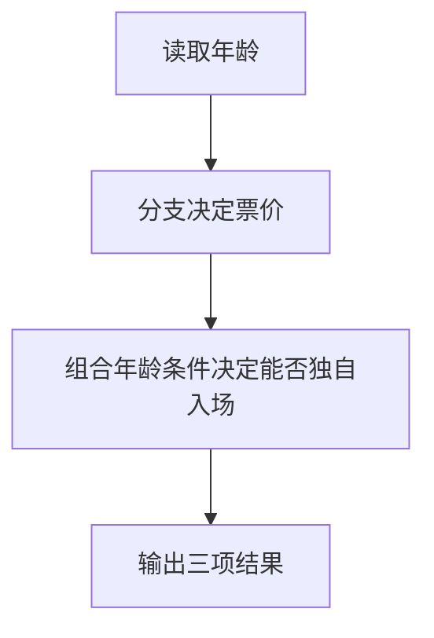

# Day 04：布尔逻辑与多分支

预计用时：60–90 分钟。

订单优惠通常不只看一个条件：订单满 200 元先减 40；没到 200 元时，会员满 100 元再减 20；其余情况可能只减 10。程序要先判断条件，再按规定的先后顺序选中一个结果。

## 完成目标

- 使用 `===`、`!==`、`>`、`>=`、`<`、`<=` 比较值。
- 使用 `&&`、`||`、`!` 组合布尔条件。
- 使用 `if / else if / else` 按优先级处理规则。
- 主动检查“刚好等于边界”的情况。

## 比较与边界

比较表达式只会得到 `true` 或 `false`，这类结果的正式类型名是 `boolean`。以分数 60 为例：

| 条件 | 60 是否通过 | 原因 |
| --- | --- | --- |
| `score > 60` | 否 | `>` 不包含 60 本身 |
| `score >= 60` | 是 | `>=` 包含 60 本身 |

题目写“至少 60”“满 100”“不低于 80”时，通常要把边界算进去。严格相等使用 `===`，严格不等使用 `!==`；初学阶段不要使用会自动转换类型的 `==` 和 `!=`。

## 组合条件

- `A && B`：两个条件都通过，结果才是 `true`。
- `A || B`：两个条件中至少一个通过，结果就是 `true`。
- `!A`：把结果反过来，`true` 变 `false`，`false` 变 `true`。

“是会员、订单满 100、并且没有使用优惠券”要同时检查三件事：

| 检查 | 示例结果 |
| --- | --- |
| `isMember` | 是会员：`true` |
| `orderTotal >= 100` | 订单 120 元：`true` |
| `!hasCoupon` | 没用优惠券：`true` |

三个结果都为 `true`，整条会员优惠规则才通过。条件较长时，先把它保存成名字清楚的布尔变量，后面的 `if` 会更容易读。

## 多分支与优先级

`if / else if / else` 从上往下检查。遇到第一个 `true` 就执行对应花括号，整组判断随即结束，下面的分支不会再检查。

因此顺序要直接照业务优先级写：

1. 先检查最高优惠。
2. 没选中时，再检查会员优惠。
3. 仍没选中时，再检查普通优惠。
4. 都没选中，就使用 `else` 或最开始准备的默认值。

同一笔 200 元会员订单可能同时满足多个条件。最高优惠写在前面，程序才会选中 40 元，而不会提前停在 20 元。

## 阅读完整示例

打开并右击运行 `example.ts`。按顺序判断年龄属于哪个分支，再计算是否允许独自入场。临时把年龄改成边界值 12、25、65，分别预测结果，再运行验证并恢复。

## Example 实际输出

运行 `example.ts` 后，终端会按下面的顺序显示。先用代码推测结果，再逐行对照：

```text
年龄: 20
票价: 30
允许独自入场: true
```

## Example 代码流程图

运行 `example.ts` 前先沿图预测执行顺序；运行后再把每个节点对应到代码行。



## 独立练习导航

本日共有 2 道独立练习。每道题都有单独目录、说明、作答文件和解题结构提示；题目之间不共享代码。

| 目录 | 场景 | 类型 |
| --- | --- | --- |
| [practice01](./practice01/README.md) | Day 04：订单优惠计算器 | 主任务 |
| [practice02](./practice02/README.md) | 电影院票价判断 | 闭卷迁移 |

右击任意练习目录中的 `practice.ts` 即可单独检查；命令行也可运行 `npm run beginner -- day04 practice02`。

## 常见错误

恰好 100 元没有优惠时，先看是不是把 `>= 100` 写成了 `> 100`。200 元订单只减了 20 时，检查会员分支是不是放在最高优惠前面。已经使用优惠券却仍得到会员优惠时，检查 `hasCoupon` 前面的 `!`。

### 错误代码示例

```ts
const orderTotal = 200;
const isMember = true;
const hasCoupon = false;
let discount = 0;

if (isMember && orderTotal > 100) {
  discount = 20; // ❌ 会员分支先成立，200 元订单错误地停在这里。
} else if (orderTotal >= 200) {
  discount = 40;
} else if (hasCoupon) {
  discount = 10;
}
// ❌ > 100 还漏掉了恰好 100 元的边界。
```

### 正确写法

```ts
const orderTotal = 200;
const isMember = true;
const hasCoupon = false;
const canUseMemberDiscount =
  isMember && orderTotal >= 100 && !hasCoupon;

let discount = 0;

if (orderTotal >= 200) {
  discount = 40; // ✅ 最高优先级规则放在最前面。
} else if (canUseMemberDiscount) {
  discount = 20; // ✅ 包含 100 元边界，并排除已使用优惠券的情况。
} else if (hasCoupon || orderTotal >= 80) {
  discount = 10;
}
```

## 拓展思考（不要求写代码）

如果 `orderTotal` 改成 200，同时仍是会员且没有优惠券，程序为什么应该只优惠 40 而不是先优惠 40 再优惠 20，这与分支顺序有什么关系？

## 解题结构提示

代码目录中的 `solution.ts` 与题目文档目录中的 `SOLUTION.md` 只提供带 TODO 的结构提示，不提供完整答案。

完成后再通过对应练习文档的“文件位置”链接查看 `solution.ts` 与 `SOLUTION.md`，重点对照条件名称和分支优先级。

## 官方资料

- [TypeScript for the New Programmer](https://www.typescriptlang.org/docs/handbook/typescript-from-scratch.html)
- [MDN：if...else](https://developer.mozilla.org/docs/Web/JavaScript/Reference/Statements/if...else)
