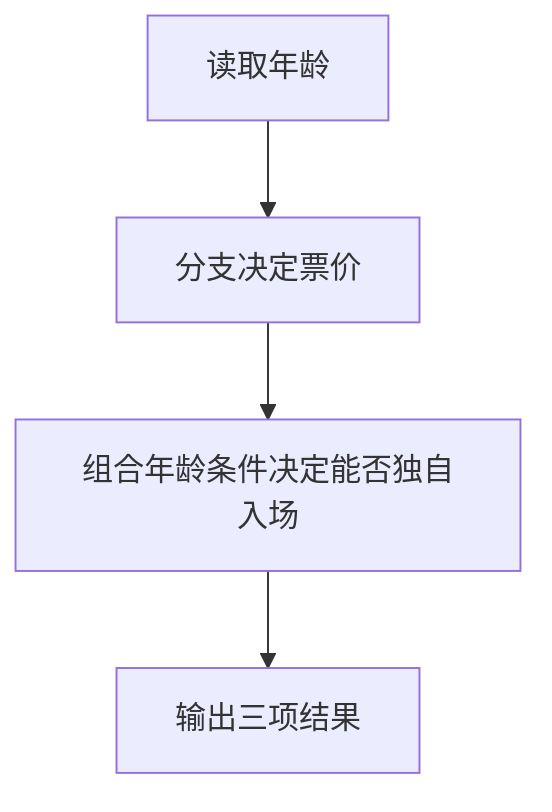

# Day 04：布尔逻辑与多分支

预计用时：60–90 分钟。

一个 `if` 只能描述最简单的规则。真实规则经常需要同时满足多个条件、选择多个入口，并按照优先级从若干方案中选出一个。今天会把比较、布尔逻辑和多分支组合成完整的优惠计算器。

## 完成目标

- 使用 `===`、`!==`、`>`、`>=`、`<`、`<=` 比较值。
- 使用 `&&`、`||`、`!` 组合布尔条件。
- 使用 `if / else if / else` 按优先级处理规则。
- 主动检查“刚好等于边界”的情况。

## 比较与边界

比较表达式的结果是 `boolean`。`score > 60` 不包含 60，`score >= 60` 包含 60。“至少”“满”“不低于”通常意味着需要包含边界。

严格相等使用 `===`，严格不等使用 `!==`。初学阶段不要使用会隐式转换类型的 `==` 和 `!=`。

## 组合条件

- `A && B`：A 与 B 都为 `true`。
- `A || B`：A 与 B 至少一个为 `true`。
- `!A`：把布尔结果反过来。

例如，“是会员、订单满 100、并且没有使用优惠券”可以由三个条件用 `&&` 连接，其中“没有”使用 `!` 表达。复杂条件可以先保存为名称清楚的布尔变量，再交给分支使用。

## 多分支与优先级

`if / else if / else` 从上往下检查。第一个满足的分支执行后，后续分支不会再运行。因此高优先级规则应放在前面：

1. 先检查最高优惠。
2. 再检查会员优惠。
3. 然后检查普通优惠。
4. 最后保留默认结果。

分支顺序本身就是业务规则的一部分。

## 阅读完整示例

打开并右击运行 `example.ts`。按顺序判断年龄属于哪个分支，再计算是否允许独自入场。临时把年龄改成边界值 12、25、65，分别预测结果，再运行验证并恢复。

## Example 代码流程图

运行 `example.ts` 前先沿图预测执行顺序；运行后再把每个节点对应到代码行。



## 独立练习导航

本日共有 2 道独立练习。每道题都有单独目录、说明、作答文件和解题结构提示；题目之间不共享代码。

| 目录 | 场景 | 类型 |
| --- | --- | --- |
| [practice01](./practice01/README.md) | Day 04：订单优惠计算器 | 主任务 |
| [practice02](./practice02/README.md) | 电影院票价判断 | 闭卷迁移 |

右击任意练习目录中的 `practice.ts` 即可单独检查；命令行也可运行 `npm run beginner -- day04 practice02`。

## 常见错误

把“满 100”写成 `> 100` 会漏掉边界；把会员分支放在满 200 前面会提前停止；把 `!` 遗漏会让已经使用优惠券的人仍进入会员规则。

### 错误代码示例

```ts
const orderTotal = 200;
const isMember = true;
const hasCoupon = false;
let discount = 0;

if (isMember && orderTotal > 100) {
  discount = 20; // ❌ 会员分支先成立，200 元订单错误地停在这里。
} else if (orderTotal >= 200) {
  discount = 40;
} else if (hasCoupon) {
  discount = 10;
}
// ❌ > 100 还漏掉了恰好 100 元的边界。
```

### 正确写法

```ts
const orderTotal = 200;
const isMember = true;
const hasCoupon = false;
const canUseMemberDiscount =
  isMember && orderTotal >= 100 && !hasCoupon;

let discount = 0;

if (orderTotal >= 200) {
  discount = 40; // ✅ 最高优先级规则放在最前面。
} else if (canUseMemberDiscount) {
  discount = 20; // ✅ 包含 100 元边界，并排除已使用优惠券的情况。
} else if (hasCoupon || orderTotal >= 80) {
  discount = 10;
}
```

## 拓展思考（不要求写代码）

如果 `orderTotal` 改成 200，同时仍是会员且没有优惠券，程序为什么应该只优惠 40 而不是先优惠 40 再优惠 20，这与分支顺序有什么关系？

## 解题结构提示

代码目录中的 `solution.ts` 与题目文档目录中的 `SOLUTION.md` 只提供带 TODO 的结构提示，不提供完整答案。

完成后再通过对应练习文档的“文件位置”链接查看 `solution.ts` 与 `SOLUTION.md`，重点对照条件名称和分支优先级。

## 官方资料

- [TypeScript for the New Programmer](https://www.typescriptlang.org/docs/handbook/typescript-from-scratch.html)
- [MDN：if...else](https://developer.mozilla.org/docs/Web/JavaScript/Reference/Statements/if...else)
