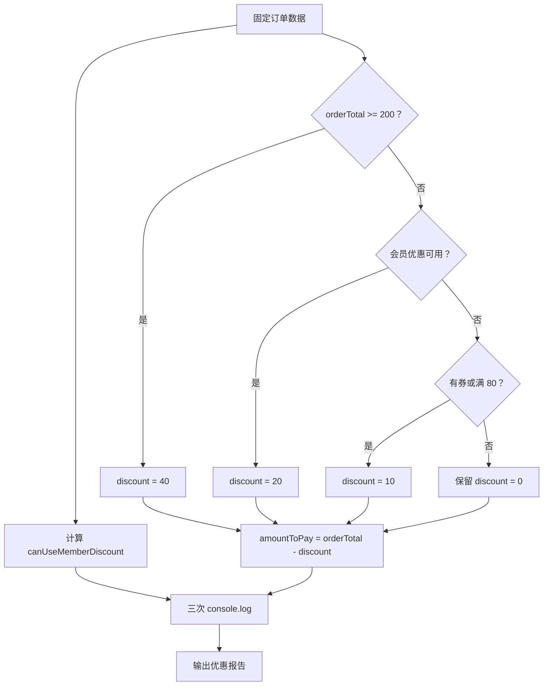

# DAY04 · Practice 01：订单优惠计算器

[返回当天课程](../README.md)

## 文件位置

- 作答文件：[practice.ts](../../../day04/practice01/practice.ts)
- 完整参考答案代码：[solution.ts](../../../day04/practice01/solution.ts)
- 方案说明：[SOLUTION.md](./SOLUTION.md)

## 场景背景

电商结算页正在处理一笔金额 120 的订单，顾客是会员且本次没有使用优惠券。平台有多条互斥优惠规则，并要求只应用优先级最高的一条，不能重复叠加。你需要生成会员优惠资格、实际优惠和应付金额，供结算页展示。

这是一道完整、独立的主练习。不要导入其他 practice 文件夹中的代码。

## 数据流

先沿变量名看数据怎样分叉和汇合；`──>` 表示值被交给下一步。

```text
orderTotal ─┬──> 比较金额边界 ──────────────┐
isMember ───┼──> 会员条件 ──┐               │
hasCoupon ──┘              └──> canUseMemberDiscount
                                            │
金额边界 + canUseMemberDiscount ──> if / else if ──> discount
discount + orderTotal ──> amountToPay ──> 输出
```

在 `practice.ts` 中从零完成“订单优惠计算器”。

固定数据和名称：

- `orderTotal` 为数字 `120`。
- `isMember` 为布尔值 `true`。
- `hasCoupon` 为布尔值 `false`。
- `canUseMemberDiscount` 保存组合条件。
- `discount` 从数字 0 开始。
- `amountToPay` 保存应付金额。

优惠规则必须按以下优先级实现：

1. 订单满 200，优惠 40。
2. 否则，如果是会员、订单满 100 且没有优惠券，优惠 20。
3. 否则，如果有优惠券或订单满 80，优惠 10。
4. 否则不优惠。

程序要求：

- `canUseMemberDiscount` 必须使用 `&&` 和 `!` 组合三个条件。
- 优惠规则必须使用一个 `if / else if / else` 结构。
- 应付金额由 `orderTotal - discount` 计算。
- 所有输出都读取变量。

精确期望输出：

```text
会员优惠可用: true
优惠: 20
应付: 100
```

限制：

- “满 200”和“满 100”都必须包含边界。
- 不得直接把 20 或 100 写进输出。
- 不得用多个互不相关的 `if` 让多条优惠同时叠加。
- 不使用嵌套三元表达式。

完成标准：

- 能说明当前数据为什么进入第二个分支。
- 能解释 `&&`、`||`、`!` 在程序中的不同作用。
- 右击运行 `practice.ts`，三行输出完全一致。

## 本题易漏语法

比较用 >=、严格相等用 ===；多分支写 } else if (...) {，不要把互斥规则拆成叠加的 if。

## 代码流程图



## 起始代码

固定订单、默认优惠和输出调用已提供。请完成布尔表达式、按优先级排列的分支和应付金额。

```ts
const orderTotal = 120;
const isMember = true;
const hasCoupon = false;

const canUseMemberDiscount = false; // TODO：替换为完整会员优惠条件。
let discount = 0;
if (false) {
  // TODO：最高优先级条件成立时更新 discount。
} else if (canUseMemberDiscount) {
  // TODO：会员条件成立时更新 discount。
} else if (false) {
  // TODO：替换为普通优惠条件，并更新 discount。
}
const amountToPay = 0; // TODO：替换为订单总额减最终优惠。

console.log(`会员优惠可用: ${canUseMemberDiscount}`);
console.log(`优惠: ${discount}`);
console.log(`应付: ${amountToPay}`);
```

## 写完后自检

- 如果 `orderTotal` 恰好是 200，同时会员条件也成立，会应用哪一档优惠？
- 如果订单仍为 120、顾客是会员但 `hasCoupon` 改成 `true`，`canUseMemberDiscount`、优惠和应付金额分别怎样变化？
- 为什么优惠规则要写成一条 `if / else if / else` 链，而不是三个独立 `if`？

## 文件

- 在 `practice.ts` 中独立作答。
- 建议先在 `practice.ts` 独立作答；完成后再查看 `solution.ts` 完整答案和 `SOLUTION.md` 调用说明。
