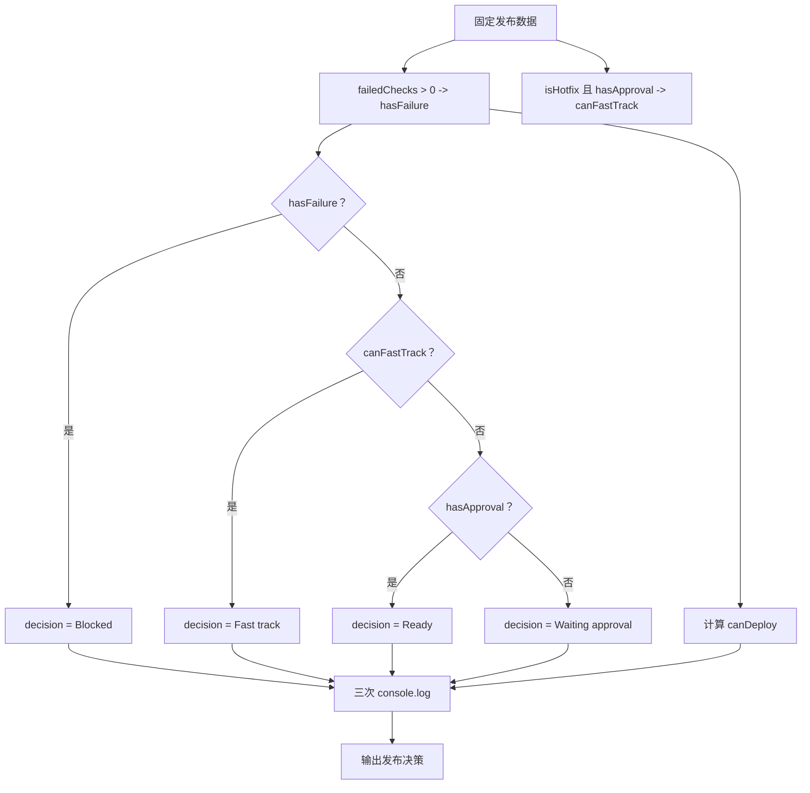

# DAY04 · Practice 02：部署闸门判断

[返回当天课程](../README.md)

## 文件位置

- 作答文件：[practice.ts](../../../day04/practice02/practice.ts)
- 完整参考答案代码：[solution.ts](../../../day04/practice02/solution.ts)
- 方案说明：[SOLUTION.md](./SOLUTION.md)

## 场景背景

发布系统准备上线一个热修复版本。当前自动检查失败数是 0，负责人已经审批，而且这次发布标记为热修复。系统需要给出一条人能读懂的决策文字，同时提供一个给程序使用的 `canDeploy` 布尔值。

为什么同一组输入要算出文字和布尔值？界面需要展示 `"Fast track"` 这样的具体原因，后续发布按钮只需要知道能不能继续。把两个结果分开，既保留解释，也方便程序判断。

## 业务规则与优先级

规则必须从上到下判断，而且只选择第一条成立的：

1. `failedChecks > 0`：`"Blocked"`。
2. 否则，热修复并且已有审批：`"Fast track"`。
3. 否则，已有审批：`"Ready"`。
4. 其余情况：`"Waiting approval"`。

`canDeploy` 的规则更简单：没有失败检查，并且已经审批。

## 数据流

```text
failedChecks ──> > 0 ────────────────> hasFailure ──┐
                                                   │
isHotfix ───────┐                                  ├── if / else if / else ──> decision
                ├── && ──> canFastTrack ───────────┤
hasApproval ────┘                                  │
                └──────────────────────────────────┘

hasFailure ──> 取反 ──┐
                      ├── && ──> canDeploy
hasApproval ──────────┘

decision + canDeploy + failedChecks ──> 三行输出
```

## 需要完成

- 固定使用 `failedChecks = 0`、`hasApproval = true`、`isHotfix = true`。
- 让 `hasFailure` 表示是否至少有一项检查失败。
- 让 `canFastTrack` 同时检查热修复和审批。
- 按上面的互斥优先级为 `decision` 赋值。
- 单独计算 `canDeploy`，不要把 `"Fast track"` 当成布尔值使用。
- 本题独立运行，不导入 `practice01` 或其他练习。

## 为什么 `hasFailure` 不能写死为 `false`

`failedChecks` 当前刚好是 0，所以 `hasFailure` 的结果确实是 `false`。但业务输入以后会改变，变量必须由失败数量计算：

```ts
const hasFailure = failedChecks > 0;
```

如果把它写死为 `false`，当 `failedChecks` 变成 1 时，程序仍会错误地允许后续发布判断。

## 精确期望输出

```text
Decision: Fast track
Can deploy: true
Failed checks: 0
```

## 和 Practice 01 的区别

Practice 01 的业务输入是订单金额、会员与优惠券，分支结果还会继续参与应付金额计算。这里的输入是失败数、审批和热修复状态：控制流程先处理阻断分支，再区分快速或普通发布，并同时输出解释文字与程序布尔值。

## 代码流程图



## 起始代码

固定检查结果、审批状态、热修复状态和输出调用已提供。请完成两个布尔结果、决策分支和最终部署判断。

```ts
const failedChecks = 0;
const hasApproval = true;
const isHotfix = true;

const hasFailure = false; // TODO：替换为失败检查数量的比较结果。
const canFastTrack = false; // TODO：替换为热修复与审批的组合条件。
let decision = "";
if (hasFailure) {
  // TODO：写入失败决策。
} else if (canFastTrack) {
  // TODO：写入快速通道决策。
} else if (hasApproval) {
  // TODO：写入普通审批决策。
} else {
  // TODO：写入等待审批决策。
}
const canDeploy = false; // TODO：替换为最终部署条件。

console.log(`Decision: ${decision}`);
console.log(`Can deploy: ${canDeploy}`);
console.log(`Failed checks: ${failedChecks}`);
```

## 写完后自检

- 如果 `failedChecks` 改成 1，而其他两个值不变，三行输出应怎样变化？
- 为什么失败检查必须放在热修复分支之前？
- 为什么 `canDeploy` 应由原始条件计算，而不是比较 `decision === "Fast track"`？

## 文件

建议先在上方链接的 `practice.ts` 独立作答；完成后再查看 `solution.ts` 完整答案和 `SOLUTION.md` 调用说明。
