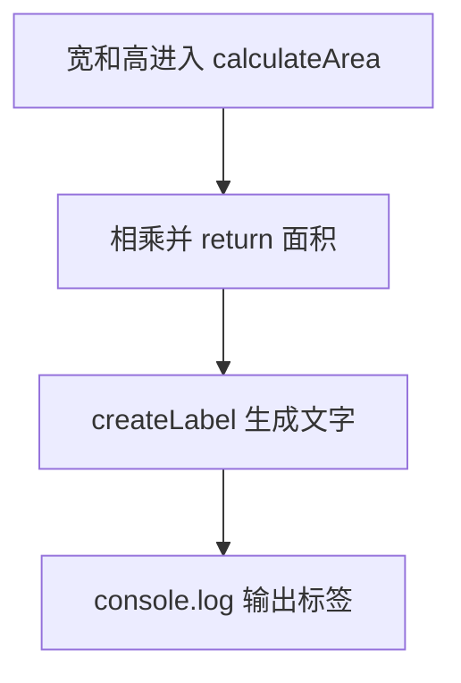

# Day 05：函数——输入、处理、输出

预计用时：60–90 分钟。

函数把一段工作取名，使它能够被重复调用。今天会把完整账单拆成几个小函数，并重点区分“把结果交还给调用者”的 `return` 和“把内容显示出来”的 `console.log`。

## 完成目标

- 声明带参数类型和返回值类型的函数。
- 理解参数是函数的输入，`return` 是函数的输出。
- 理解 `console.log` 只负责显示，不能代替 `return`。
- 使用局部变量组织计算。
- 让计算函数只依赖参数，不意外修改外部变量。

## 参数与返回值

```ts
function add(left: number, right: number): number {
  return left + right;
}
```

调用 `add(2, 3)` 时，两个参数分别得到 2 和 3。圆括号后的 `: number` 表示函数必须返回数字。

`return` 会把结果交回调用位置：

```ts
const answer = add(2, 3);
```

若函数内部只写 `console.log(left + right)`，终端虽然显示 5，`answer` 却得不到可继续计算的数字。显示和返回是两个不同动作。

## 局部变量与纯计算

函数内部声明的变量通常只在函数内部存在。计算函数应优先从参数取得所需数据并返回新结果，而不是悄悄修改函数外的变量：

```ts
function addBonus(points: number, bonus: number): number {
  return points + bonus;
}
```

相同输入会得到相同输出，这让函数更容易理解、复用和测试。

## 拆分一项完整工作

账单计算可以拆成：

1. 数量与单价产生小计。
2. 小计与会员状态产生优惠。
3. 小计减优惠产生应付金额。
4. 最外层代码负责显示结果。

每个函数只负责一个清楚动作，函数名和参数名应表达业务含义。

## 阅读完整示例

打开并右击运行 `example.ts`。指出 `calculateArea` 和 `createLabel` 各自的输入、返回类型与调用结果。临时把其中一个 `return` 改成 `console.log`，观察类型错误与额外输出，再撤销。

## 函数变量追踪

把 calculateSubtotal(quantity, unitPrice) 读成一条路径：调用处的两个实参分别进入局部参数 quantity、unitPrice，乘积由 return 交回，外部 subtotal 接住它。函数内的参数和局部变量不会自动出现在外部；外部变量也不应被计算函数偷偷读取。

## Example 代码流程图

运行 `example.ts` 前先沿图预测执行顺序；运行后再把每个节点对应到代码行。



## 独立练习导航

本日共有 2 道独立练习。每道题都有单独目录、说明、作答文件和解题结构提示；题目之间不共享代码。

| 目录 | 场景 | 类型 |
| --- | --- | --- |
| [practice01](./practice01/README.md) | Day 05：会员账单函数 | 主任务 |
| [practice02](./practice02/README.md) | 书桌面积函数 | 闭卷迁移 |

右击任意练习目录中的 `practice.ts` 即可单独检查；命令行也可运行 `npm run beginner -- day05 practice02`。

## 常见错误

函数中打印了数字不等于返回数字；漏掉某个分支的 `return` 可能得到 `undefined`；把数量和单价的参数顺序调换会改变含义；读取外部变量会让函数难以复用。

### 错误代码示例

```ts
const quantity = 3;
const unitPrice = 40;

function calculateSubtotal(): number {
  console.log(quantity * unitPrice);
  // ❌ console.log 只负责显示；函数没有 return，调用者拿不到 120。
}

const subtotal = calculateSubtotal();
```

### 正确写法

```ts
function calculateSubtotal(
  quantity: number,
  unitPrice: number,
): number {
  return quantity * unitPrice; // ✅ 把结果交回调用位置。
}

// ✅ 外部值通过实参进入函数，函数不依赖同名全局变量。
const subtotal = calculateSubtotal(3, 40);
console.log(subtotal);
```

## 拓展思考（不要求写代码）

如果 `calculateSubtotal` 内部把 120 打印出来却没有 `return`，为什么后面的 `calculateDiscount(subtotal, isMember)` 仍然无法得到正确的小计？

## 解题结构提示

代码目录中的 `solution.ts` 与题目文档目录中的 `SOLUTION.md` 只提供带 TODO 的结构提示，不提供完整答案。

完成后再通过对应练习文档的“文件位置”链接查看 `solution.ts` 与 `SOLUTION.md`，重点比较函数边界，而不只比较最终数字。

## 官方资料

- [Everyday Types：Functions](https://www.typescriptlang.org/docs/handbook/2/everyday-types.html#functions)
- [More on Functions](https://www.typescriptlang.org/docs/handbook/2/functions.html)
