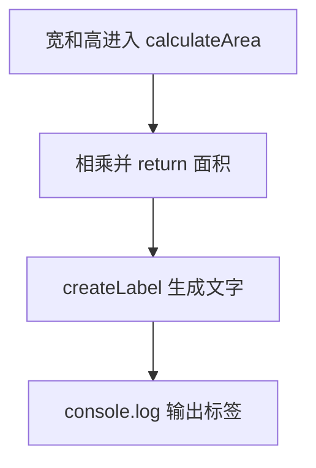

# Day 05：函数——输入、处理、输出

预计用时：60–90 分钟。

账单里“小计 = 数量 × 单价”可能要算很多次。把这段计算写成函数以后，每次只要交给它数量和单价，就能拿回小计。今天还要分清两个动作：`return` 把结果交给后续代码，`console.log` 只是把内容显示在终端。

## 完成目标

- 声明带参数类型和返回值类型的函数。
- 理解参数是函数的输入，`return` 是函数的输出。
- 理解 `console.log` 只负责显示，不能代替 `return`。
- 使用局部变量组织计算。
- 让计算函数只依赖参数，不意外修改外部变量。

## 参数与返回值

```ts
function add(left: number, right: number): number {
  return left + right;
}
```

先把函数声明拆开看：

| 部分 | 含义 |
| --- | --- |
| `add` | 函数名，调用时使用这个名字 |
| `left: number` | 第一个输入必须是数字 |
| `right: number` | 第二个输入必须是数字 |
| 圆括号后的 `: number` | 这个函数必须交回一个数字 |
| `return left + right` | 计算后，把结果交回调用处 |

调用 `add(2, 3)` 时，`left` 在这次调用中是 2，`right` 是 3。`return` 得到 5 后，把它交回调用位置：

```ts
const answer = add(2, 3);
```

这次调用的数据流是：

| 位置 | 得到什么 |
| --- | --- |
| `add(2, 3)` | 把 2 和 3 送进函数 |
| `left + right` | 算出 5 |
| `return` | 把 5 交回调用处 |
| `answer` | 接住返回的 5 |

如果函数内部只写 `console.log(left + right)`，终端虽然会显示 5，但函数没有把 5 交回去，`answer` 就拿不到可继续计算的数字。显示和返回是两件事。

## 局部变量与纯计算

函数参数和函数内部声明的变量，只能在函数体内直接访问。每次调用函数时，它们会得到这一次调用自己的值。计算需要什么数据，就从参数传进来；算完后再 `return`。这样读函数时，不需要到文件其他位置寻找它偷偷使用了哪个变量：

```ts
function addBonus(points: number, bonus: number): number {
  return points + bonus;
}
```

例如 `addBonus(80, 5)` 每次都得到 85。调用别的分数时，只换参数，不需要修改函数内部代码，所以也更容易单独检查。

## 拆分一项完整工作

一张账单可以按数据流拆开：

1. 数量和单价进入“小计函数”，返回小计。
2. 小计和会员状态进入“优惠函数”，返回优惠金额。
3. 小计减去优惠，得到应付金额。
4. 最外层代码最后再用 `console.log` 显示结果。

每一步的返回值会成为下一步的输入。函数名和参数名应直接说明它处理什么数据。

## 阅读完整示例

打开并右击运行 `example.ts`。指出 `calculateArea` 和 `createLabel` 各自的输入、返回类型与调用结果。临时把其中一个 `return` 改成 `console.log`，观察类型错误与额外输出，再撤销。

## 函数变量追踪

把 `calculateSubtotal(quantity, unitPrice)` 按下面的箭头读：

`外部数量和单价 → 参数 quantity、unitPrice → 相乘 → return → 外部 subtotal`

参数名只在函数里面代表本次收到的数据。函数执行结束后，外部代码只能拿到 `return` 交回的结果，不能直接读取函数内部的局部变量。

## Example 实际输出

运行 `example.ts` 后，终端会按下面的顺序显示。先用代码推测结果，再逐行对照：

```text
书桌面积: 120
```

## Example 代码流程图

运行 `example.ts` 前先沿图预测执行顺序；运行后再把每个节点对应到代码行。



## 独立练习导航

本日共有 2 道独立练习。每道题都有单独目录、说明、作答文件和解题结构提示；题目之间不共享代码。

| 目录 | 场景 | 类型 |
| --- | --- | --- |
| [practice01](./practice01/README.md) | Day 05：会员账单函数 | 主任务 |
| [practice02](./practice02/README.md) | 书桌面积函数 | 闭卷迁移 |

右击任意练习目录中的 `practice.ts` 即可单独检查；命令行也可运行 `npm run beginner -- day05 practice02`。

## 常见错误

终端看见数字，但下一步计算拿不到它时，检查函数有没有 `return`。有多个分支时，每条可能执行的路线都要返回结果；漏掉一条路线时，调用者可能拿到 `undefined`。调用参数还要按声明顺序传入：数量和单价都是数字，顺序写反可能不报类型错误，却会改变业务含义。

### 错误代码示例

```ts
const quantity = 3;
const unitPrice = 40;

function calculateSubtotal(): number {
  console.log(quantity * unitPrice);
  // ❌ console.log 只负责显示；函数没有 return，调用者拿不到 120。
}

const subtotal = calculateSubtotal();
```

### 正确写法

```ts
function calculateSubtotal(
  quantity: number,
  unitPrice: number,
): number {
  return quantity * unitPrice; // ✅ 把结果交回调用位置。
}

// ✅ 外部值通过实参进入函数，函数不依赖同名全局变量。
const subtotal = calculateSubtotal(3, 40);
console.log(subtotal);
```

## 拓展思考（不要求写代码）

如果 `calculateSubtotal` 内部把 120 打印出来却没有 `return`，为什么后面的 `calculateDiscount(subtotal, isMember)` 仍然无法得到正确的小计？

## 解题结构提示

代码目录中的 `solution.ts` 与题目文档目录中的 `SOLUTION.md` 只提供带 TODO 的结构提示，不提供完整答案。

完成后再通过对应练习文档的“文件位置”链接查看 `solution.ts` 与 `SOLUTION.md`，重点比较函数边界，而不只比较最终数字。

## 官方资料

- [Everyday Types：Functions](https://www.typescriptlang.org/docs/handbook/2/everyday-types.html#functions)
- [More on Functions](https://www.typescriptlang.org/docs/handbook/2/functions.html)
