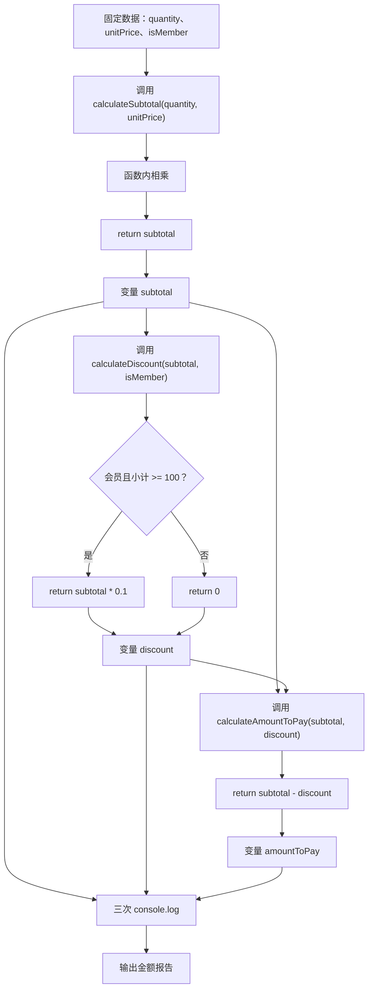

# DAY05 · Practice 01：会员账单函数

[返回当天课程](../README.md)

## 文件位置

- 作答文件：[practice.ts](../../../day05/practice01/practice.ts)
- 完整参考答案代码：[solution.ts](../../../day05/practice01/solution.ts)
- 方案说明：[SOLUTION.md](./SOLUTION.md)

## 场景背景

会员商城需要为一笔购买 3 件、每件 40 元的订单生成账单，当前顾客是会员。结算过程被拆成小计、优惠和应付金额三个独立步骤，便于以后替换任意一条业务规则。最终要得到三项账单数据并统一输出给收银页面。

这是一道完整、独立的主练习。不要导入其他 practice 文件夹中的代码。

## 数据流

先沿变量名看数据怎样分叉和汇合；`──>` 表示值被交给下一步。

```text
quantity + unitPrice ──> calculateSubtotal ──> subtotal
isMember + subtotal ──> calculateDiscount ──> discount
subtotal + discount ──> calculateAmountToPay ──> amountToPay

subtotal + discount + amountToPay ──> 账单输出
```

在 `practice.ts` 中从零完成“会员账单”。

必须声明这些函数：

- `calculateSubtotal(quantity: number, unitPrice: number): number`：返回数量乘单价。
- `calculateDiscount(subtotal: number, isMember: boolean): number`：会员并且小计至少 100 时返回小计的 10%，否则返回 0。
- `calculateAmountToPay(subtotal: number, discount: number): number`：返回小计减优惠。

固定数据与名称：

- `quantity` 为 3。
- `unitPrice` 为 40。
- `isMember` 为 `true`。
- 调用结果依次保存为 `subtotal`、`discount`、`amountToPay`。

精确期望输出：

```text
小计: 120
优惠: 12
应付: 108
```

限制：

- 三个函数都必须明确标注参数类型和返回值类型。
- 计算函数内部不得调用 `console.log`。
- 函数不得读取或修改题目中的外部变量。
- 不得把 120、12、108 直接写入输出语句。
- 只在所有计算完成后输出三行。

完成标准：

- 能指出每个函数的输入和返回值。
- 相同参数重复调用函数会得到相同结果。
- 右击运行 `practice.ts`，没有额外日志且三行完全一致。

## 本题易漏语法

函数头写 function 名称(参数: 类型): 返回类型 {；形参与实参用逗号，return 值; 交回结果。

## 代码流程图



## 起始代码

三个函数签名、固定数据、调用顺序和输出已经提供。函数内部的计算、判断和 return 由你完成。

```ts
function calculateSubtotal(quantity: number, unitPrice: number): number {
  return 0; // TODO：替换为 quantity 与 unitPrice 的计算结果。
}

function calculateDiscount(subtotal: number, isMember: boolean): number {
  const canDiscount = false; // TODO：替换为会员优惠条件。
  if (canDiscount) {
    return 0; // TODO：替换为 10% 优惠金额。
  }
  return 0;
}

function calculateAmountToPay(subtotal: number, discount: number): number {
  return 0; // TODO：替换为应付金额。
}

const quantity = 3;
const unitPrice = 40;
const isMember = true;

const subtotal = calculateSubtotal(quantity, unitPrice);
const discount = calculateDiscount(subtotal, isMember);
const amountToPay = calculateAmountToPay(subtotal, discount);

console.log(`小计: ${subtotal}`);
console.log(`优惠: ${discount}`);
console.log(`应付: ${amountToPay}`);
```

## 写完后自检

- 如果 `isMember` 改成 `false`，小计、优惠和应付金额会分别是多少？
- 小计恰好为 100 时，优惠分支为什么应该成立？
- 为什么三个计算函数用参数接收数据、用 `return` 交回结果，而不直接读取外部变量或在函数里输出？

## 文件

- 在 `practice.ts` 中独立作答。
- 建议先在 `practice.ts` 独立作答；完成后再查看 `solution.ts` 完整答案和 `SOLUTION.md` 调用说明。
