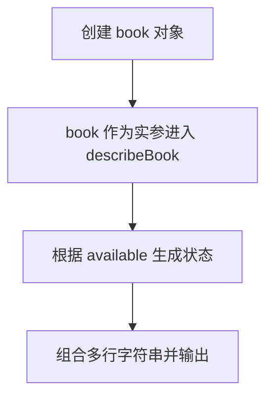

# Day 06：对象与引用

预计用时：60–90 分钟。

一项学习任务不只有一个值，它可能同时有标题、完成状态、学生资料和分数。对象把这些属于同一件事的数据放在一起。今天还要看清一个常见误区：给同一个对象再起一个变量名，并没有复制出第二份数据。

## 完成目标

- 创建对象并用点号读取、修改属性。
- 把对象传给函数，并描述函数需要的对象形状。
- 读取嵌套对象和对象里的数组。
- 使用循环处理对象中的数组。
- 理解对象赋值复制的是引用。

## 对象与属性

```ts
const task = {
  title: "学习对象",
  done: false,
};

console.log(task.title);
```

先看符号分别放在哪里：

| 写法 | 作用 |
| --- | --- |
| `const task =` | `=` 把右侧整个对象交给变量 `task` |
| `{ ... }` | 花括号包住对象的所有属性 |
| `title: "学习对象"` | 对象内部用 `:` 连接属性名和值 |
| `,` | 分隔对象中的相邻属性 |
| `;` | 整条变量声明结束 |

所以要写 `const student = { name: "Lin" };`。对象内部的通用格式是 `属性名: 值`：不能省略变量名后的 `=`，也不能把对象属性内部的 `:` 写成 `=`。TypeScript 会根据右侧初始值判断每个属性的类型。

对象属性的值还可以是另一个对象，这叫嵌套对象。读取时按层级从外往里使用点号：

```ts
const student = {
  name: "Mei",
  address: {
    city: "成都",
  },
};

console.log(student.address.city);
```

这行可以读成：“先找到 `student`，再进入它的 `address`，最后读取 `city`。”少写一层，就会读到不同的数据。

## 对象作为函数参数

函数如果只需要对象中的 `scores`，可以直接写出“传进来的对象至少要有什么”：

```ts
function readScores(record: { scores: number[] }): number {
  return record.scores.length;
}
```

`record: { scores: number[] }` 表示：参数名是 `record`；它必须是对象；对象里必须有 `scores`；`scores` 必须是数字数组。调用者可以多带其他属性，但不能缺少这里列出的内容。Day 09 会学习怎样给重复出现的对象形状取名。

## 引用与独立副本

```ts
const original = { done: false };
const alias = original;
alias.done = true;
```

这里只有一个对象，`original` 和 `alias` 都能找到它。`const alias = original` 复制的是找到对象的引用，不是对象本身。通过 `alias.done = true` 修改后，再从 `original.done` 读取，看到的也是 `true`。这种“变量保存的是同一个对象的位置”叫引用。

要得到互不影响的副本，必须明确创建新对象。里面的嵌套对象和数组也分别是引用；如果它们也要独立，就要分别创建新的对象和数组。后续课程会学习更简洁的展开语法。

## 为什么要这样设计

一条任务包含标题、状态、学生和成绩时，如果用许多互不关联的变量保存，很容易把不同任务的数据混在一起。对象把同一条记录的属性放在一个边界里，函数也能通过一个参数接收整条记录，而不是维护一长串参数。

JavaScript 运行时负责保存对象引用，所以把对象赋给另一个变量时，两边默认指向同一个对象；属性读取和函数参数传递也沿用这套规则。你仍要决定函数只读取还是修改对象，以及复制时哪些嵌套对象和数组必须真正独立。把循环封装进函数时，参数是输入，局部数组只服务本次调用，`return` 再把结果交回外部。

对象复制通常只复制当前一层。只创建新的外层对象，并不会自动复制里面的 `student` 或 `scores`；漏掉深层复制仍会让原件和副本互相影响。反过来，所有内容都深拷贝也有成本，应按“哪些部分允许共享”来决定。

## 阅读完整示例

打开并右击运行 `example.ts`。调用 `describeBook(book)` 时，圆括号里的外部变量 `book` 是实参；函数声明中的参数即使也叫 `book`，它仍是函数内部接收数据的形参。再看函数声明，找出它明确要求对象必须提供哪些属性。临时新增一个作者属性，观察函数是否也需要读取它；实验后恢复。

## 全局循环与独立函数：两种写法的数据流

“把每个分数放进一个新数组”可以直接写在文件中，也可以写进函数。计算结果可以一样；区别是这些变量能在哪里使用，以及以后能不能用同一段功能处理别的数组。

### 写法一：在全局代码中循环

```ts
const copiedScores: number[] = [];

for (const score of originalTask.scores) {
  copiedScores.push(score);
}
```

这段代码按下面的顺序运行：

- 先在循环外创建空数组 `copiedScores`，所以循环结束后仍能读取它。
- 每轮把一个分数交给 `score`。`score` 在 `for` 的花括号内声明，只代表当前一轮；循环外不能使用这个临时变量。
- `copiedScores.push(score)` 把当前分数加入同一个新数组。
- `const copiedScores` 表示这个变量不能重新赋值成另一个数组，但允许修改当前数组里的内容，所以可以调用 `push`。

如果其他地方也要复制数字数组，顶层写法就需要再写一次循环。

### 写法二：封装为可复用函数

```ts
function copyScores(source: number[]): number[] {
  const result: number[] = [];

  for (const score of source) {
    result.push(score);
  }

  return result;
}

const copiedScores = copyScores(originalTask.scores);
```

用一次 `copyScores(originalTask.scores)` 来追踪变量：

| 位置 | 当前发生的事 |
| --- | --- |
| 调用处 | 把 `originalTask.scores` 传进函数 |
| 参数 `source` | 在函数内部代表传进来的原数组 |
| 局部变量 `result` | 创建一个新的空数组 |
| 每轮的 `score` | 依次拿到原数组中的一个分数 |
| `result.push(score)` | 把当前分数加入新数组，不修改 `source` |
| `return result;` | 把新数组交回调用处；分号表示这条语句结束 |
| 外部 `copiedScores` | 接住函数返回的新数组 |

参数名不需要和外部变量名相同。`result` 和每轮的 `score` 都只能在函数内部使用。若改成 `source.push(...)`，修改的就会是调用者传入的原数组。

函数版把“怎样复制”收进一个有名字的功能中，同一个函数可以处理其他数字数组。今天先完成顶层循环版，再重构成函数版；两版的输出应保持一致。

## Example 实际输出

运行 `example.ts` 后，终端会按下面的顺序显示。先用代码推测结果，再逐行对照：

```text
书名: TypeScript 入门
页数: 320
状态: 可借阅
```

## Example 代码流程图

运行 `example.ts` 前先沿图预测执行顺序；运行后再把每个节点对应到代码行。



## 独立练习导航

本日共有 3 道独立练习。每道题都有单独目录、说明、作答文件和解题结构提示；题目之间不共享代码。

| 目录 | 场景 | 类型 |
| --- | --- | --- |
| [practice01](./practice01/README.md) | Day 06：学习任务副本与成绩报告 | 主任务 |
| [practice02](./practice02/README.md) | 图书借阅卡 | 闭卷迁移 |
| [practice03](./practice03/README.md) | 购物车深复制函数 | 综合应用 |

右击任意练习目录中的 `practice.ts` 即可单独检查；命令行也可运行 `npm run beginner -- day06 practice02`。

## 常见错误

修改副本时原数据也跟着变，先检查是不是写了 `const copy = original`。即使创建了新的顶层对象，只要里面仍直接使用原来的 `student` 或 `scores`，这些内层数据仍然共享。属性名还要逐字一致，大小写不同就是两个名字。

### 错误代码示例

```ts
const student { name = "Lin" };
// ❌ 变量名后缺少 =；对象属性的名称和值之间应使用 :。
```

即使对象语法写对，下面的写法仍没有复制数据：

```ts
const originalTask = {
  student: { name: "Lin" },
  scores: [88, 92],
};

const copiedTask = originalTask;
copiedTask.scores.push(100);
// ❌ 两个变量指向同一个对象，原任务的 scores 也被修改。
```

### 正确写法

```ts
const student = { name: "Lin" };
// ✅ = 把右侧对象赋给变量；对象内部用 : 连接属性名和值；语句以 ; 结束。

const originalTask = {
  student,
  scores: [88, 92],
};
const copiedScores: number[] = [];

for (const score of originalTask.scores) {
  copiedScores.push(score); // ✅ 逐项加入显式创建的新数组。
}

const copiedTask = {
  student: { name: originalTask.student.name }, // ✅ 新的嵌套对象。
  scores: copiedScores, // ✅ 与原对象使用不同的数组。
};

copiedTask.scores.push(100); // ✅ 只修改副本的数组。
```

## 面试时怎么回答

**问：把循环写在全局和封装成函数有什么区别？对象传入函数后为什么可能被改掉？**

两种写法都能完成一次 `push`，差别在职责和复用。全局循环直接依赖外部的 `scores`，适合一次性的顺序脚本；函数把输入写成参数、把工作集中在一个名字下，同一逻辑可以用于不同数组，也更容易单独测试。参数不是自动复制数据：数组和对象传入函数时，函数拿到的仍是同一个引用，因此在函数里 `scores.push(90)`，外面的数组也会多出 `90`。

这也解释了 `const` 的边界：`const scores = [80]` 禁止把变量重新指向另一数组，却允许 `scores.push(90)`，最终输出 `[80, 90]`。`readonly` 可以在类型检查阶段限制写操作，但通常也是浅层限制，并不会在运行时自动冻结对象。若函数不应修改原数据，应返回副本并把这条约定写进类型和名称。

## 拓展思考（不要求写代码）

如果 `copiedTask.student` 直接使用 `originalTask.student`，随后修改副本学生的城市，为什么原任务中的城市也会变化，而本题单独创建嵌套对象后不会？

## 解题结构提示

代码目录中的 `solution.ts` 与题目文档目录中的 `SOLUTION.md` 只提供带 TODO 的结构提示，不提供完整答案。

完成后再通过对应练习文档的“文件位置”链接查看 `solution.ts` 与 `SOLUTION.md`，并尝试画出两套对象结构。

## 官方资料

- [Everyday Types：Object Types](https://www.typescriptlang.org/docs/handbook/2/everyday-types.html#object-types)
- [Object Types](https://www.typescriptlang.org/docs/handbook/2/objects.html)
