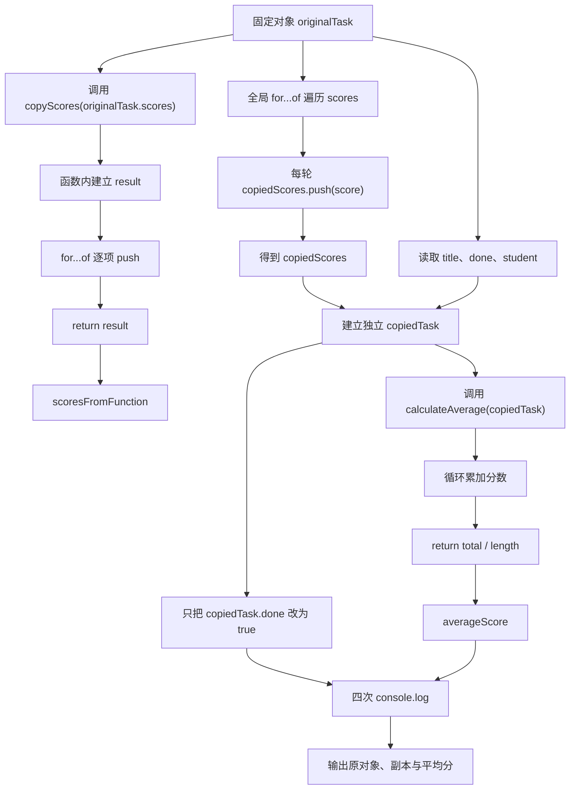

# DAY06 · Practice 01：学习任务副本与成绩报告

[返回当天课程](../README.md)

## 文件位置

- 作答文件：[practice.ts](../../../day06/practice01/practice.ts)
- 完整参考答案代码：[solution.ts](../../../day06/practice01/solution.ts)
- 方案说明：[SOLUTION.md](./SOLUTION.md)

## 场景背景

学习平台要从 Mei 的原始任务记录创建一份可独立修改的副本，原记录中包含完成状态、城市和三次成绩。助教会在副本上标记任务完成，并查看学生资料与平均分，但原始任务必须保持不变。最终报告需要同时证明两份状态互不影响，并展示副本对应的学生和成绩摘要。

这是一道完整、独立的主练习。不要导入其他 practice 文件夹中的代码。

## 数据流

先沿变量名看数据怎样分叉和汇合；`──>` 表示值被交给下一步。

```text
originalTask.scores
   ├── 顶层 for...of + push ──> copiedScores ──> 组成 copiedTask
   └── copyScores(source) ──> 函数局部 result ──> 返回另一份数组
copiedTask.scores ──> calculateAverage ──> averageScore

originalTask 与 copiedTask ──> 修改副本后比较输出
```

`practice.ts` 的必做路线是第一条：在全局循环中得到 `copiedScores`。完成后再看 `SOLUTION.md` 中的函数路线，比较 `source`、局部 `result` 和返回值怎样让同一段复制逻辑可以处理别的数组；函数路线不增加本题的必做输出。

在 `practice.ts` 中从零完成“学习任务副本与成绩报告”。

创建 `originalTask`，固定结构如下：

- `title` 为 `"完成对象练习"`。
- `done` 为 `false`。
- `student` 是嵌套对象，包含 `name: "Mei"` 和 `city: "成都"`。
- `scores` 是数字数组 `[88, 92, 90]`。

程序要求：

1. 创建空数字数组 `copiedScores`，使用 `for...of` 把原数组的每个分数 `push` 进去。
2. 创建新对象 `copiedTask`，逐项读取原对象的值；`student` 必须是新对象，`scores` 使用 `copiedScores`。
3. 只把 `copiedTask.done` 修改为 `true`。
4. 实现 `calculateAverage(record: { scores: number[] }): number`，用循环计算平均分。
5. 输出原任务与副本状态、嵌套学生资料和平均分。

> **先看清输出标点：** 代码语法中的函数括号 `()` 和类型冒号 `:` 必须使用英文半角符号。下面 `Mei（成都）` 的 `（ ）` 是中文全角括号，只是字符串里展示给读者的文字。运行器不会因中英文括号或冒号的全半角差异判你失败，但其他文字、数字和顺序仍要一致。

精确期望输出：

```text
原任务完成: false
副本完成: true
学生: Mei（成都）
平均分: 90
```

限制：

- 不得写 `const copiedTask = originalTask`。
- 不使用尚未学习的对象或数组展开语法。
- 平均分必须根据数组循环计算，不得直接写 90。
- 函数必须从参数读取分数，不得读取外部 `originalTask`。

完成标准：

- 修改副本后，原对象仍保持 `false`。
- 能画出原对象和副本各自指向的嵌套对象与数组。
- 右击运行 `practice.ts`，四行输出完全一致。

## 本题易漏语法

对象值写 `const student = { name: "Mei", scores: [88] };`：变量名后用 `=`，值属性内部用 `:`，属性之间用逗号，数组用 `[]`。对象参数类型写 `{ name: string; scores: number[] }`：属性名与类型之间仍用 `:`，类型属性推荐用分号。对象值关闭后是 `};`，函数或循环代码块关闭后通常只有 `}`。

## 代码流程图



## 起始代码

固定对象、两个函数签名、调用和输出已经给出。循环、push、对象复制、状态修改、平均分计算与 return 由你完成。

```ts
const originalTask = {
  title: "完成对象练习",
  done: false,
  student: { name: "Mei", city: "成都" },
  scores: [88, 92, 90],
};

const copiedScores: number[] = [];
for (const score of originalTask.scores) {
  // TODO：把本轮 score 追加到 copiedScores。
}

function copyScores(source: number[]): number[] {
  const result: number[] = [];
  for (const score of source) {
    // TODO：把本轮 score 追加到 result。
  }
  return []; // TODO：把占位数组换成本轮生成的 result。
}

const scoresFromFunction = copyScores(originalTask.scores);
void scoresFromFunction;

const copiedTask = {
  title: "", // TODO：读取原任务标题。
  done: false, // TODO：读取原任务初始状态。
  student: {
    name: "", // TODO：读取原学生姓名。
    city: "", // TODO：读取原学生城市。
  },
  scores: copiedScores,
};
// TODO：只把 copiedTask.done 更新为 true。

function calculateAverage(record: { scores: number[] }): number {
  let total = 0;
  for (const score of record.scores) {
    // TODO：把本轮 score 累加到 total。
  }
  return 0; // TODO：替换为平均分计算结果。
}

const averageScore = calculateAverage(copiedTask);
console.log(`原任务完成: ${originalTask.done}`);
console.log(`副本完成: ${copiedTask.done}`);
console.log(`学生: ${copiedTask.student.name}（${copiedTask.student.city}）`);
console.log(`平均分: ${averageScore}`);
```

## 写完后自检

- 如果把成绩改成 `[88, 92, 100]`，平均分会怎样变化？如果数组为空，当前除法会产生什么结果，函数需要怎样的输入约定？
- 为什么只创建新的外层 `copiedTask` 还不够，`student` 和 `scores` 也要分别创建新数据？
- 顶层循环与 `copyScores(source)` 都能复制数组；为什么需要复用时更适合把来源放进参数，并从函数返回局部 `result`？

## 文件

- 在 `practice.ts` 中独立作答。
- 建议先在 `practice.ts` 独立作答；完成后再查看 `solution.ts` 完整答案和 `SOLUTION.md` 调用说明。
