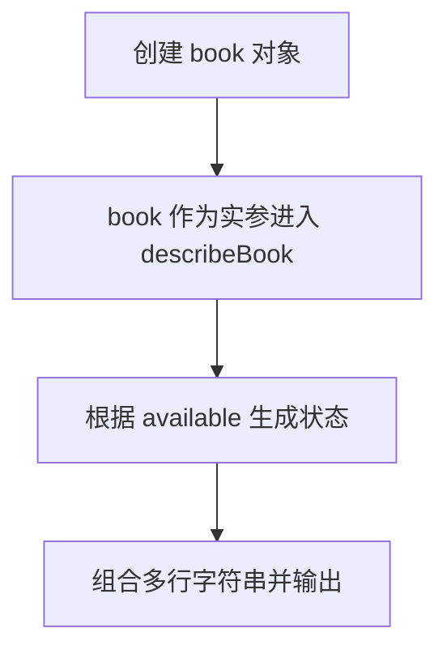

# DAY06 · Practice 02：图书借阅卡

[返回当天课程](../README.md)

## 文件位置

- 作答文件：[practice.ts](../../../day06/practice02/practice.ts)
- 结构提示代码：[solution.ts](../../../day06/practice02/solution.ts)
- 方案说明：[SOLUTION.md](./SOLUTION.md)

## 场景背景

图书馆终端取得一本《TypeScript 入门》的借阅记录，其中包含书名、320 页以及当前可借阅状态。读者不需要看到原始对象，而需要一段清楚的三行图书说明。你的程序要把整条记录交给独立功能处理，再将生成的借阅卡显示出来。

这是一道与 Practice 01 文件完全分开的闭卷迁移题。先理解并运行当天 `example.ts`，然后关闭它；不要复制代码，仅根据下面的流程与输出从空白重新实现。

## 代码流程图



## 必须练到的能力

创建对象、读取属性，并让函数只通过参数取得对象数据。

- 不得导入 `practice01` 或直接调用其他练习的实现。
- 输出必须由变量、计算或函数返回值产生，不把整行结果写死。
- 每个参数、局部变量和返回值都应能在流程图中找到位置。

## 精确期望输出

```text
书名: TypeScript 入门
页数: 320
状态: 可借阅
```

## 文件

在上方链接的 `practice.ts` 作答；独立完成后再查看 `solution.ts` 的 TODO 解题结构与 `SOLUTION.md` 的结构提示，它们不提供完整答案。
