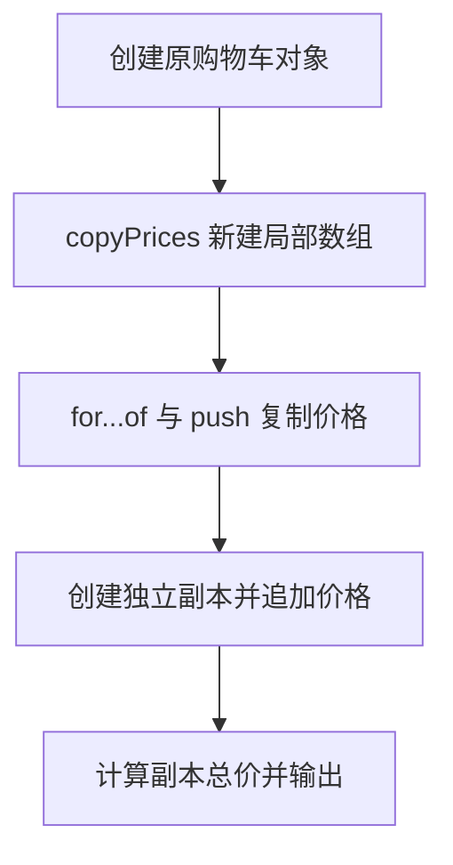

# DAY06 · Practice 03：购物车深复制函数

[返回当天课程](../README.md)

## 文件位置

- 作答文件：[practice.ts](../../../day06/practice03/practice.ts)
- 结构提示代码：[solution.ts](../../../day06/practice03/solution.ts)
- 方案说明：[SOLUTION.md](./SOLUTION.md)

## 场景背景

客服要为顾客 Lin 的购物车制作一份试算副本，原购物车中已有两件价格分别为 10 和 20 的商品。试算时会在副本中追加一件商品并重新计算总价，但正式购物车的商品数量不能变化。最终摘要需要同时展示原件与副本的数量、副本总价和顾客姓名，以证明复制是独立的。

## 代码流程图



## 要求

- 从空白文件完成本题需要的类型、函数、固定输入与输出。
- 不得导入其他 practice 文件夹。
- 计算必须来自参数和局部变量；函数用 return 交付结果。
- 保持原数据不变，并按流程图处理边界或状态。

## 精确期望输出

```text
Original items: 2
Copied items: 3
Copied total: 60
Customer: Lin
```

## 文件

在上方链接的 `practice.ts` 作答；独立完成后再查看 `solution.ts` 的 TODO 解题结构与 `SOLUTION.md` 的结构提示，它们不提供完整答案。
