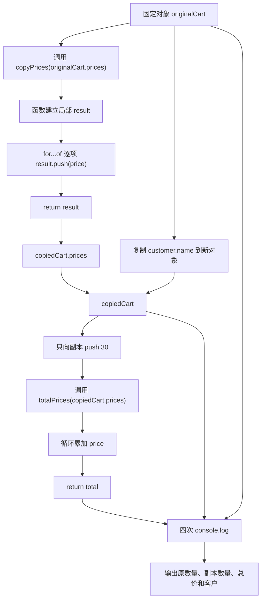

# DAY06 · Practice 03：购物车深复制函数

[返回当天课程](../README.md)

## 文件位置

- 作答文件：[practice.ts](../../../day06/practice03/practice.ts)
- 完整参考答案代码：[solution.ts](../../../day06/practice03/solution.ts)
- 方案说明：[SOLUTION.md](./SOLUTION.md)

## 场景背景

客服要为顾客 Lin 的购物车制作一份试算副本，原购物车中已有两件价格分别为 10 和 20 的商品。试算时会在副本中追加一件商品并重新计算总价，但正式购物车的商品数量不能变化。最终摘要需要同时展示原件与副本的数量、副本总价和顾客姓名，以证明复制是独立的。

## 数据流

先沿变量名看数据怎样分叉和汇合；`──>` 表示值被交给下一步。

```text
originalCart.prices
   │
   └── copyPrices
          └── for...of + push ──> 新 prices 数组 ──> copiedCart
                                                        │
                                                        ├── push 新价格
                                                        └── totalPrices ──> 副本总价
originalCart + copiedCart ──> 比较输出
```

## 要求

- 声明 `type Cart = { customer: { name: string }; prices: number[] }`。
- `copyPrices(source: number[]): number[]` 从空数组开始，用 `for...of` 与 `push` 返回新的价格数组。
- `totalPrices(prices: number[]): number` 用局部累加器返回总价。
- `originalCart` 固定为顾客 `"Lin"`、价格 `[10, 20]`；`copiedCart` 使用新的 `customer` 对象与 `copyPrices` 的结果。
- 只向 `copiedCart.prices` 追加价格 30，再从两份购物车计算输出。本题按已知的两层结构逐层复制，不代表这个函数能深复制任意对象。
- 不得导入其他 practice 文件夹。
- 计算必须来自参数和局部变量；函数用 return 交付结果。
- 保持原数据不变，并按流程图处理边界或状态。

## 精确期望输出

```text
Original items: 2
Copied items: 3
Copied total: 60
Customer: Lin
```

## 代码流程图



## 起始代码

类型、两个函数签名、固定购物车、函数调用和输出都已给出。复制循环、累加循环、return 和只修改副本的 push 由你完成。

```ts
type Cart = { customer: { name: string }; prices: number[] };

function copyPrices(source: number[]): number[] {
  const result: number[] = [];
  for (const price of source) {
    // TODO：把本轮 price 追加到 result。
  }
  return []; // TODO：把占位数组换成 result。
}

function totalPrices(prices: number[]): number {
  let total = 0;
  for (const price of prices) {
    // TODO：把本轮 price 累加到 total。
  }
  return 0; // TODO：把占位结果换成 total。
}

const originalCart: Cart = {
  customer: { name: "Lin" },
  prices: [10, 20],
};

const copiedCart: Cart = {
  customer: { name: originalCart.customer.name },
  prices: copyPrices(originalCart.prices),
};

// TODO：只向 copiedCart.prices 追加 30。

console.log(`Original items: ${originalCart.prices.length}`);
console.log(`Copied items: ${copiedCart.prices.length}`);
console.log(`Copied total: ${totalPrices(copiedCart.prices)}`);
console.log(`Customer: ${copiedCart.customer.name}`);
```

## 写完后自检

- 如果追加价格从 30 改成 5，原件数量、副本数量和副本总价分别会是什么？
- 修改 `copiedCart.customer.name` 或向 `copiedCart.prices` 再追加一项时，为什么原购物车不应变化？
- 为什么这里只复制外层对象、`customer` 和 `prices` 三个已知层级，而不能把这种写法称为适用于任意数据的通用深复制？

## 文件

建议先在上方链接的 `practice.ts` 独立作答；完成后再查看 `solution.ts` 完整答案和 `SOLUTION.md` 调用说明。
