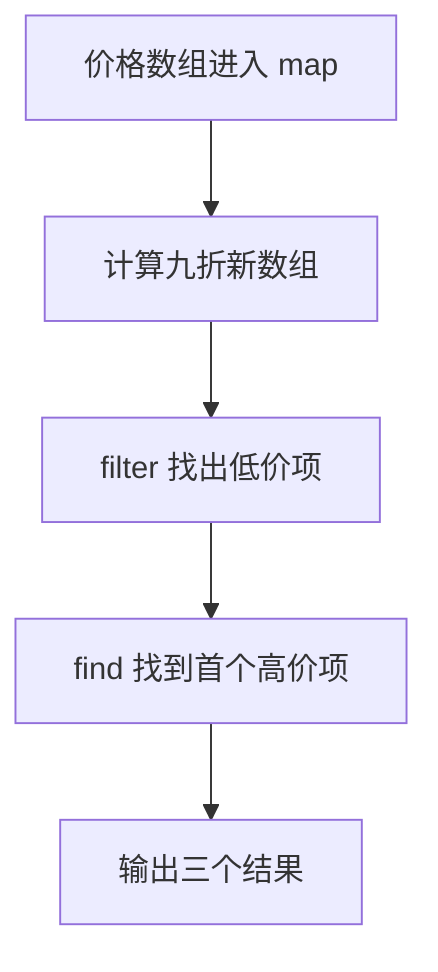

# Day 07：数组方法与回调

预计用时：60–90 分钟。

Day 03 里，你用 `for...of` 自己写循环。今天先不背“回调函数”这个词。假设原数组是 `[1, 2, 3]`，现在要得到 `[2, 4, 6]`：程序需要把 1、2、3 依次拿出来，每次乘以 2，再把三个结果放进新数组。`map` 负责重复取值，你只写“拿到一个值后怎么算”。把这条规则写成函数交给 `map`，再由 `map` 反复调用，它就是回调函数。

## 完成目标

- 使用 `map` 把每一项转换成新值。
- 使用 `filter` 保留满足条件的项。
- 使用 `find` 寻找第一项，并处理可能找不到的情况。
- 读懂箭头函数 `(item) => ...`。
- 理解回调的参数与返回值。

## `map`：每一项变成什么

```ts
const numbers = [1, 2, 3];
const doubled = numbers.map((number) => number * 2);
```

先把 `numbers.map((number) => number * 2)` 分成两部分：

- `numbers.map(...)`：从左到右读取 `numbers` 中的每一项，并收集每次处理后的结果。
- `(number) => number * 2`：当前项先放进临时变量 `number`，然后计算 `number * 2`。

对 `[1, 2, 3]`，程序实际做了三轮：

| 轮次 | 当前项进入 `number` | 箭头右侧计算 | 本轮交给 `map` 的值 |
| --- | --- | --- | --- |
| 1 | `1` | `1 * 2` | `2` |
| 2 | `2` | `2 * 2` | `4` |
| 3 | `3` | `3 * 2` | `6` |

`map` 把三轮交回来的值按顺序收集起来，所以 `doubled` 是新数组 `[2, 4, 6]`。`numbers` 仍然是 `[1, 2, 3]`。

箭头函数还要注意两种写法：

| 写法 | 每轮交回什么 | `map` 最后得到的新数组 |
| --- | --- | --- |
| `(number) => number * 2` | 自动交回乘法结果 | `[2, 4, 6]` |
| `(number) => { return number * 2; }` | `return` 明确交回乘法结果 | `[2, 4, 6]` |
| `(number) => { number * 2; }` | 没有 `return`，每轮交回 `undefined` | `[undefined, undefined, undefined]` |

因此，花括号不是“多写也一样”。一旦用了花括号，就要自己写 `return`。

## `filter`：哪些项要保留

```ts
const large = numbers.filter((number) => number >= 2);
```

`filter` 不会把数字改成 `true` 或 `false`。它只是用布尔结果决定原来的数字留不留下：

| 当前项 | 检查 `number >= 2` | 处理 |
| --- | --- | --- |
| `1` | `false` | 不放进新数组 |
| `2` | `true` | 保留原来的 `2` |
| `3` | `true` | 保留原来的 `3` |

所以 `large` 是 `[2, 3]`。可以把 `filter` 的规则读成一个问题：“当前这一项符合条件吗？”

## `find`：第一项在哪里

```ts
const found = numbers.find((number) => number === 2);
```

`find` 也逐项检查，但找到第一项后就停止：

| 当前项 | 检查 `number === 2` | 接下来做什么 |
| --- | --- | --- |
| `1` | `false` | 继续找 |
| `2` | `true` | 停止并返回 `2` |
| `3` | 不再检查 | 前一轮已经找到了 |

因此 `found` 是数字 `2`，不是数组 `[2]`。如果条件改成 `number === 9`，三项都不符合，结果就是 `undefined`。

如果数组里放的是对象，读取找到对象的属性前，先用 `if` 排除 `undefined`。排除后，TypeScript 才能确定这里确实是对象；这个“先判断，再把可能范围缩小”的过程叫类型收窄。Day 08 会学习更简洁的安全访问写法。

## 回调函数到底是什么

在 `numbers.map((number) => number * 2)` 中，你没有亲自调用 `(number) => number * 2`。`map` 每拿到一项，就替你调用一次这个小函数：

`map 取出当前项 → 把当前项交给 number → 执行箭头右侧 → 收集返回值`

“交给另一个功能，在需要时由它调用的函数”叫回调函数。这里的箭头函数就是回调。刚开始先把每一步保存为有名字的中间数组，不要连续写很多方法；这样更容易看出是哪一步得到了错误结果。

## 阅读完整示例

打开并右击运行 `example.ts`。依次找出 `map` 产生的新价格、`filter` 保留的价格，以及 `find` 返回的第一项。临时改变阈值，先预测三个结果再运行并恢复。

## 函数变量追踪

以 `map` 的第二轮为例：数组当前项是 `2`，所以参数 `number` 在这一轮暂时等于 `2`；这一轮结束后，这个临时值就不用了。下一轮参数会接到 `3`。

回调的返回值由数组方法接收：`map` 收集每轮的新值，`filter` 根据每轮的 `true` 或 `false` 决定保留哪一项，`find` 遇到第一个 `true` 就返回当前项。

## Example 实际输出

运行 `example.ts` 后，终端会按下面的顺序显示。先用代码推测结果，再逐行对照：

```text
打折后: 13.5, 72, 108, 40.5
低于 50: 13.5, 40.5
第一个至少 100: 120
```

## Example 代码流程图

运行 `example.ts` 前先沿图预测执行顺序；运行后再把每个节点对应到代码行。



## 独立练习导航

本日共有 2 道独立练习。每道题都有单独目录、说明、作答文件和解题结构提示；题目之间不共享代码。

| 目录 | 场景 | 类型 |
| --- | --- | --- |
| [practice01](./practice01/README.md) | Day 07：订单数组报告 | 主任务 |
| [practice02](./practice02/README.md) | 商品折扣筛选 | 闭卷迁移 |

右击任意练习目录中的 `practice.ts` 即可单独检查；命令行也可运行 `npm run beginner -- day07 practice02`。

## 常见错误

新数组里全是 `undefined` 时，先看箭头函数是否用了花括号却漏写 `return`。想保留符合条件的原数据，用 `filter`；想把每项变成另一种值，用 `map`。`find` 得到的是第一项或 `undefined`，不是数组，因此读取属性前要先判断是否找到。

### 错误代码示例

```ts
const orders = [
  { id: "A1", amount: 40 },
  { id: "B2", amount: 120 },
];

const ids = orders.map((order) => {
  order.id; // ❌ 使用花括号后漏写 return，每一项都会变成 undefined。
});

const largeOrder = orders.find((order) => order.amount >= 100);
console.log(largeOrder.id); // ❌ find 可能返回 undefined，不能直接读取 id。
```

### 正确写法

```ts
const orders = [
  { id: "A1", amount: 40 },
  { id: "B2", amount: 120 },
];

const ids = orders.map((order) => order.id);
// ✅ 单表达式箭头函数会隐式返回 order.id。

const largeOrder = orders.find((order) => order.amount >= 100);

if (largeOrder !== undefined) {
  console.log(largeOrder.id); // ✅ 收窄后才能确定对象存在。
}
```

## 拓展思考（不要求写代码）

如果先把所有订单 `map` 成只包含编号的字符串，再尝试筛选 `status === "done"`，为什么已经无法完成筛选，这说明数组操作的顺序会怎样影响后续可用信息？

## 解题结构提示

代码目录中的 `solution.ts` 与题目文档目录中的 `SOLUTION.md` 只提供带 TODO 的结构提示，不提供完整答案。

完成后再通过对应练习文档的“文件位置”链接查看 `solution.ts` 与 `SOLUTION.md`，重点对照三个数组方法各自保存的中间结果。

## 官方资料

- [Everyday Types：Arrays](https://www.typescriptlang.org/docs/handbook/2/everyday-types.html#arrays)
- [MDN：Array](https://developer.mozilla.org/docs/Web/JavaScript/Reference/Global_Objects/Array)
