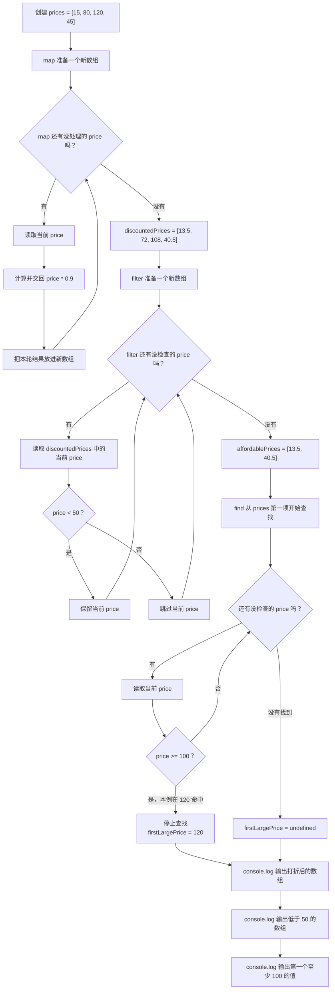

# Day 07：数组方法与回调

预计用时：60–90 分钟。

Day 03 里，你用循环自己逐项处理数组。今天先不背新名词。假设原数组是 `[1, 2, 3]`，现在要得到 `[2, 4, 6]`：程序需要把 1、2、3 依次拿出来，每次乘以 2，再把三个结果放进新数组。JavaScript 已经提供了负责重复取值的数组工具，你只需把“拿到一个值后怎么算”交给它。

## 写 Example 前先认识这些写法

今天四个方法都由数组提供，所以点号左边永远是“这一步要读取的数组”。它们不会因为调用本身而改写原数组容器。

| 写法 | 圆括号里传什么 | 返回什么 | 主要解决什么 |
| --- | --- | --- | --- |
| `items.map(callback)` | 如何把当前项变成新值的函数 | 与原数组等长的新数组 | 批量转换 |
| `items.filter(callback)` | 当前项要不要保留的函数 | 只含保留项的新数组 | 批量筛选 |
| `items.find(callback)` | 当前项是不是目标的函数 | 第一项匹配值，找不到是 `undefined` | 找一个结果 |
| `items.join(separator)` | 项与项之间使用的分隔文字 | 一个字符串 | 把数组整理成显示文字 |

最小示例：

```ts
const numbers = [1, 2, 3];
const doubled = numbers.map((number) => number * 2);
const large = numbers.filter((number) => number >= 2);
const found = numbers.find((number) => number === 2);

console.log(`Doubled: ${doubled.join(", ")}`);
console.log(`Large: ${large.join(", ")}`);
console.log(`Found: ${found}`);
```

实际输出：

```text
Doubled: 2, 4, 6
Large: 2, 3
Found: 2
```

回调参数 `number` 表示当前这一项，名字可以换，但它不是整个数组。`map` 收集回调交回的新值；`filter` 与 `find` 把回调结果当作“是/否”。`find` 遇到第一个 `true` 就停止，全部为 `false` 时返回 `undefined`。`join` 不接收回调；括号里的 `", "` 是相邻两项之间的分隔符，空数组会得到空字符串。

方法名都是小写。常见错误是漏写点号、把 `find` 误以为返回数组，或在带花括号的回调中忘记 `return`。

## 完成目标

- 使用 `map` 把每一项转换成新值。
- 使用 `filter` 保留满足条件的项。
- 使用 `find` 寻找第一项，并处理可能找不到的情况。
- 读懂箭头函数 `(item) => ...`。
- 理解回调的参数与返回值。

## `map`：每一项变成什么

```ts
const numbers = [1, 2, 3];
const doubled = numbers.map((number) => number * 2);
```

先把 `numbers.map((number) => number * 2)` 分成两部分：

- `numbers.map(...)`：从左到右读取 `numbers` 中的每一项，并收集每次处理后的结果。
- `(number) => number * 2`：当前项先放进临时变量 `number`，然后计算 `number * 2`。

对 `[1, 2, 3]`，程序实际做了三轮：

| 轮次 | 当前项进入 `number` | 箭头右侧计算 | 本轮交给 `map` 的值 |
| --- | --- | --- | --- |
| 1 | `1` | `1 * 2` | `2` |
| 2 | `2` | `2 * 2` | `4` |
| 3 | `3` | `3 * 2` | `6` |

`map` 把三轮交回来的值按顺序收集起来，所以 `doubled` 是新数组 `[2, 4, 6]`。`numbers` 仍然是 `[1, 2, 3]`。

箭头函数还要注意两种写法：

| 写法 | 每轮交回什么 | `map` 最后得到的新数组 |
| --- | --- | --- |
| `(number) => number * 2` | 自动交回乘法结果 | `[2, 4, 6]` |
| `(number) => { return number * 2; }` | `return` 明确交回乘法结果 | `[2, 4, 6]` |
| `(number) => { number * 2; }` | 没有 `return`，每轮交回 `undefined` | `[undefined, undefined, undefined]` |

因此，花括号不是“多写也一样”。一旦用了花括号，就要自己写 `return`。

## `filter`：哪些项要保留

```ts
const large = numbers.filter((number) => number >= 2);
```

`filter` 不会把数字改成 `true` 或 `false`。它只是用布尔结果决定原来的数字留不留下：

| 当前项 | 检查 `number >= 2` | 处理 |
| --- | --- | --- |
| `1` | `false` | 不放进新数组 |
| `2` | `true` | 保留原来的 `2` |
| `3` | `true` | 保留原来的 `3` |

所以 `large` 是 `[2, 3]`。可以把 `filter` 的规则读成一个问题：“当前这一项符合条件吗？”

## `find`：第一项在哪里

```ts
const found = numbers.find((number) => number === 2);
```

`find` 也逐项检查，但找到第一项后就停止：

| 当前项 | 检查 `number === 2` | 接下来做什么 |
| --- | --- | --- |
| `1` | `false` | 继续找 |
| `2` | `true` | 停止并返回 `2` |
| `3` | 不再检查 | 前一轮已经找到了 |

因此 `found` 是数字 `2`，不是数组 `[2]`。如果条件改成 `number === 9`，三项都不符合，结果就是 `undefined`。

如果数组里放的是对象，读取找到对象的属性前，先用 `if` 排除 `undefined`。排除后，TypeScript 才能确定这里确实是对象；这个“先判断，再把可能范围缩小”的过程叫类型收窄。Day 08 会学习更简洁的安全访问写法。

## 回调函数到底是什么

在 `numbers.map((number) => number * 2)` 中，你没有亲自调用 `(number) => number * 2`。`map` 每拿到一项，就替你调用一次这个小函数：

`map 取出当前项 → 把当前项交给 number → 执行箭头右侧 → 收集返回值`

“交给另一个功能，在需要时由它调用的函数”叫回调函数。这里的箭头函数就是回调。刚开始先把每一步保存为有名字的中间数组，不要连续写很多方法；这样更容易看出是哪一步得到了错误结果。

## 为什么要这样设计

`find` 知道怎样从左到右检查数组、找到后停止，却不知道你的业务里什么叫“需要处理”。如果每种查找规则都要发明一个新的数组方法，库会变得又多又难记。因此数组方法负责重复流程，你通过回调只提供“当前项是否符合”这条规则。`filter` 和 `map` 也是同样分工：库负责遍历与收集，你决定保留条件或转换结果。

例如，运维面板要找出第一台离线服务，可以把“`online` 是 `false`”作为匹配条件：

```ts
const servers = [
  { name: "api-1", online: true },
  { name: "api-2", online: false },
];

const firstOfflineServer = servers.find(
  (server) => server.online === false,
);
```

它与下面的花括号写法完全等价：

```ts
const firstOfflineServer = servers.find((server) => {
  return server.online === false;
});
```

每检查一台服务，回调返回 `true` 表示“当前服务匹配”，`find` 会立刻停止并交回这台服务；返回 `false` 表示“当前服务不匹配”，`find` 会继续检查下一台。如果错误地让每一轮都执行字面量 `return false`，就永远找不到结果。正确写法应直接返回题目要求的比较条件，不需要在条件后面再补一条 `return false`。

`filter` 也最好让每一轮都明确交回布尔比较结果。如果只在匹配分支写 `return true`，其他情况什么都不返回，那些轮次实际交回的是 `undefined`；`filter` 会把它当成“不保留”，结果有时碰巧正确，但代码没有清楚表达完整规则。直接返回一个条件判断，可以同时说明什么时候保留、什么时候不保留。

数组方法不能替你决定业务阈值，也不会保证一定找到结果；阈值来自题目，查找不到时结果仍是 `undefined`。另外，连续串联很多方法虽然更短，却会隐藏中间结果，初学阶段保留有名字的中间变量更容易排错。

## 阅读完整示例

打开并右击运行 `example.ts`。依次找出 `map` 产生的新价格、`filter` 保留的价格，以及 `find` 返回的第一项。临时改变阈值，先预测三个结果再运行并恢复。

## 函数变量追踪

以 `map` 的第二轮为例：数组当前项是 `2`，所以参数 `number` 在这一轮暂时等于 `2`；这一轮结束后，这个临时值就不用了。下一轮参数会接到 `3`。

回调的返回值由数组方法接收：`map` 收集每轮的新值，`filter` 根据每轮的 `true` 或 `false` 决定保留哪一项，`find` 遇到第一个 `true` 就返回当前项。

## Example 实际输出

运行 `example.ts` 后，终端会按下面的顺序显示。先用代码推测结果，再逐行对照：

```text
打折后: 13.5, 72, 108, 40.5
低于 50: 13.5, 40.5
第一个至少 100: 120
```

## Example 代码流程图

运行 `example.ts` 前先沿图预测执行顺序；运行后再把每个节点对应到代码行。



## 官方手册扩展阅读（可选）

完成当天教程后，如想继续确认概念，只选 [Day 07 对应的 1 篇官方阅读](../OFFICIAL-READING.md#day-07) 即可。它不是练习前置，不需要先读完才能作答。

## 独立练习导航

本日共有 2 道独立练习。每道题都有单独目录、说明、作答文件和完整参考答案；题目之间不共享代码。

| 目录 | 场景 | 类型 |
| --- | --- | --- |
| [practice01](./practice01/README.md) | Day 07：订单数组报告 | 主任务 |
| [practice02](./practice02/README.md) | 商品折扣筛选 | 闭卷迁移 |

右击任意练习目录中的 `practice.ts` 即可单独检查；命令行也可运行 `npm run beginner -- day07 practice02`。

## 常见错误

新数组里全是 `undefined` 时，先看箭头函数是否用了花括号却漏写 `return`。想保留符合条件的原数据，用 `filter`；想把每项变成另一种值，用 `map`。`find` 得到的是第一项或 `undefined`，不是数组，因此读取属性前要先判断是否找到。

### 错误代码示例

假设构建服务要汇总每个源文件的警告数量，并找出第一个存在警告的文件。开发者一直使用“至少有一个文件会报警”的测试数据，于是同时做了两个危险假设：`map` 的花括号会自动返回数量，`find` 一定能找到文件。某次构建没有任何警告，问题才暴露：

```ts
const buildFiles = [
  { path: "src/app.ts", warningCount: 0 },
  { path: "src/api.ts", warningCount: 0 },
];

const warningCounts = buildFiles.map((file) => {
  file.warningCount; // ❌ 有花括号却没有 return。
});

const firstProblemFile = buildFiles.find(
  (file) => file.warningCount > 0,
);

console.log(`Warning counts: ${warningCounts.join(", ")}`);
console.log(`First problem: ${firstProblemFile.path}`);
// ❌ find 可能返回 undefined，不能直接读取 path。
```

TypeScript 会先指出 `firstProblemFile` 可能是 `undefined`。如果忽略错误运行 JavaScript，第一行会显示两个空位置，因为 `map` 每轮都交回 `undefined`；随后读取 `firstProblemFile.path` 时程序会因 `firstProblemFile` 实际是 `undefined` 而中断。

这类错误在项目中很常见：固定测试数据让 `find` 总能命中，直到代码质量提升、筛选条件改变或接口返回空列表，隐藏的空结果才出现。

### 正确写法

```ts
const buildFiles = [
  { path: "src/app.ts", warningCount: 0 },
  { path: "src/api.ts", warningCount: 0 },
];

const warningCounts = buildFiles.map(
  (file) => file.warningCount,
);
// ✅ 单表达式箭头函数会自动交回 warningCount。
const firstProblemFile = buildFiles.find(
  (file) => file.warningCount > 0,
);

console.log(`Warning counts: ${warningCounts.join(", ")}`);

if (firstProblemFile !== undefined) {
  console.log(`First problem: ${firstProblemFile.path}`);
} else {
  console.log("First problem: none");
}
```

实际输出：

```text
Warning counts: 0, 0
First problem: none
```

单表达式箭头函数会把 `file.warningCount` 自动交给 `map`；若改用花括号，就要明确写 `return file.warningCount;`。`find` 的返回类型保留了“可能没找到”，所以调用处必须同时处理文件对象和 `undefined` 两条路线。

## 面试时怎么回答

**问：`map`、`filter`、`find` 的回调分别要交回什么？**

可以这样回答：

三者都会逐项调用回调，但处理回调结果的方式不同。`map` 收集每轮返回值，得到与原数组等长的新数组；`filter` 用每轮结果判断是否保留当前原始项；`find` 在第一次得到真值时返回当前项，全部不匹配则返回 `undefined`。这三个方法不会因为调用本身修改原数组容器，但回调如果主动修改对象属性，数组中的对象仍可能变化。

箭头右侧是单个表达式时会自动交回结果；用了 `{}` 就要明确 `return`。因此 `servers.find(server => server.online === false)` 与 `servers.find(server => { return server.online === false; })` 等价。单独写字面量 `return false` 表示“所有当前项都不匹配”，实际项目中常会因此让查找结果始终是 `undefined`。

官方参考：

- [MDN：Array.prototype.map()](https://developer.mozilla.org/en-US/docs/Web/JavaScript/Reference/Global_Objects/Array/map)
- [MDN：Array.prototype.filter()](https://developer.mozilla.org/en-US/docs/Web/JavaScript/Reference/Global_Objects/Array/filter)
- [MDN：Array.prototype.find()](https://developer.mozilla.org/en-US/docs/Web/JavaScript/Reference/Global_Objects/Array/find)

## 拓展思考（不要求写代码）

如果先把所有订单 `map` 成只包含编号的字符串，再尝试筛选 `status === "done"`，为什么已经无法完成筛选，这说明数组操作的顺序会怎样影响后续可用信息？

## 完整参考答案

代码目录中的 `solution.ts` 提供可运行的完整答案，题目文档目录中的 `SOLUTION.md` 解释直接调用逻辑。

完成后再通过对应练习文档的“文件位置”链接查看 `solution.ts` 与 `SOLUTION.md`，重点对照三个数组方法各自保存的中间结果。
