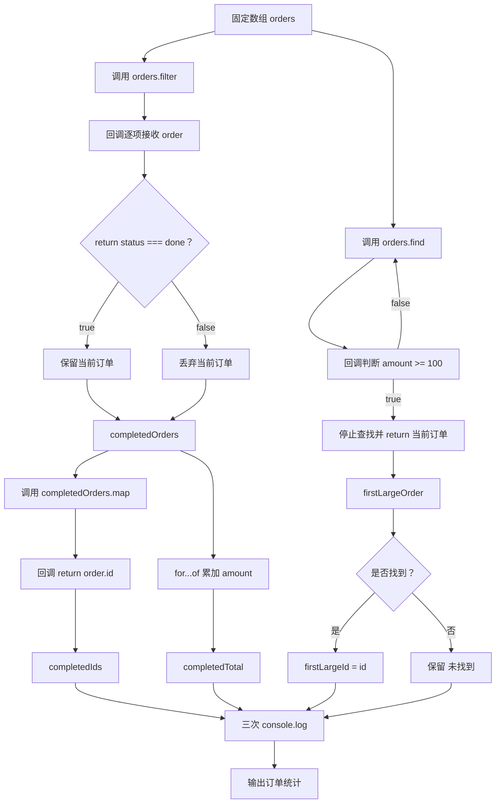

# DAY07 · Practice 01：订单数组报告

[返回当天课程](../README.md)

## 文件位置

- 作答文件：[practice.ts](../../../day07/practice01/practice.ts)
- 完整参考答案代码：[solution.ts](../../../day07/practice01/solution.ts)
- 方案说明：[SOLUTION.md](./SOLUTION.md)

## 场景背景

运营人员收到四笔包含编号、金额和状态的订单，需要生成一份当日处理摘要。报告只关心已完成订单的编号与总额，同时还要定位第一笔达到大额标准的订单，方便人工复核。所有结果都应从订单数组推导，并且不能改变原始订单记录。

这是一道完整、独立的主练习。不要导入其他 practice 文件夹中的代码。

## 数据流

先沿变量名看数据怎样分叉和汇合；`──>` 表示值被交给下一步。

```text
orders
   │
   ├── filter ──> completedOrders
   │                 ├── map ──> completedIds
   │                 └── for...of 累加 ──> completedTotal
   │
   └── find ──> firstLargeOrder
                     └── if 找到 ──> firstLargeId

completedIds + completedTotal + firstLargeId ──> 报告输出
```

在 `practice.ts` 中从零完成“订单数组报告”。

创建 `orders`，固定为四个对象：

| id | amount | status |
| --- | ---: | --- |
| A1 | 40 | done |
| B2 | 80 | pending |
| C3 | 60 | done |
| D4 | 120 | pending |

程序要求：

1. 使用 `filter` 创建 `completedOrders`，只保留 `status === "done"` 的订单。
2. 使用 `map` 创建 `completedIds`，把已完成订单转换为编号字符串。
3. 使用 `find` 创建 `firstLargeOrder`，寻找第一笔 `amount >= 100` 的订单。
4. 使用 `for...of` 累加 `completedOrders` 的金额到 `completedTotal`。
5. 创建 `firstLargeId`，初始为 `"未找到"`；只有查找结果不是 `undefined` 时才改成该订单编号。
6. 使用 `.join(", ")` 连接已完成编号并输出报告。

精确期望输出：

```text
已完成订单: A1, C3
完成总额: 100
第一笔大额订单: D4
```

限制：

- 筛选、转换和查找必须分别使用 `filter`、`map`、`find`。
- 不得假设 `find` 一定成功。
- 不得直接把编号列表、总额或 D4 写入输出。
- 不得修改原数组中的对象。

完成标准：

- 能用一句话区分三个数组方法。
- 能解释每个回调返回的内容。
- 右击运行 `practice.ts`，三行输出完全一致。

## `return false` 在 `find` 回调里是什么意思

本题把“大额边界”定为 100，也就是金额达到或超过 100。下面是实际项目中常见的错误写法：

```ts
const firstLargeOrder = orders.find((order) => {
  return false;
});
```

它对 `find` 的意思是：“当前订单不匹配，请继续检查下一笔。”每轮都返回 `false`，四笔订单都会被判定为不匹配，最终得到 `undefined`。正确回调应直接返回金额比较结果：

你写的简洁形式没有问题：

```ts
const firstLargeOrder = orders.find((order) => order.amount >= 100);
```

箭头右侧只有一个表达式时，比较结果会自动交给 `find`，所以看不到单独的 `return`。它等价于带花括号并明确 `return order.amount >= 100;`。

## 本题易漏语法

单表达式箭头可省略 return；写了 {} 就必须显式 return。回调参数只在回调内部可用。

## 代码流程图



## 起始代码

固定订单、数组方法调用、结果变量和输出已提供。三个回调的 return、累加循环和查找后的判断由你完成。

```ts
const orders = [
  { id: "A1", amount: 40, status: "done" },
  { id: "B2", amount: 80, status: "pending" },
  { id: "C3", amount: 60, status: "done" },
  { id: "D4", amount: 120, status: "pending" },
];

const completedOrders = orders.filter((order) => {
  return false; // TODO：替换为当前订单是否已完成的比较结果。
});

const completedIds = completedOrders.map((order) => {
  return ""; // TODO：替换为当前订单 id。
});

const firstLargeOrder = orders.find((order) => {
  return false; // TODO：替换为当前订单金额是否达到 100。
});

let completedTotal = 0;
for (const order of completedOrders) {
  // TODO：把当前订单金额累加到 completedTotal。
}

let firstLargeId = "未找到";
if (false) {
  // TODO：把 false 换成“确实找到订单”的判断，并保存订单 id。
}

console.log(`已完成订单: ${completedIds.join(", ")}`);
console.log(`完成总额: ${completedTotal}`);
console.log(`第一笔大额订单: ${firstLargeId}`);
```

## 写完后自检

- 如果大额边界改成 130，`find` 会返回什么，`firstLargeId` 最后应保留哪个值？
- 如果给 `filter` 或 `find` 的花括号回调漏写 `return`，每一轮实际交回什么，结果数组或查找结果会怎样？
- 为什么先保留完整的 `completedOrders`，再从它生成编号和总额，而不是一开始只留下编号？

## 文件

- 在 `practice.ts` 中独立作答。
- 建议先在 `practice.ts` 独立作答；完成后再查看 `solution.ts` 完整答案和 `SOLUTION.md` 调用说明。
