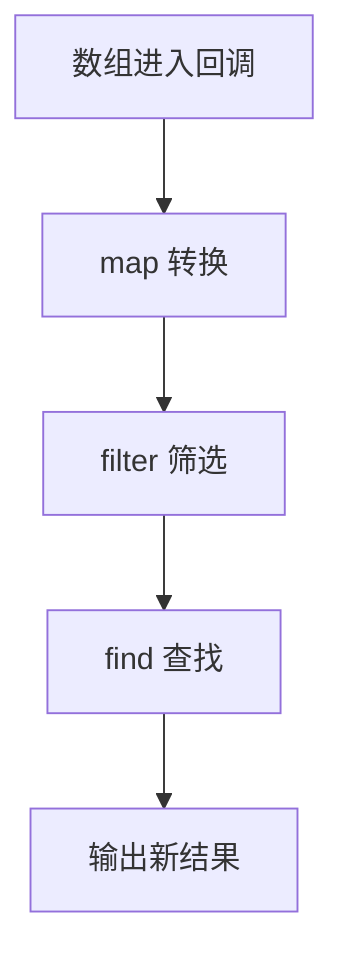

# DAY07 · Practice 01：Day 07：订单数组报告

[返回当天课程](../README.md)

## 文件位置

- 作答文件：[practice.ts](../../../day07/practice01/practice.ts)
- 结构提示代码：[solution.ts](../../../day07/practice01/solution.ts)
- 方案说明：[SOLUTION.md](./SOLUTION.md)

## 场景背景

运营人员收到四笔包含编号、金额和状态的订单，需要生成一份当日处理摘要。报告只关心已完成订单的编号与总额，同时还要定位第一笔达到大额标准的订单，方便人工复核。所有结果都应从订单数组推导，并且不能改变原始订单记录。

这是一道完整、独立的主练习。不要导入其他 practice 文件夹中的代码。

## 代码流程图



在 `practice.ts` 中从零完成“订单数组报告”。

创建 `orders`，固定为四个对象：

| id | amount | status |
| --- | ---: | --- |
| A1 | 40 | done |
| B2 | 80 | pending |
| C3 | 60 | done |
| D4 | 120 | pending |

程序要求：

1. 使用 `filter` 创建 `completedOrders`，只保留 `status === "done"` 的订单。
2. 使用 `map` 创建 `completedIds`，把已完成订单转换为编号字符串。
3. 使用 `find` 创建 `firstLargeOrder`，寻找第一笔 `amount >= 100` 的订单。
4. 使用 `for...of` 累加 `completedOrders` 的金额到 `completedTotal`。
5. 创建 `firstLargeId`，初始为 `"未找到"`；只有查找结果不是 `undefined` 时才改成该订单编号。
6. 使用 `.join(", ")` 连接已完成编号并输出报告。

精确期望输出：

```text
已完成订单: A1, C3
完成总额: 100
第一笔大额订单: D4
```

限制：

- 筛选、转换和查找必须分别使用 `filter`、`map`、`find`。
- 不得假设 `find` 一定成功。
- 不得直接把编号列表、总额或 D4 写入输出。
- 不得修改原数组中的对象。

完成标准：

- 能用一句话区分三个数组方法。
- 能解释每个回调返回的内容。
- 右击运行 `practice.ts`，三行输出完全一致。

## 本题易漏语法

单表达式箭头可省略 return；写了 {} 就必须显式 return。回调参数只在回调内部可用。

## 文件

- 在 `practice.ts` 中独立作答。
- 独立完成并自检后，再查看 `solution.ts` 的 TODO 解题结构与 `SOLUTION.md` 的结构提示；它们不提供完整答案。
