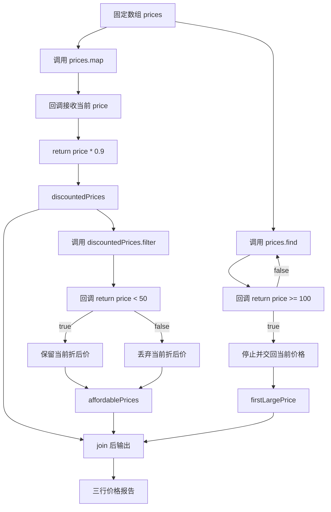

# DAY07 · Practice 02：商品折扣筛选

[返回当天课程](../README.md)

## 文件位置

- 作答文件：[practice.ts](../../../day07/practice02/practice.ts)
- 完整参考答案代码：[solution.ts](../../../day07/practice02/solution.ts)
- 方案说明：[SOLUTION.md](./SOLUTION.md)

## 场景背景

商店准备对原价 `[15, 80, 120, 45]` 的四件商品执行统一折扣，并为顾客整理选购建议。页面既要展示全部折后价格，也要筛出低于预算线的商品，并找到第一件达到高价标准的原价商品。目标是从同一组价格数据生成三项互有关联的结果。

这次把相同的数组方法迁移到纯数字价格。关闭 `example.ts` 后，按“原价、折后价、预算筛选”三条路线独立实现。

## 数据流

先沿变量名看数据怎样分叉和汇合；`──>` 表示值被交给下一步。

```text
prices
   ├── map(九折) ──> discountedPrices
   │                      └── filter ──> affordablePrices
   └── find(大额边界) ──> firstLargePrice

discountedPrices + affordablePrices + firstLargePrice ──> 输出
```

## 必须练到的能力

使用 map、filter、find；回调带花括号时明确 return。

- 固定使用 `prices = [15, 80, 120, 45]`。
- `map` 为每个原价计算九折价格，得到 `discountedPrices`。
- 从折后数组中 `filter` 出严格低于 50 的 `affordablePrices`。
- 从原价数组中 `find` 第一项大于或等于 100 的 `firstLargePrice`。
- 不得导入 `practice01` 或直接调用其他练习的实现。
- 输出必须由变量、计算或函数返回值产生，不把整行结果写死。
- 每个参数、局部变量和返回值都应能在流程图中找到位置。

## 精确期望输出

```text
打折后: 13.5, 72, 108, 40.5
低于 50: 13.5, 40.5
第一个至少 100: 120
```

## 和 Practice 01 的区别

Practice 01 处理订单对象：先按状态筛选，再提取编号、累计金额，并处理“可能找不到”的情况。这里处理纯数字数组，折后数组会继续流入预算筛选，而高价查找仍读取原价数组；两条路线的数据来源不同。

## 迁移挑战（不要求提交输出）

另建 `statusCodes = [200, 404, 204, 500]`：用 `map` 生成每项是否成功的布尔数组，用 `filter` 保留错误状态码，再用 `find` 找第一项“没有响应正文”的 204。不要改动本题原输出；先在纸上预测三个结果数组/值，再单独运行核对。

## 代码流程图



## 起始代码

固定价格、三个数组方法调用和输出已提供。请完成 map、filter、find 回调里的 return。

```ts
const prices = [15, 80, 120, 45];

const discountedPrices = prices.map((price) => {
  return 0; // TODO：替换为当前价格的九折结果。
});

const affordablePrices = discountedPrices.filter((price) => {
  return false; // TODO：替换为当前折后价是否严格低于 50。
});

const firstLargePrice = prices.find((price) => {
  return false; // TODO：替换为当前原价是否至少为 100。
});

console.log(`打折后: ${discountedPrices.join(", ")}`);
console.log(`低于 50: ${affordablePrices.join(", ")}`);
console.log(`第一个至少 100: ${firstLargePrice}`);
```

## 写完后自检

- 如果某件商品折后价格恰好是 50，为什么它不会进入“低于 50”的结果？
- 如果原价数组中删除 120，`find` 会得到什么？若页面不能显示 `undefined`，还需要在哪一步补缺失处理？
- 为什么高价查找使用原价数组，而预算筛选使用折后数组？交换数据来源会改变哪条业务含义？

## 文件

建议先在上方链接的 `practice.ts` 独立作答；完成后再查看 `solution.ts` 完整答案和 `SOLUTION.md` 调用说明。
