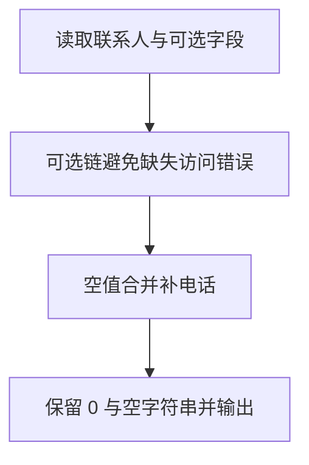

# Day 08：缺失值与安全访问

预计用时：60–90 分钟。

Day 07 的 `find` 可能找不到名字，通讯录中的电话也可能没有填写。程序如果直接读取一个不存在的值，就可能报错。今天会先承认“这个值可能没有”，再用 `?.` 安全读取，用 `??` 补上显示文字。

## 完成目标

- 理解 `undefined` 与 `null` 表示缺失值。
- 使用 `?` 描述可选属性。
- 使用 `?.` 在前一层存在时继续访问。
- 使用 `??` 只为 `null` 或 `undefined` 提供默认值。
- 区分 `??` 与 `||` 对 0、空字符串、`false` 的不同处理。
- 不使用非空断言 `!` 掩盖风险。

## `undefined` 和 `null` 表示什么

- `undefined` 常见于“没有找到”或“这个属性没有填写”。
- `null` 通常表示代码明确放入了一个“这里没有值”的标记。

两者都表示当前没有可用数据。重点不是背它们的来源，而是看到类型中有 `undefined` 或 `null` 时，先处理缺失情况，再读取属性。

## 可选属性

```ts
const user: { name: string; phone?: string } = {
  name: "Lin",
};
```

`phone?: string` 可以拆开读：

| 部分 | 含义 |
| --- | --- |
| `phone` | 属性名 |
| `?` | 这个属性允许不出现 |
| `string` | 如果出现，它的值必须是字符串 |

因此 `user.phone` 可能得到电话号码，也可能得到 `undefined`。TypeScript 会保留这个提醒，不允许你直接假设电话一定存在。

## 可选链 `?.`

下面单独看安全访问的写法，假设 `user` 还有一个可以缺失的 `address` 属性：

```ts
const city = user.address?.city;
```

把 `user.address?.city` 按顺序读：

1. 先读取 `user.address`。
2. 如果 `address` 存在，继续读取它的 `city`。
3. 如果 `address` 不存在，就停在这里，整个表达式得到 `undefined`。

`?.` 的作用是“缺失时停止”，不会自动显示“未填写”。需要默认文字时，还要配合 `??`。

## 空值合并 `??`

```ts
const shownCity = city ?? "未填写";
```

`??` 先看左侧有没有真正缺失：

| `city` 的值 | `city ?? "未填写"` 的结果 |
| --- | --- |
| `"成都"` | `"成都"` |
| `""` | 保留空字符串 `""` |
| `undefined` | `"未填写"` |
| `null` | `"未填写"` |

`||` 的范围更宽，它还会把 `0`、`""` 和 `false` 当成“不成立”。这些值有时是合法数据，例如分数可以是 0。只想处理真正缺失的 `null` 和 `undefined` 时，使用 `??`。

## 不要用非空断言跳过处理

`foundUser!.name` 中的 `!` 只是告诉 TypeScript：“不用提醒，我保证它存在。”程序运行时不会因此多做一次检查。如果实际没有找到用户，读取 `name` 仍会出错。初学阶段优先用 `if` 明确判断，或使用 `?.` 和 `??`。

## 阅读完整示例

打开并右击运行 `example.ts`。观察缺少电话的联系人如何得到默认值，同时数字 0 和空字符串为何被保留。临时把搜索名字改成不存在的名字，先预测四行输出，再运行并恢复。

## Example 实际输出

运行 `example.ts` 后，终端会按下面的顺序显示。先用代码推测结果，再逐行对照：

```text
联系人: Mei
电话: 未提供
分数显示: 0
昵称显示: ""
```

## Example 代码流程图

运行 `example.ts` 前先沿图预测执行顺序；运行后再把每个节点对应到代码行。



## 独立练习导航

本日共有 2 道独立练习。每道题都有单独目录、说明、作答文件和解题结构提示；题目之间不共享代码。

| 目录 | 场景 | 类型 |
| --- | --- | --- |
| [practice01](./practice01/README.md) | Day 08：联系人安全摘要 | 主任务 |
| [practice02](./practice02/README.md) | 联系人缺省值 | 闭卷迁移 |

右击任意练习目录中的 `practice.ts` 即可单独检查；命令行也可运行 `npm run beginner -- day08 practice02`。

## 常见错误

结果仍然显示 `undefined` 时，检查是否只写了 `?.`，却没有用 `??` 提供默认文字。合法的 0 被换成默认值时，检查是否误用了 `||`。代码中出现 `!` 后不再报类型错误，也不代表运行时安全，它没有检查数据是否真的存在。

### 错误代码示例

```ts
type Contact = { address?: { city?: string } };

function showContact(
  selectedContact: Contact | undefined,
  score: number | undefined,
): void {
  const displayedScore = score || 100;
  // ❌ score 为有效的 0 时，|| 仍会错误改成 100。

  const city = selectedContact!.address!.city;
  // ❌ ! 只让编译器暂时相信值存在，运行时仍可能报错。

  console.log(displayedScore, city);
}
```

### 正确写法

```ts
type Contact = { address?: { city?: string } };

function showContact(
  selectedContact: Contact | undefined,
  score: number | undefined,
): void {
  const displayedScore = score ?? 100;
  // ✅ 只有 score 为 null 或 undefined 时才使用 100。

  const city = selectedContact?.address?.city ?? "未填写";
  // ✅ 每一层都安全访问，并在确实缺失时提供默认值。

  console.log(displayedScore, city);
}
```

## 拓展思考（不要求写代码）

若把 `score ?? 100` 改成 `score || 100`，当前分数为什么会从合法的 0 变成 100，而 `??` 不会？

## 解题结构提示

代码目录中的 `solution.ts` 与题目文档目录中的 `SOLUTION.md` 只提供带 TODO 的结构提示，不提供完整答案。

完成后再通过对应练习文档的“文件位置”链接查看 `solution.ts` 与 `SOLUTION.md`，重点对照每一层缺失值是怎样被处理的。

## 官方资料

- [Everyday Types：Optional Properties](https://www.typescriptlang.org/docs/handbook/2/everyday-types.html#optional-properties)
- [Everyday Types：null and undefined](https://www.typescriptlang.org/docs/handbook/2/everyday-types.html#null-and-undefined)
