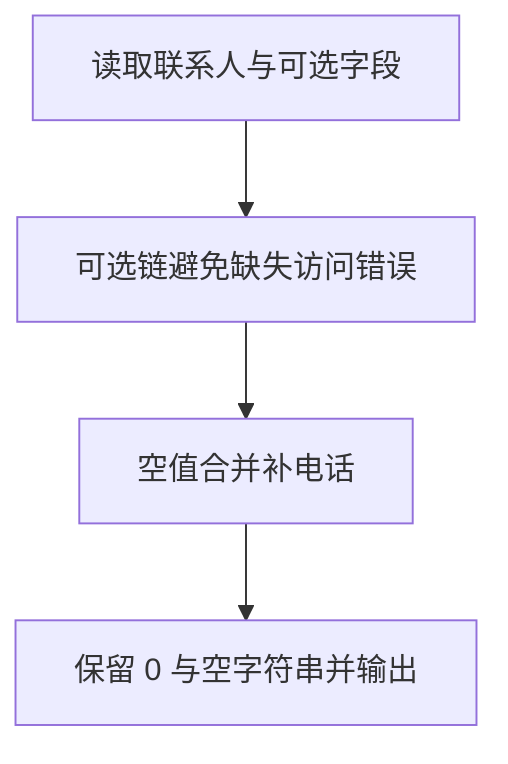

# Day 08：缺失值与安全访问

预计用时：60–90 分钟。

`find` 可能找不到项目，对象的可选属性也可能不存在。今天学习把这种可能性诚实地写进类型，并使用 `?.` 和 `??` 安全地生成显示内容。

## 完成目标

- 理解 `undefined` 与 `null` 表示缺失值。
- 使用 `? `描述可选属性。
- 使用 `?.` 在前一层存在时继续访问。
- 使用 `??` 只为 `null` 或 `undefined` 提供默认值。
- 区分 `??` 与 `||` 对 0、空字符串、`false` 的不同处理。
- 不使用非空断言 `!` 掩盖风险。

## 可选属性

```ts
const user: { name: string; phone?: string } = {
  name: "Lin",
};
```

`phone?: string` 表示属性可以是字符串，也可以不存在。读取它时，TypeScript 会保留“可能为 `undefined`”的提醒。

## 可选链 `?.`

```ts
const city = user.address?.city;
```

如果 `address` 存在，就继续读取 `city`；如果不存在，整个表达式得到 `undefined`，不会因为访问缺失对象而崩溃。可选链负责安全停止，但不会自动提供显示文字。

## 空值合并 `??`

```ts
const shownCity = city ?? "未填写";
```

只有左侧是 `null` 或 `undefined` 时，才使用右侧默认值。

`||` 的范围更宽，它还会把 `0`、`""` 和 `false` 当作不成立。当这些值是合法数据时，使用 `||` 会误换成默认值；只处理真正缺失时应使用 `??`。

## 不要用非空断言跳过处理

`foundUser!.name` 只是在告诉编译器“相信我”，不会增加任何运行时检查。如果保证错误，程序仍会崩溃。初学阶段优先显式判断、`?.` 与 `??`。

## 阅读完整示例

打开并右击运行 `example.ts`。观察缺少电话的联系人如何得到默认值，同时数字 0 和空字符串为何被保留。临时把搜索名字改成不存在的名字，先预测四行输出，再运行并恢复。

## Example 代码流程图

运行 `example.ts` 前先沿图预测执行顺序；运行后再把每个节点对应到代码行。



## 独立练习导航

本日共有 2 道独立练习。每道题都有单独目录、说明、作答文件和解题结构提示；题目之间不共享代码。

| 目录 | 场景 | 类型 |
| --- | --- | --- |
| [practice01](./practice01/README.md) | Day 08：联系人安全摘要 | 主任务 |
| [practice02](./practice02/README.md) | 联系人缺省值 | 闭卷迁移 |

右击任意练习目录中的 `practice.ts` 即可单独检查；命令行也可运行 `npm run beginner -- day08 practice02`。

## 常见错误

`?.` 不会自动提供默认文字；`??` 只处理 `null` 与 `undefined`；`||` 会误替换有效的 0 和空字符串；非空断言不会产生运行时保护。

### 错误代码示例

```ts
type Contact = { address?: { city?: string } };

function showContact(
  selectedContact: Contact | undefined,
  score: number | undefined,
): void {
  const displayedScore = score || 100;
  // ❌ score 为有效的 0 时，|| 仍会错误改成 100。

  const city = selectedContact!.address!.city;
  // ❌ ! 只让编译器暂时相信值存在，运行时仍可能报错。

  console.log(displayedScore, city);
}
```

### 正确写法

```ts
type Contact = { address?: { city?: string } };

function showContact(
  selectedContact: Contact | undefined,
  score: number | undefined,
): void {
  const displayedScore = score ?? 100;
  // ✅ 只有 score 为 null 或 undefined 时才使用 100。

  const city = selectedContact?.address?.city ?? "未填写";
  // ✅ 每一层都安全访问，并在确实缺失时提供默认值。

  console.log(displayedScore, city);
}
```

## 拓展思考（不要求写代码）

若把 `score ?? 100` 改成 `score || 100`，当前分数为什么会从合法的 0 变成 100，而 `??` 不会？

## 解题结构提示

代码目录中的 `solution.ts` 与题目文档目录中的 `SOLUTION.md` 只提供带 TODO 的结构提示，不提供完整答案。

完成后再通过对应练习文档的“文件位置”链接查看 `solution.ts` 与 `SOLUTION.md`，重点对照每一层缺失值是怎样被处理的。

## 官方资料

- [Everyday Types：Optional Properties](https://www.typescriptlang.org/docs/handbook/2/everyday-types.html#optional-properties)
- [Everyday Types：null and undefined](https://www.typescriptlang.org/docs/handbook/2/everyday-types.html#null-and-undefined)
