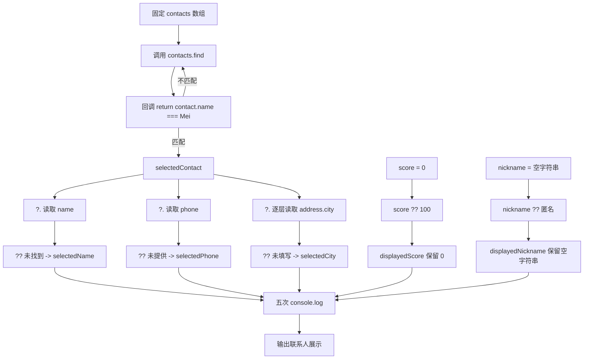

# DAY08 · Practice 01：联系人安全摘要

[返回当天课程](../README.md)

## 文件位置

- 作答文件：[practice.ts](../../../day08/practice01/practice.ts)
- 完整参考答案代码：[solution.ts](../../../day08/practice01/solution.ts)
- 方案说明：[SOLUTION.md](./SOLUTION.md)

## 场景背景

客服系统保存了 Lin 和 Mei 的联系人资料，但电话、地址与城市等字段不一定完整。客服选择 Mei 后，需要安全生成姓名、电话和城市摘要；同一页面还要正确显示可能为 0 的分数与可能为空字符串的昵称。目标是在数据缺失时提供合适提示，同时保留真实存在的“空值感”数据。

这是一道完整、独立的主练习。不要导入其他 practice 文件夹中的代码。

## 数据流

先沿变量名看数据怎样分叉和汇合；`──>` 表示值被交给下一步。

```text
contacts
   └── find ──> selectedContact
                    ├── ?.name ?? 后备值 ──> selectedName
                    ├── ?.phone ?? 后备值 ──> selectedPhone
                    └── ?.address?.city ?? 后备值 ──> selectedCity
score ──> ?? ──> displayedScore
nickname ──> ?? ──> displayedNickname
五个显示值 ──> 摘要输出
```

在 `practice.ts` 中从零完成“联系人安全摘要”。

声明 `contacts`，显式标注为具有下列形状的对象数组：

- 必填 `name: string`。
- 可选 `phone?: string`。
- 可选 `address?: { city?: string }`。

固定数据：

- 第一项是 `{ name: "Lin", phone: "13800000000", address: { city: "上海" } }`。
- 第二项是 `{ name: "Mei", address: {} }`。

程序要求：

1. 使用 `find` 创建 `selectedContact`，查找名字为 `"Mei"` 的联系人。
2. 使用 `selectedContact?.name ?? "未找到"` 得到 `selectedName`。
3. 用相同思路得到 `selectedPhone`，缺失时显示 `"未提供"`。
4. 安全访问嵌套城市得到 `selectedCity`，缺失时显示 `"未填写"`。
5. 声明 `score: number | undefined = 0` 和 `nickname: string | undefined = ""`。
6. 使用 `??` 为分数提供默认值 100、为昵称提供默认值 `"匿名"`，并用 `JSON.stringify` 显示昵称。

精确期望输出：

```text
联系人: Mei
电话: 未提供
城市: 未填写
分数: 0
昵称: ""
```

限制：

- 不使用非空断言 `!` 或类型断言 `as`。
- 不使用 `||` 提供默认值。
- 不假设 `find` 一定成功。
- 所有结果必须从固定数据安全推导。

完成标准：

- 能指出每条可选链可能在哪一层停止。
- 0 和空字符串不会被默认值替换。
- 右击运行 `practice.ts`，五行输出完全一致。

## 本题易漏语法

?. 是安全访问，?? 只在 null/undefined 时使用后备值；不要与普通点号或 || 混淆。

## 代码流程图



## 起始代码

固定联系人、查找调用、用于比较的 0/空字符串和输出都已提供。查找回调、安全访问和空值合并表达式由你完成。

```ts
const contacts: {
  name: string;
  phone?: string;
  address?: { city?: string };
}[] = [
  { name: "Lin", phone: "13800000000", address: { city: "上海" } },
  { name: "Mei", address: {} },
];

const selectedContact = contacts.find((contact) => {
  return false; // TODO：替换为姓名是否为 "Mei"。
});

const selectedName = ""; // TODO：替换为安全读取姓名与默认值的表达式。
const selectedPhone = ""; // TODO：替换为安全读取电话与默认值的表达式。
const selectedCity = ""; // TODO：替换为逐层读取城市与默认值的表达式。
const score: number | undefined = 0;
const nickname: string | undefined = "";
const displayedScore = -1; // TODO：用 ?? 在缺失时选择 100。
const displayedNickname = "TODO"; // TODO：用 ?? 在缺失时选择“匿名”。

console.log(`联系人: ${selectedName}`);
console.log(`电话: ${selectedPhone}`);
console.log(`城市: ${selectedCity}`);
console.log(`分数: ${displayedScore}`);
console.log(`昵称: ${JSON.stringify(displayedNickname)}`);
```

## 写完后自检

- 如果查找名字改成 `"Noah"`，姓名、电话和城市三条安全访问会分别选择哪些后备值？
- 如果 `score` 改成 `undefined`，`nickname` 仍为空字符串，两项显示结果有什么不同？
- 为什么这里用 `??` 而不是 `||`？0、空字符串和 `undefined` 在两种运算符中分别怎样判断？

## 文件

- 在 `practice.ts` 中独立作答。
- 建议先在 `practice.ts` 独立作答；完成后再查看 `solution.ts` 完整答案和 `SOLUTION.md` 调用说明。
