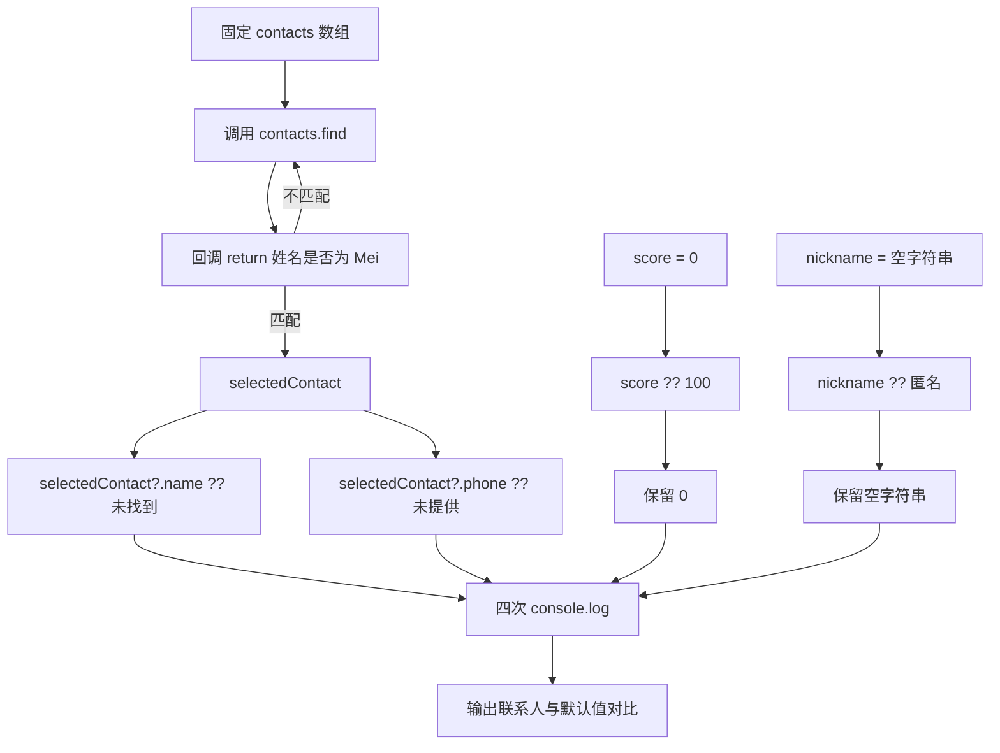

# DAY08 · Practice 02：活动报名资料缺省值

[返回当天课程](../README.md)

## 文件位置

- 作答文件：[practice.ts](../../../day08/practice02/practice.ts)
- 完整参考答案代码：[solution.ts](../../../day08/practice02/solution.ts)
- 方案说明：[SOLUTION.md](./SOLUTION.md)

## 场景背景

工作坊报名页有 Lin 和 Mei 两条联系记录，其中 Mei 没有填写电话号码。签到侧栏还要展示她当前为 0 的积分和允许为空的昵称。你要生成四行稳定的界面数据：资料真的缺失时显示提示，0 与空字符串则保留原值。

这题只处理一层可选电话，并用两个反例检查 `??` 的边界。关闭 `example.ts` 后，按下方固定数据独立实现。

## 数据流

先沿变量名看数据怎样分叉和汇合；`──>` 表示值被交给下一步。

```text
contacts
   └── find ──> selectedContact
                    ├── ?.name ?? 后备值 ──> selectedName
                    └── ?.phone ?? 后备值 ──> phone
score ──> ?? ──> displayedScore
nickname ──> ?? ──> displayedNickname
四个显示值 ──> 输出
```

## 必须练到的能力

使用可选属性、可选链和空值合并，不使用非空断言。

- `contacts` 的类型是 `Array<{ name: string; phone?: string }>`，数据为 Lin（有电话）与 Mei（无电话）。
- 用 `find` 查找 `"Mei"`；姓名缺失时显示 `"未找到"`，电话缺失时显示 `"未提供"`。
- 固定声明 `score: number | undefined = 0`、`nickname: string | undefined = ""`；分别用 `??` 提供 100 与 `"匿名"` 的后备值。
- 昵称输出使用 `JSON.stringify`，让保留下来的空字符串可以在终端中看见。
- 不得导入 `practice01` 或直接调用其他练习的实现。
- 输出必须由变量、计算或函数返回值产生，不把整行结果写死。
- 每个参数、局部变量和返回值都应能在流程图中找到位置。

## 精确期望输出

```text
联系人: Mei
电话: 未提供
分数显示: 0
昵称显示: ""
```

## 和 Practice 01 的区别

Practice 01 的输入数据包含可能缺少的嵌套地址，查找后要继续跨层安全访问。这里的电话只有一层可选属性，同时加入数字 0 和空字符串作为边界输入，用来分清“值存在但看起来为空”与 `undefined` 的区别。

## 迁移挑战（不要求提交输出）

不改现有四行输出，另建一个播放器设置对象：`volume?: number` 与 `caption?: string`。分别测试 `{ volume: 0, caption: "" }` 和空对象，用 `??` 生成显示值。重点观察 0、空字符串和真正缺失时，后备值分别会不会启用。

## 代码流程图



## 起始代码

固定联系人、find 调用、0/空字符串和输出都已给出。回调、安全属性访问与 ?? 表达式由你完成。

```ts
const contacts: Array<{ name: string; phone?: string }> = [
  { name: "Lin", phone: "13800000000" },
  { name: "Mei" },
];

const selectedContact = contacts.find((contact) => {
  return false; // TODO：替换为姓名是否为 "Mei"。
});

const selectedName = ""; // TODO：替换为安全读取姓名与默认值的表达式。
const phone = ""; // TODO：替换为安全读取电话与默认值的表达式。
const score: number | undefined = 0;
const nickname: string | undefined = "";
const displayedScore = -1; // TODO：用 ?? 在缺失时选择 100。
const displayedNickname = "TODO"; // TODO：用 ?? 在缺失时选择“匿名”。

console.log(`联系人: ${selectedName}`);
console.log(`电话: ${phone}`);
console.log(`分数显示: ${displayedScore}`);
console.log(`昵称显示: ${JSON.stringify(displayedNickname)}`);
```

## 写完后自检

- 如果查找名字改成不存在的 `"Noah"`，联系人和电话两行应分别显示什么？
- 如果 `score` 与 `nickname` 都改成 `undefined`，两个后备值会在什么情况下启用？
- 为什么要先用 `?.` 安全读取联系人字段，再用 `??` 处理缺失，而不能用非空断言跳过检查？

## 文件

建议先在上方链接的 `practice.ts` 独立作答；完成后再查看 `solution.ts` 完整答案和 `SOLUTION.md` 调用说明。
