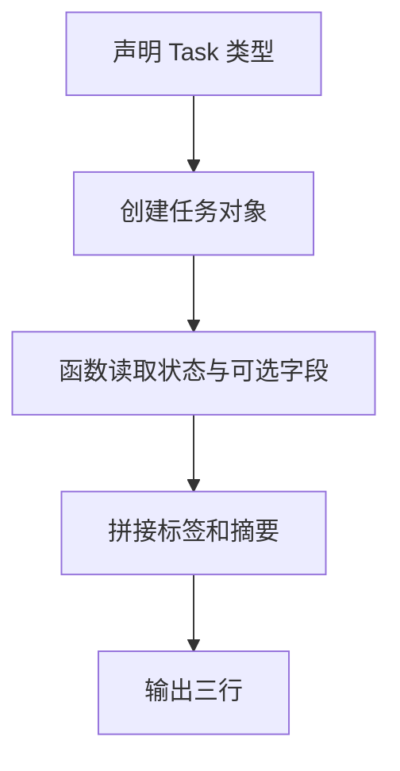

# Day 09：`type`、`interface` 与 `readonly`

预计用时：60–90 分钟。

多个函数都要接收“用户对象”时，如果每次都重写 `{ id: string; name: string; bio?: string }`，很容易少写一个字段或写错类型。`type` 和 `interface` 可以给这套规则取名；`readonly` 则告诉 TypeScript，某个位置不允许通过当前引用重新赋值。

## 完成目标

- 使用 `type` 给类型取名称。
- 使用 `interface` 描述可复用的对象形状。
- 使用可选属性 `?` 与只读属性 `readonly`。
- 使用 `ReadonlyArray<T>` 表达不应修改的数组。
- 理解 TypeScript 类型只用于检查。
- 理解 `readonly` 只在 TypeScript 检查时生效，而且默认只保护标记的那一层。

## `type` 给类型取名

```ts
type UserId = string;
type Point = { x: number; y: number };
```

`type UserId = string` 可以读成：“以后写到 `UserId`，类型要求就是 `string`。”它只是给类型规则起名字，不会在程序运行时创建一个叫 `UserId` 的变量。

基础类型固定写成小写 `string`、`number`、`boolean`。大写的 `String`、`Number`、`Boolean` 是另一类包装对象，初学阶段不要用来代替基础类型。

## `interface` 描述对象形状

```ts
interface User {
  readonly id: string;
  name: string;
  bio?: string;
}
```

逐项看这份对象规则：

| 属性 | 要求 |
| --- | --- |
| `readonly id: string` | 必须有字符串 `id`，并且不能通过这个类型给它重新赋值 |
| `name: string` | 必须有字符串 `name` |
| `bio?: string` | `bio` 可以没有；如果有，必须是字符串 |

普通对象既可以用 `type`，也可以用 `interface`。本课程用 `interface` 描述主要对象，用 `type` 表示别名或联合，方便你看到名字时判断它大概扮演什么角色。

## `readonly` 与只读数组

```ts
const tags: ReadonlyArray<string> = ["TypeScript", "基础"];
```

通过变量 `tags` 读取数组没有问题，但不能调用 `push`、`pop` 等修改方法。对象的 `readonly id` 也不能通过当前类型改成另一个值。

这些限制发生在 TypeScript 检查阶段。它们不会自动执行 `Object.freeze`，程序运行后的 JavaScript 也不会保留完整的类型规则。可以把 `readonly` 理解成“让编辑器和类型检查提前拦住这类修改”。

## `readonly` 默认是浅层的

```ts
interface Box {
  readonly info: {
    count: number;
  };
}
```

这里 `readonly` 修饰的是 `box.info` 这一层：不能写 `box.info = 另一个对象`。但更里面的 `box.info.count` 没有 `readonly`，所以 `box.info.count = 2` 仍然允许。

这叫浅层只读：只保护明确标记的那一层。内层也不能改时，需要在内层属性前继续写 `readonly`。

## 为什么要这样设计

同一种项目或任务形状如果在每个函数旁边重复写，新增字段时容易只改到一处，调用方和实现方就会逐渐不一致。`type` 和 `interface` 给数据契约一个名字，让多个变量与函数共用同一份说明；`readonly` 再表达“这段代码只应读取，不能重新赋值”。

TypeScript 负责在编译时检查对象是否符合契约，并阻止明显的只读写入；编辑器也能据此提示属性。你仍要决定哪些字段必填、哪些可选、哪些应该只读，以及一个概念更适合对象接口还是其他类型组合。类型名只是约束，不会替你生成或保存真实数据。

这些保护在运行后的 JavaScript 中不会自动变成权限系统，而且 `readonly` 默认只约束标记到的那一层。嵌套对象是否也只读，需要在类型中继续明确。

## 阅读完整示例

打开并右击运行 `example.ts`。在编辑器中临时尝试给 `task.id` 重新赋值，以及对 `tags` 调用 `push`，观察类型错误后撤销。注意这些保护来自类型检查。

## Example 实际输出

运行 `example.ts` 后，终端会按下面的顺序显示。先用代码推测结果，再逐行对照：

```text
T-01 | 学习 type 和 interface | 未完成
备注: 无
标签: TypeScript, 基础
```

## Example 代码流程图

运行 `example.ts` 前先沿图预测执行顺序；运行后再把每个节点对应到代码行。



## 官方手册扩展阅读（可选）

完成当天教程后，如想继续确认概念，只选 [Day 09 对应的 1 篇官方阅读](../OFFICIAL-READING.md#day-09) 即可。它不是练习前置，不需要先读完才能作答。

## 独立练习导航

本日共有 2 道独立练习。每道题都有单独目录、说明、作答文件和解题结构提示；题目之间不共享代码。

| 目录 | 场景 | 类型 |
| --- | --- | --- |
| [practice01](./practice01/README.md) | Day 09：项目进度摘要 | 主任务 |
| [practice02](./practice02/README.md) | 任务卡片类型 | 闭卷迁移 |

右击任意练习目录中的 `practice.ts` 即可单独检查；命令行也可运行 `npm run beginner -- day09 practice02`。

## 常见错误

把类型名称拿去 `console.log` 却提示不存在，是因为类型只参与检查，不是运行时变量。读取可选属性后，还要处理它可能是 `undefined` 的情况。数组调用 `push` 被拦住时，检查它是不是 `ReadonlyArray<T>`。内层属性还能修改时，不要以为外层一个 `readonly` 会自动保护所有层级；逐层查看哪些属性真正写了 `readonly`。

### 错误代码示例

```ts
interface Project {
  readonly progress: {
    completed: number;
    total: number;
  };
  members: ReadonlyArray<string>;
}

const project: Project = {
  progress: { completed: 2, total: 5 },
  members: ["Lin"],
};

project.progress.completed = 3;
// ❌ 这行竟然允许：readonly 只保护 progress 这个引用，不会自动深入对象。

project.members.push("Mei");
// ❌ ReadonlyArray 没有可修改数组的 push 方法。
```

### 正确写法

```ts
interface Project {
  readonly progress: {
    readonly completed: number;
    readonly total: number;
  };
  members: ReadonlyArray<string>;
}

const project: Project = {
  progress: { completed: 2, total: 5 },
  members: ["Lin"],
};

// ✅ 需要新进度时创建新对象，而不是修改只读数据。
const nextProject: Project = {
  members: project.members,
  progress: {
    completed: project.progress.completed + 1,
    total: project.progress.total,
  },
};
```

## 面试时怎么回答

**问：`interface` 和 `type` 应该怎么选？`readonly` 能让对象完全不可变吗？**

二者都能描述对象形状，不必背成“对象只能用 `interface`”。`interface` 支持同名声明合并，适合需要被扩展的公开对象契约；`type` 还能直接表示联合类型、元组和其他类型运算。一个对象形状的类型别名也可以被类实现，例如 `type Named = { name: string }` 之后，类可以 `implements Named`。真正的选择要看是否需要声明合并，以及要表达的是开放对象契约还是类型组合。

`readonly` 主要是编译期写入限制，而且默认是浅层的。`readonly profile: { name: string }` 会阻止把 `profile` 换成另一个对象，却不一定阻止 `profile.name = "新名字"`；生成 JavaScript 后也没有自动的冻结代码。复制可以避免改动原对象，但副本仍然可变；要在运行时阻止当前对象的写入，需要冻结对象或封装修改入口，嵌套对象仍要逐层处理。需要深层只读时则要设计递归类型，并理解它仍只是静态约束。

## 拓展思考（不要求写代码）

接口中 `readonly progress: { completed: number; total: number }` 为什么只阻止替换整个 `progress` 对象，却不阻止 `progress.completed = 3`，若业务要求完全只读还需要改变哪里？

## 解题结构提示

代码目录中的 `solution.ts` 与题目文档目录中的 `SOLUTION.md` 只提供带 TODO 的结构提示，不提供完整答案。

完成后再通过对应练习文档的“文件位置”链接查看 `solution.ts` 与 `SOLUTION.md`，重点检查类型设计是否表达了题目意图。
