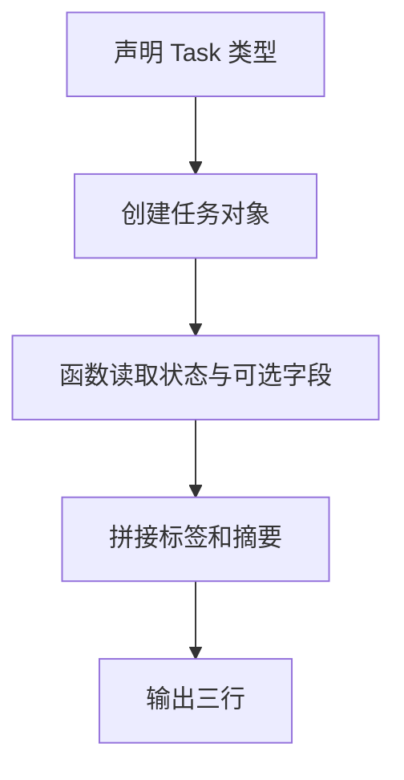

# Day 09：`type`、`interface` 与 `readonly`

预计用时：60–90 分钟。

对象形状重复出现时，直接在每个参数旁重写会变得冗长且容易遗漏。今天学习给类型取名，并用 `readonly` 表达“不应通过这里重新赋值”的设计意图。

## 完成目标

- 使用 `type` 给类型取名称。
- 使用 `interface` 描述可复用的对象形状。
- 使用可选属性 `?` 与只读属性 `readonly`。
- 使用 `ReadonlyArray<T>` 表达不应修改的数组。
- 理解 TypeScript 类型只用于检查。
- 理解 `readonly` 是编译期且默认浅层的。

## `type` 给类型取名

```ts
type UserId = string;
type Point = { x: number; y: number };
```

类型名称不会在运行时创建新的值。基础类型仍写成小写 `string`、`number`、`boolean`，不要写包装对象 `String`、`Number`、`Boolean`。

## `interface` 描述对象形状

```ts
interface User {
  readonly id: string;
  name: string;
  bio?: string;
}
```

`id` 必须存在且不能通过这个类型重新赋值，`name` 必须存在，`bio` 可以缺失。普通对象既可以使用 `type` 也可以使用 `interface`；本课程习惯用 `interface` 描述主要对象，用 `type` 表示别名或联合。

## `readonly` 与只读数组

```ts
const tags: ReadonlyArray<string> = ["TypeScript", "基础"];
```

通过 `tags` 不能调用 `push` 等修改方法。对象的 `readonly id` 也不能重新赋值。

这些都是编译期检查，不会自动执行 `Object.freeze`。运行后的 JavaScript 不会保留完整的 TypeScript 类型信息。

## `readonly` 默认是浅层的

```ts
interface Box {
  readonly info: {
    count: number;
  };
}
```

不能把 `box.info` 替换成另一个对象，但 `box.info.count` 自身没有 `readonly`，所以类型系统仍允许修改它。需要深层只读时，内层属性也要明确设计。

## 阅读完整示例

打开并右击运行 `example.ts`。在编辑器中临时尝试给 `task.id` 重新赋值，以及对 `tags` 调用 `push`，观察类型错误后撤销。注意这些保护来自类型检查。

## Example 代码流程图

运行 `example.ts` 前先沿图预测执行顺序；运行后再把每个节点对应到代码行。



## 独立练习导航

本日共有 2 道独立练习。每道题都有单独目录、说明、作答文件和解题结构提示；题目之间不共享代码。

| 目录 | 场景 | 类型 |
| --- | --- | --- |
| [practice01](./practice01/README.md) | Day 09：项目进度摘要 | 主任务 |
| [practice02](./practice02/README.md) | 任务卡片类型 | 闭卷迁移 |

右击任意练习目录中的 `practice.ts` 即可单独检查；命令行也可运行 `npm run beginner -- day09 practice02`。

## 常见错误

类型名称不是运行时变量；基础类型不要大写；`ReadonlyArray<T>` 不能通过该引用修改；可选属性读取后仍需处理 `undefined`；顶层只读不会自动深入内部属性。

### 错误代码示例

```ts
interface Project {
  readonly progress: {
    completed: number;
    total: number;
  };
  members: ReadonlyArray<string>;
}

const project: Project = {
  progress: { completed: 2, total: 5 },
  members: ["Lin"],
};

project.progress.completed = 3;
// ❌ 这行竟然允许：readonly 只保护 progress 这个引用，不会自动深入对象。

project.members.push("Mei");
// ❌ ReadonlyArray 没有可修改数组的 push 方法。
```

### 正确写法

```ts
interface Project {
  readonly progress: {
    readonly completed: number;
    readonly total: number;
  };
  members: ReadonlyArray<string>;
}

const project: Project = {
  progress: { completed: 2, total: 5 },
  members: ["Lin"],
};

// ✅ 需要新进度时创建新对象，而不是修改只读数据。
const nextProject: Project = {
  members: project.members,
  progress: {
    completed: project.progress.completed + 1,
    total: project.progress.total,
  },
};
```

## 拓展思考（不要求写代码）

接口中 `readonly progress: { completed: number; total: number }` 为什么只阻止替换整个 `progress` 对象，却不阻止 `progress.completed = 3`，若业务要求完全只读还需要改变哪里？

## 解题结构提示

代码目录中的 `solution.ts` 与题目文档目录中的 `SOLUTION.md` 只提供带 TODO 的结构提示，不提供完整答案。

完成后再通过对应练习文档的“文件位置”链接查看 `solution.ts` 与 `SOLUTION.md`，重点检查类型设计是否表达了题目意图。

## 官方资料

- [Everyday Types：Type Aliases](https://www.typescriptlang.org/docs/handbook/2/everyday-types.html#type-aliases)
- [Everyday Types：Interfaces](https://www.typescriptlang.org/docs/handbook/2/everyday-types.html#interfaces)
- [Object Types：readonly Properties](https://www.typescriptlang.org/docs/handbook/2/objects.html#readonly-properties)
