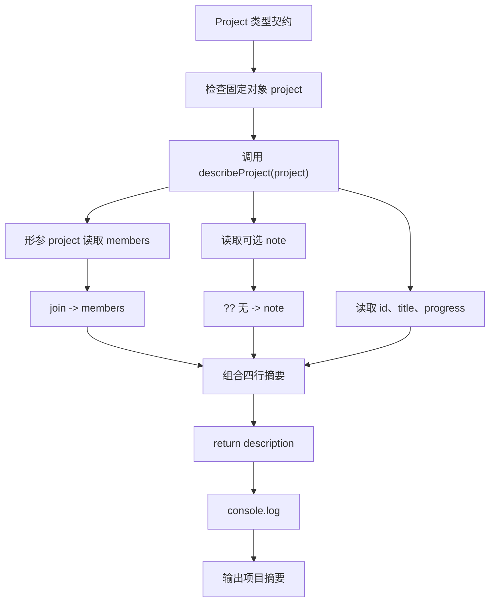

# DAY09 · Practice 01：项目进度摘要

[返回当天课程](../README.md)

## 文件位置

- 作答文件：[practice.ts](../../../day09/practice01/practice.ts)
- 完整参考答案代码：[solution.ts](../../../day09/practice01/solution.ts)
- 方案说明：[SOLUTION.md](./SOLUTION.md)

## 场景背景

团队看板要展示项目 P-01“TypeScript 练习”的只读身份信息、成员名单与完成进度。项目可能没有备注，而且用于识别项目和记录进度的数据不允许被展示逻辑意外修改。你的任务是先定义稳定的数据契约，再生成一份四行项目摘要供看板显示。

这是一道完整、独立的主练习。不要导入其他 practice 文件夹中的代码。

## 数据流

先沿变量名看数据怎样分叉和汇合；`──>` 表示值被交给下一步。

```text
Project 类型规则
   │
   └── 检查 project 对象
             ├── readonly id
             ├── progress 数据
             └── 可选 note
                    │
                    └── describeProject ──> 项目摘要输出
```

在 `practice.ts` 中从零完成“项目进度摘要”。

必须声明：

```text
type ProjectId = string
```

以及名为 `Project` 的接口，形状如下：

- `readonly id: ProjectId`
- `title: string`
- `members: ReadonlyArray<string>`
- `readonly progress: { completed: number; total: number }`
- `note?: string`

固定对象 `project: Project`：

- id 为 `"P-01"`
- title 为 `"TypeScript 练习"`
- members 为 `["Lin", "Mei"]`
- progress 为 `{ completed: 2, total: 5 }`
- 不提供 note

实现 `describeProject(project: Project): string`，返回四行组成的字符串。成员使用 `.join(", ")`，缺少备注时使用 `?? "无"`。

精确期望输出：

```text
P-01 | TypeScript 练习
成员: Lin, Mei
进度: 2/5
备注: 无
```

限制：

- 函数参数必须使用命名接口 `Project`，不得重复写对象形状。
- 不得修改项目、成员数组或进度对象。
- 不得使用 `any`、类型断言或非空断言。
- 只调用一次 `console.log(describeProject(project))`。

完成标准：

- 能说明 `type`、`interface`、`readonly`、`? `各自表达什么。
- 编辑器会阻止重新赋值 id、progress 或向 members 中 push。
- 右击运行 `practice.ts`，四行输出完全一致。

## 本题易漏语法

interface 内写 field: string;；创建值写 const value: Name = { field: "x" };。类型成员用分号，值属性用逗号。

## 代码流程图



## 起始代码

类型名称、接口字段、固定对象、函数签名、调用和输出已经提供。成员连接、可选备注处理与 return 由你完成。

```ts
type ProjectId = string;

interface Project {
  readonly id: ProjectId;
  title: string;
  members: ReadonlyArray<string>;
  readonly progress: { completed: number; total: number };
  note?: string;
}

function describeProject(project: Project): string {
  const members = ""; // TODO：替换为成员连接结果。
  const note = ""; // TODO：替换为可选备注与默认值。
  return ""; // TODO：替换为使用 project、members、note 的四行摘要。
}

const project: Project = {
  id: "P-01",
  title: "TypeScript 练习",
  members: ["Lin", "Mei"],
  progress: { completed: 2, total: 5 },
};

console.log(describeProject(project));
```

## 写完后自检

- 如果 `note` 明确保存空字符串，`project.note ?? "无"` 会显示空字符串还是“无”？它和属性缺失有什么区别？
- `readonly progress` 为什么只能阻止替换整个 `progress` 属性，却不自动阻止修改 `progress.completed`？
- 为什么成员使用 `ReadonlyArray<string>`，而描述函数仍然可以调用 `.join(", ")`？

## 文件

- 在 `practice.ts` 中独立作答。
- 建议先在 `practice.ts` 独立作答；完成后再查看 `solution.ts` 完整答案和 `SOLUTION.md` 调用说明。
