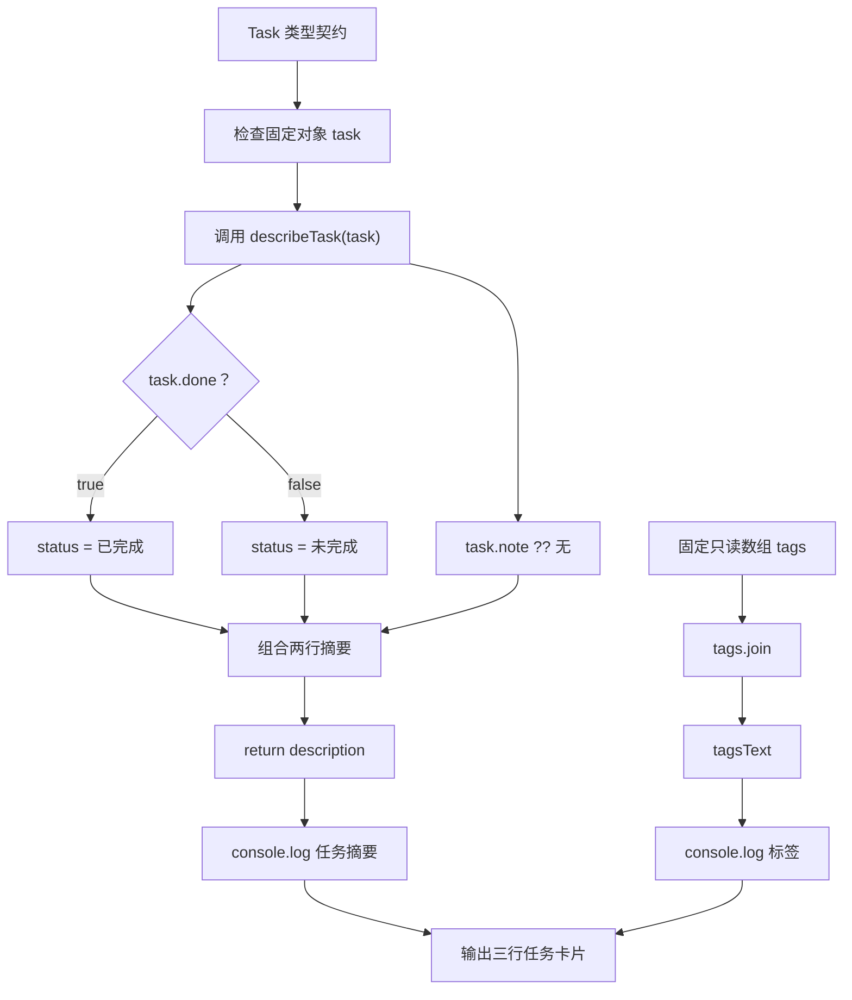

# DAY09 · Practice 02：任务卡片类型

[返回当天课程](../README.md)

## 文件位置

- 作答文件：[practice.ts](../../../day09/practice02/practice.ts)
- 完整参考答案代码：[solution.ts](../../../day09/practice02/solution.ts)
- 方案说明：[SOLUTION.md](./SOLUTION.md)

## 场景背景

学习任务看板中有一张编号 T-01 的任务卡，用于跟踪“学习 type 和 interface”的完成状态。任务可能没有备注，但还带有一组只供展示的分类标签，界面代码不应修改这些标签。最终要依据同一份类型约束生成任务状态、备注和标签三行内容。

这次把命名类型迁移到一张任务卡，并把可变任务状态与只读标签分开。关闭 `example.ts` 后，根据固定契约独立完成。

## 数据流

先沿变量名看数据怎样分叉和汇合；`──>` 表示值被交给下一步。

```text
Task 类型规则 ──> 检查 task 对象 ──> describeTask ──> 任务摘要
tags
   └── ReadonlyArray ──> join ──> tagsText

任务摘要 + tagsText ──> 输出
```

## 必须练到的能力

使用 type 或 interface 描述对象，并正确处理 readonly。

- 声明 `type TaskId = string`，并用命名接口 `Task` 描述 `readonly id`、`title`、`done` 与可选 `note`。
- 固定 `task` 为 `{ id: "T-01", title: "学习 type 和 interface", done: false }`。
- `describeTask(task: Task): string` 从 `done` 推导“已完成”或“未完成”，缺少备注时显示“无”，并返回前两行摘要。
- 独立声明 `tags: ReadonlyArray<string> = ["TypeScript", "基础"]`，用 `.join(", ")` 得到 `tagsText`。
- 不得导入 `practice01` 或直接调用其他练习的实现。
- 输出必须由变量、计算或函数返回值产生，不把整行结果写死。
- 每个参数、局部变量和返回值都应能在流程图中找到位置。

## 精确期望输出

```text
T-01 | 学习 type 和 interface | 未完成
备注: 无
标签: TypeScript, 基础
```

## 和 Practice 01 的区别

Practice 01 的输入数据是带嵌套进度的 `Project`，并区分多层只读状态。这里使用较扁平的 `Task` 与独立标签数组，输出可选备注；重点是让对象契约与函数参数共用同一个命名类型。

## 迁移挑战（不要求提交输出）

另写一个构建配置类型：包含 `readonly releaseId`、`environment`、可选 `note`，以及 `readonly targets: ReadonlyArray<string>`。创建一个配置后，分别尝试修改环境、编号、目标数组项，观察哪些写法通过类型检查；不要用 `as` 绕过错误。

## 代码流程图



## 起始代码

类型、固定任务和标签、函数签名、调用与输出都已给出。状态判断、备注默认值、标签连接和 return 由你完成。

```ts
type TaskId = string;

interface Task {
  readonly id: TaskId;
  title: string;
  done: boolean;
  note?: string;
}

function describeTask(task: Task): string {
  const status = ""; // TODO：替换为根据 done 选择出的状态。
  const note = ""; // TODO：替换为可选备注与默认值。
  return ""; // TODO：替换为两行任务摘要。
}

const task: Task = {
  id: "T-01",
  title: "学习 type 和 interface",
  done: false,
};
const tags: ReadonlyArray<string> = ["TypeScript", "基础"];
const tagsText = ""; // TODO：替换为 tags 的连接结果。

console.log(describeTask(task));
console.log(`标签: ${tagsText}`);
```

## 写完后自检

- 如果 `done` 改成 `true`，第一行中的状态文字应怎样变化？如果 `note` 是空字符串，`?? "无"` 会不会替换它？
- 为什么 `Task` 使用命名接口供对象和函数参数共用，而不是在两处重复写相同形状？
- `readonly id` 与 `ReadonlyArray<string>` 各限制哪种写操作？它们会不会在运行时自动冻结对象？

## 文件

建议先在上方链接的 `practice.ts` 独立作答；完成后再查看 `solution.ts` 完整答案和 `SOLUTION.md` 调用说明。
