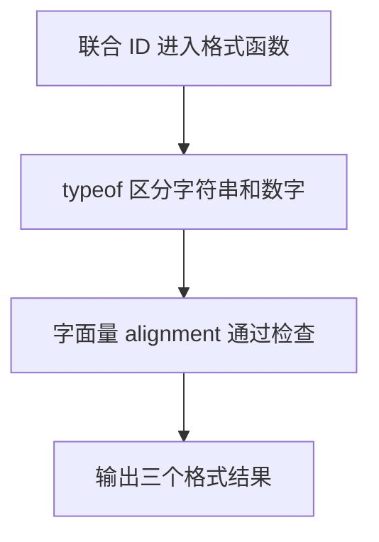

# Day 10：联合类型、字面量类型与收窄

预计用时：60–90 分钟。

同一个工单编号可能来自两处：系统生成的是数字 `42`，人工录入的是字符串 `"A42"`。函数要同时接收这两种数据，但不能还没判断就调用字符串专用方法。代码先检查当前到底是哪一种，再使用对应方法；这个“先排除其他可能”的过程叫类型收窄。

## 完成目标

- 使用 `A | B` 声明联合类型。
- 使用字符串字面量联合限制合法选项。
- 使用 `typeof` 收窄基础类型。
- 使用 `Array.isArray` 区分数组。
- 使用相等判断收窄字面量。
- 使用 `in` 区分具有不同属性的对象。
- 理解 `as` 不是运行时检查。

## 联合类型表示多种可能

```ts
type Id = string | number;
```

竖线 `|` 可以读成“或者”。`string | number` 表示：这一次收到的值要么是字符串，要么是数字，不会同时是两种。

还没判断时，TypeScript 只允许使用两种类型都支持的操作。`toUpperCase` 只有字符串能用，所以必须先确认当前值是字符串。

## `typeof` 收窄基础类型

```ts
function formatId(id: string | number): string {
  if (typeof id === "string") {
    return id.toUpperCase();
  }

  return `#${id}`;
}
```

假设调用 `formatId("a42")`：

1. 参数 `id` 先接到字符串 `"a42"`。
2. `typeof id === "string"` 得到 `true`。
3. 进入 `if`，这时 TypeScript 已排除数字，所以允许调用 `toUpperCase()`。
4. 函数返回 `"A42"`。

如果调用 `formatId(42)`，条件是 `false`，程序跳过字符串分支，最后返回 `"#42"`。`typeof` 的结果固定使用小写 `"string"`、`"number"`。

## 字面量联合限制选项

```ts
type Priority = "low" | "medium" | "high";
```

普通 `string` 可以放任何文字；`Priority` 只允许 `"low"`、`"medium"`、`"high"` 三个准确值。写成 `"hight"` 会在运行前被 TypeScript 拦住，编辑器也能给出这三个候选项。

判断 `priority === "high"` 后，当前分支里只剩 `"high"` 这一种可能，这也是类型收窄。

## 数组与对象收窄

`typeof []` 的结果也是 `"object"`，所以只检查 `typeof value === "object"` 不能分清数组和普通对象。要判断数组，使用 `Array.isArray(value)`。

两个对象外形不同时，可以找出只属于其中一种的属性，再用 `in` 检查：

```ts
if ("email" in contact) {
  return contact.email;
}
```

如果 `"email" in contact` 是 `true`，TypeScript 就能确定当前对象拥有 `email`，分支内才可以安全读取它。

## 类型断言不是验证

`value as string` 表示“请编译器暂时把它看成字符串”。这是类型断言，不会执行检查，也不会把运行时的数字变成字符串；如果判断错了，程序仍可能报错。对象类型也一样：`value as EmailContact` 不会检查 `email` 属性是否真的存在。

能够用 `typeof`、`Array.isArray`、相等判断或 `in` 真正检查数据时，就先检查，再让 TypeScript 缩小可能范围，不要用 `as` 跳过判断。

## 为什么要这样设计

工单编号可能是字符串或数字，联系人也可能提供邮箱或电话。如果为了省事都写成 `any`，代码可以随意调用不存在的方法，错误只能等到运行时出现。联合类型把允许的几种可能提前列出来，收窄则要求程序先拿到证据，再使用某一成员专属的能力。

TypeScript 负责根据 `typeof`、`Array.isArray`、`in` 和分支条件追踪当前范围，在不安全访问时提醒你。你仍要决定真实数据允许哪些成员、用什么运行时检查区分它们，以及每个分支返回什么业务文字。字面量联合还能把合法选项限制成一份明确清单。

类型收窄只对当前代码中已经检查的值有效。来自网络或文件的未知数据仍需运行时验证；`as` 断言只是让检查器相信你，并不会检查真实值，因此不能拿它替代验证。

## 阅读完整示例

打开并右击运行 `example.ts`。指出每次调用进入 `formatId` 的哪个分支，并观察字面量类型如何限制对齐方式。临时传入非法字面量，阅读错误后撤销。

## 函数变量追踪

联合参数刚进入函数时，TypeScript 还不知道这次收到的是哪一种类型。`if` 判断只会让当前分支里的类型变得明确；离开这条分支后，仍要按剩余可能处理。每条路线最后都用 `return` 把结果交回调用处。

## Example 实际输出

运行 `example.ts` 后，终端会按下面的顺序显示。先用代码推测结果，再逐行对照：

```text
TS-10
#42
对齐方式: center
```

## Example 代码流程图

运行 `example.ts` 前先沿图预测执行顺序；运行后再把每个节点对应到代码行。



## 独立练习导航

本日共有 2 道独立练习。每道题都有单独目录、说明、作答文件和解题结构提示；题目之间不共享代码。

| 目录 | 场景 | 类型 |
| --- | --- | --- |
| [practice01](./practice01/README.md) | Day 10：支持工单摘要 | 主任务 |
| [practice02](./practice02/README.md) | 工单编号格式化 | 闭卷迁移 |

右击任意练习目录中的 `practice.ts` 即可单独检查；命令行也可运行 `npm run beginner -- day10 practice02`。

## 常见错误

联合值无法调用某个类型专用的方法时，先写运行时判断。`typeof` 判断始终用小写 `"string"`、`"number"`；数组使用 `Array.isArray`。用了 `as` 后类型错误消失，不表示外部数据已经通过验证。使用 `in` 时，属性名必须和对象中的真实字段完全一致。

### 错误代码示例

```ts
function formatId(id: string | number): string {
  if (typeof id === "String") {
    return id.toUpperCase();
    // ❌ typeof 不会返回 "String"，这里也无法把 id 收窄为 string。
  }

  return `#${id}`;
}

interface EmailContact {
  email: string;
}

function printEmail(externalValue: unknown): void {
  const contact = externalValue as EmailContact;
  console.log(contact.email.toLowerCase());
  // ❌ as 没有检查外部值；缺少 email 时运行会出错。
}
```

### 正确写法

```ts
function formatId(id: string | number): string {
  if (typeof id === "string") {
    return id.toUpperCase(); // ✅ typeof 返回小写 "string"。
  }

  return `#${id}`;
}

function printEmail(externalValue: unknown): void {
  if (
    typeof externalValue === "object" &&
    externalValue !== null &&
    "email" in externalValue &&
    typeof externalValue.email === "string"
  ) {
    console.log(externalValue.email.toLowerCase());
    // ✅ 运行时逐步检查后，email 才被收窄为 string。
  }
}
```

## 面试时怎么回答

**问：`any`、`unknown`、联合类型和类型断言分别适合什么场景？**

`any` 相当于暂时退出类型检查，几乎什么操作都能写，因此错误也会继续向后传播；`unknown` 表示“现在还不知道”，使用前必须通过 `typeof`、`Array.isArray` 或自定义校验收窄。`Array.isArray` 只能确认容器是数组，元素类型仍要继续检查。联合类型则表示一组已知可能，例如 `string | number`，分支判断后才能使用某一种类型独有的方法。外部输入通常先用 `unknown` 接住，再验证，比直接写 `any` 更安全。

类型断言不是第四种校验方式。假设 `value: unknown` 在运行时是字符串 `"42"`，`value as number` 不会让它变成数字；只有检查或转换才能改变后续行为。收窄的价值正是把运行时已经确认的事实告诉 TypeScript。面试时可以用一句边界收尾：类型系统能检查你写出的契约，但不能凭空证明网络响应符合契约。

## 拓展思考（不要求写代码）

如果外部值是 `null`、数字或字符串，直接执行 `"email" in value` 也可能报错。应先用 `value !== null && typeof value === "object"` 确认它是非空对象，再检查 `"email" in value`。这两步分别排除了什么风险？

## 解题结构提示

代码目录中的 `solution.ts` 与题目文档目录中的 `SOLUTION.md` 只提供带 TODO 的结构提示，不提供完整答案。

完成后再通过对应练习文档的“文件位置”链接查看 `solution.ts` 与 `SOLUTION.md`，逐个指出四个函数使用的收窄方法。

## 官方资料

- [Everyday Types：Union Types](https://www.typescriptlang.org/docs/handbook/2/everyday-types.html#union-types)
- [Everyday Types：Literal Types](https://www.typescriptlang.org/docs/handbook/2/everyday-types.html#literal-types)
- [Narrowing](https://www.typescriptlang.org/docs/handbook/2/narrowing.html)
