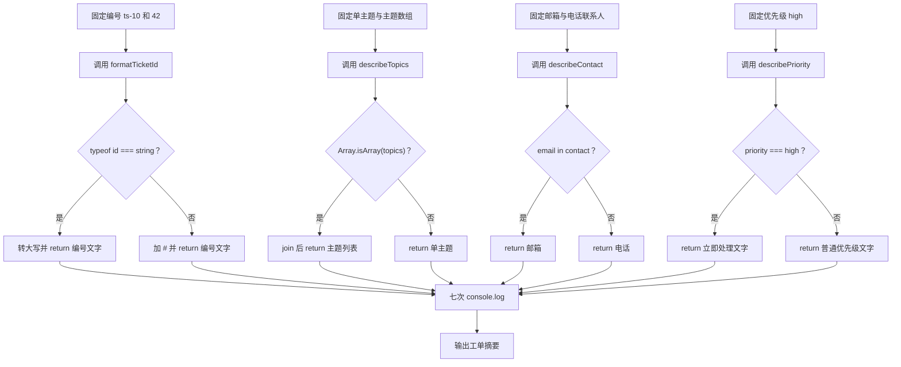

# DAY10 · Practice 01：支持工单摘要

[返回当天课程](../README.md)

## 文件位置

- 作答文件：[practice.ts](../../../day10/practice01/practice.ts)
- 完整参考答案代码：[solution.ts](../../../day10/practice01/solution.ts)
- 方案说明：[SOLUTION.md](./SOLUTION.md)

## 场景背景

客服中心收到的工单数据来自不同渠道，因此编号可能是文本或数字，主题可能是一项或多项，联系人也可能留下邮箱或电话。工单还带有受限制的优先级，需要针对紧急情况给出额外提示。你要把这些不同形状的输入安全整理成七行统一摘要，供客服工作台展示。

这是一道完整、独立的主练习。不要导入其他 practice 文件夹中的代码。

## 数据流

先沿变量名看数据怎样分叉和汇合；`──>` 表示值被交给下一步。

```text
TicketId ──> formatTicketId ──> 格式化编号
TopicInput ──> Array.isArray 收窄 ──> describeTopics ──> 主题文字
Contact ──> in 检查专属字段 ──> describeContact ──> 联系方式
Priority ──> 字面量分支 ──> describePriority ──> 优先级文字

四条结果 ──> 输出
```

在 `practice.ts` 中从零完成“支持工单摘要”。

必须声明这些类型：

- `type TicketId = string | number`
- `type TopicInput = string | string[]`
- `type Priority = "low" | "medium" | "high"`
- `interface EmailContact { name: string; email: string }`
- `interface PhoneContact { name: string; phone: string }`
- `type Contact = EmailContact | PhoneContact`

必须实现这些函数：

- `formatTicketId(id: TicketId): string`：字符串编号转大写，数字编号前加 `#`，都带前缀 `"编号: "`。
- `describeTopics(topics: TopicInput): string`：数组返回 `"主题列表: "` 加逗号空格连接；字符串返回 `"主题: "` 加原值。
- `describeContact(contact: Contact): string`：用 `"email" in contact` 返回邮箱或电话。
- `describePriority(priority: Priority): string`：当值为 `"high"` 返回 `"优先级: high（立即处理）"`，其他值返回 `"优先级: "` 加原值。

固定调用数据：

- 工单编号 `"ts-10"` 和 `42`。
- 主题 `"variables"` 和 `["variables", "arrays"]`。
- 邮箱联系人 `{ name: "Lin", email: "a@example.com" }`。
- 电话联系人 `{ name: "Mei", phone: "13800000000" }`。
- 优先级 `"high"`。

> **先看清输出标点：** 代码语法中的函数括号 `()` 和类型冒号 `:` 必须使用英文半角符号。下面 `high（立即处理）` 的 `（ ）` 是中文全角括号，只是输出文字。运行器不会因中英文括号或冒号的全半角差异判你失败，但其他文字、数字和顺序仍要一致。

精确期望输出：

```text
编号: TS-10
编号: #42
主题: variables
主题列表: variables, arrays
邮箱: a@example.com
电话: 13800000000
优先级: high（立即处理）
```

限制：

- 四个函数都必须使用题目指定的命名类型。
- 分别使用 `typeof`、`Array.isArray`、`in` 和严格相等判断收窄。
- 不使用 `any`、`as` 或非空断言。
- 不得把最终七行整句直接交给 `console.log`。

完成标准：

- 能说明每个分支进入后变量被收窄成什么类型。
- 非法优先级会在运行前被 TypeScript 拒绝。
- 右击运行 `practice.ts`，七行输出完全一致。

## 本题易漏语法

联合成员用 |；先用 typeof、in 或判别字段收窄，再访问特定成员。

## 代码流程图



## 起始代码

所有命名类型、函数签名、固定联系人、调用和输出都已提供。四个函数中的收窄判断和 return 由你完成。

```ts
type TicketId = string | number;
type TopicInput = string | string[];
type Priority = "low" | "medium" | "high";
interface EmailContact { name: string; email: string }
interface PhoneContact { name: string; phone: string }
type Contact = EmailContact | PhoneContact;

function formatTicketId(id: TicketId): string {
  if (false) {
    // TODO：把 false 换成字符串类型判断。
    return ""; // TODO：返回字符串编号格式。
  }
  return ""; // TODO：返回数字编号格式。
}
function describeTopics(topics: TopicInput): string {
  if (false) {
    // TODO：把 false 换成数组判断。
    return ""; // TODO：返回主题列表。
  }
  return ""; // TODO：返回单个主题。
}
function describeContact(contact: Contact): string {
  if (false) {
    // TODO：把 false 换成 email 字段检查。
    return ""; // TODO：返回邮箱文字。
  }
  return ""; // TODO：返回电话文字。
}
function describePriority(priority: Priority): string {
  if (false) {
    // TODO：把 false 换成 high 判断。
    return ""; // TODO：返回立即处理文字。
  }
  return ""; // TODO：返回普通优先级文字。
}

const emailContact: EmailContact = { name: "Lin", email: "a@example.com" };
const phoneContact: PhoneContact = { name: "Mei", phone: "13800000000" };

console.log(formatTicketId("ts-10"));
console.log(formatTicketId(42));
console.log(describeTopics("variables"));
console.log(describeTopics(["variables", "arrays"]));
console.log(describeContact(emailContact));
console.log(describeContact(phoneContact));
console.log(describePriority("high"));
```

## 写完后自检

- 如果优先级改成 `"medium"`，最后一行会怎样变化？如果编号改成数字 0，会进入哪条格式化分支？
- 为什么 `Contact` 收窄前不能直接读取 `.email`，而 `"email" in contact` 后可以？
- 联合类型只检查已进入程序的 TypeScript 调用；如果值来自外部 JSON，为什么仍需要先做运行时验证？

## 文件

- 在 `practice.ts` 中独立作答。
- 建议先在 `practice.ts` 独立作答；完成后再查看 `solution.ts` 完整答案和 `SOLUTION.md` 调用说明。
