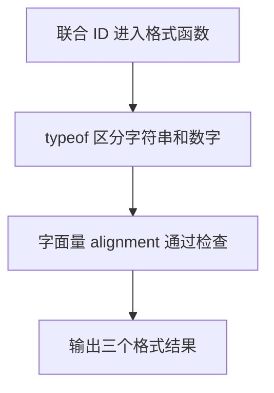

# DAY10 · Practice 02：工单编号格式化

[返回当天课程](../README.md)

## 文件位置

- 作答文件：[practice.ts](../../../day10/practice02/practice.ts)
- 结构提示代码：[solution.ts](../../../day10/practice02/solution.ts)
- 方案说明：[SOLUTION.md](./SOLUTION.md)

## 场景背景

工单列表同时接收文本编号 `"ts-10"` 和数字编号 `42`，但界面要求它们采用各自统一的显示格式。列表布局还只允许三种预设对齐方式，本次使用 `center`。目标是生成两个规范化编号和一条合法的对齐说明，让调用方无需关心原始输入类型。

这是一道与 Practice 01 文件完全分开的闭卷迁移题。先理解并运行当天 `example.ts`，然后关闭它；不要复制代码，仅根据下面的流程与输出从空白重新实现。

## 代码流程图



## 必须练到的能力

使用联合类型和控制流收窄后再访问成员专属能力。

- 不得导入 `practice01` 或直接调用其他练习的实现。
- 输出必须由变量、计算或函数返回值产生，不把整行结果写死。
- 每个参数、局部变量和返回值都应能在流程图中找到位置。

## 精确期望输出

```text
TS-10
#42
对齐方式: center
```

## 文件

在上方链接的 `practice.ts` 作答；独立完成后再查看 `solution.ts` 的 TODO 解题结构与 `SOLUTION.md` 的结构提示，它们不提供完整答案。
