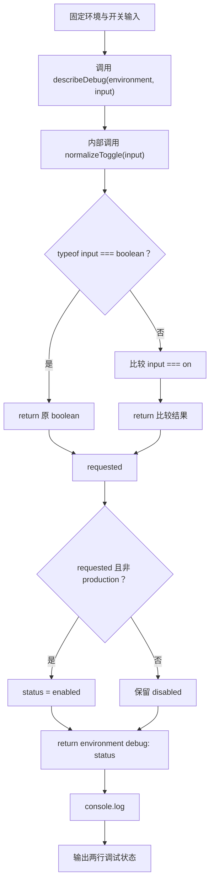

# DAY10 · Practice 02：调试开关规范化

[返回当天课程](../README.md)

## 文件位置

- 作答文件：[practice.ts](../../../day10/practice02/practice.ts)
- 完整参考答案代码：[solution.ts](../../../day10/practice02/solution.ts)
- 方案说明：[SOLUTION.md](./SOLUTION.md)

## 场景背景

旧配置文件用 `"on"`、`"off"` 表示调试开关，新配置已经改用 `true`、`false`。迁移期间程序必须同时接收两种格式。业务代码如果到处判断三种输入，不仅重复，还很容易漏掉某一种，所以先把输入统一成一个 `boolean`。

即使用户请求开启调试，生产环境也必须保持关闭。这里有两个不同职责：`normalizeToggle` 只负责把输入格式统一；`describeDebug` 再应用环境规则。

## 类型与规则

```ts
type ToggleInput = boolean | "on" | "off";
type Environment = "development" | "staging" | "production";
```

- 输入本来就是 `boolean`：原样作为规范结果。
- 输入是字符串：只有 `"on"` 规范成 `true`，`"off"` 规范成 `false`。
- 最终允许开启：规范结果为 `true`，并且环境不是 `"production"`。

## 数据流

```text
input: boolean | "on" | "off"
   │
   └── typeof input === "boolean"
          ├── true ──> 使用原布尔值 ──┐
          └── false ──> input === "on" ─┴──> requested: boolean
                                              │
environment ──> !== "production" ─────────────┴──> canEnable
                                                      │
                                                      ├── true ──> "enabled"
                                                      └── false ──> "disabled"
                                                                     │
environment ──────────────────────────────────────────────────────────┴──> 最终文字

"staging" + "on" ──> 第一行
"production" + true ──> 第二行
```

## 需要完成

- 声明上面的两个联合类型。
- 声明 `normalizeToggle(input: ToggleInput): boolean`，先用 `typeof` 区分布尔值和字符串。
- 声明 `describeDebug(environment: Environment, input: ToggleInput): string`，内部必须调用 `normalizeToggle`。
- 生产环境始终输出 `"disabled"`；其他环境只有在请求开启时输出 `"enabled"`。
- 分别调用 `describeDebug("staging", "on")` 与 `describeDebug("production", true)`。
- 本题独立运行，不导入 `practice01` 或其他练习。

## 为什么先“规范化”

外部输入可以有多种形状，但业务规则最好只处理一种稳定形状。规范化以后，环境规则只问 `requested` 是真是假，不需要知道它最初来自 `true` 还是 `"on"`。将来旧字符串格式下线时，只要修改输入类型和规范化函数，后面的策略不必重写。

## 为什么 `typeof` 分支有用

进入函数时，`input` 可能是布尔值或字符串。条件 `typeof input === "boolean"` 成立后，TypeScript 知道该分支里的 `input` 是 `boolean`；另一条路径则只剩 `"on" | "off"`。这叫收窄：先用运行时真实条件证明类型，再按更具体的类型处理。

## 精确期望输出

```text
staging debug: enabled
production debug: disabled
```

## 和 Practice 01 的区别

Practice 01 针对工单的编号、主题、联系方式和优先级使用四种不同收窄方式，并格式化多个字段。这里让同一个联合输入先穿过规范化边界，再进入环境策略；重点是减少后续代码需要面对的状态数量。

## 代码流程图



## 起始代码

联合类型、两个函数签名、固定调用和输出都已提供。规范化判断、环境策略、状态分支和 return 由你完成。

```ts
type ToggleInput = boolean | "on" | "off";
type Environment = "development" | "staging" | "production";

function normalizeToggle(input: ToggleInput): boolean {
  if (false) {
    // TODO：把 false 换成 boolean 类型判断，并 return 原布尔值。
    return false;
  }
  return false; // TODO：替换为字符串是否为 "on" 的比较结果。
}

function describeDebug(
  environment: Environment,
  input: ToggleInput,
): string {
  const requested = normalizeToggle(input);
  const canEnable = false; // TODO：替换为请求开启且不是生产环境。
  let status = "disabled";
  if (canEnable) {
    // TODO：更新为 enabled。
  }
  return ""; // TODO：替换为环境和最终状态组成的文字。
}

console.log(describeDebug("staging", "on"));
console.log(describeDebug("production", true));
```

## 写完后自检

- `describeDebug("development", "off")` 会得到什么结果，数据会经过哪条分支？
- 为什么 `describeDebug("production", true)` 仍不能开启？
- 为什么把字符串与布尔值统一成 `requested`，比在每条环境规则里反复判断 `input === true || input === "on"` 更合适？

## 文件

建议先在上方链接的 `practice.ts` 独立作答；完成后再查看 `solution.ts` 完整答案和 `SOLUTION.md` 调用说明。
