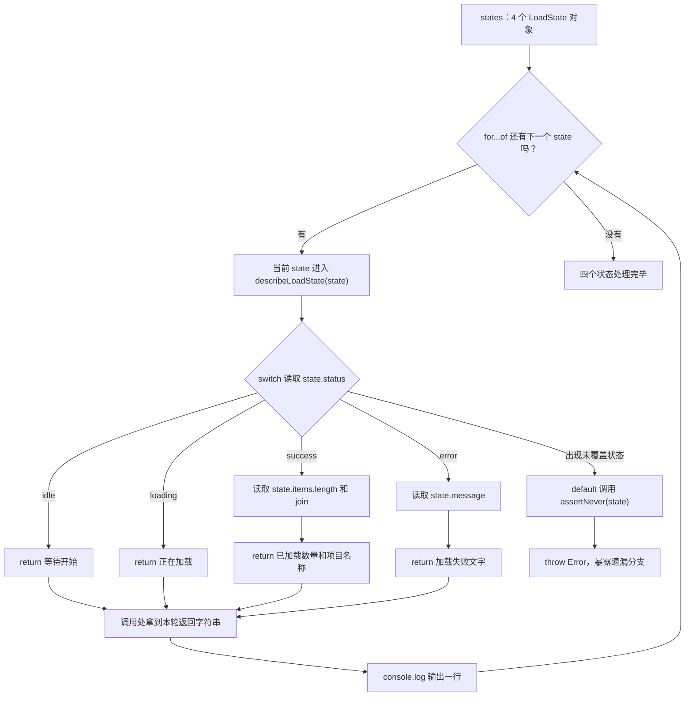

# Day 11：判别联合、switch 与完整分支

预计用时：75–90 分钟。

今天用“页面正在等待、加载中、加载成功或加载失败”来理解状态。一个状态对象在同一时间只会是其中一种情况：成功时带数据，失败时带错误信息，等待和加载中不需要这两类内容。TypeScript 可以根据状态标签检查你有没有读错字段，也能提醒你漏写了哪种情况。

## 写 Example 前先认识这些写法

### `new Error(message)`：创建标准错误对象

`Error` 是 JavaScript 运行环境提供的构造函数，首字母必须大写。`new Error("状态遗漏")` 把括号里的字符串保存为错误对象的 `message`；返回的是一个对象，不是普通字符串。

只创建 `Error` 不会自动停止程序。`throw error` 才会立即结束当前调用路径，并把错误交给外层的 `catch`。错误对象通常还有 `name` 和调用位置等信息，所以不要用 `throw "出错了"` 代替。

```ts
const problem = new Error("状态遗漏");
console.log(problem.name);
console.log(problem.message);
```

实际输出：

```text
Error
状态遗漏
```

## 核心讲解

先看类型允许的数据形状。下面四种对象都有 `status`，但 `status` 的值不同，能读取的其他字段也跟着不同：

~~~ts
type LoadState =
  | { status: "idle" }
  | { status: "loading" }
  | { status: "success"; items: string[] }
  | { status: "error"; message: string };
~~~

直接用代码看每种状态怎样工作：

```ts
function assertNever(value: never): never {
  throw new Error("未处理的状态：" + JSON.stringify(value));
}

function describeLoadState(state: LoadState): string {
  switch (state.status) {
    case "idle":
      return "等待开始";
    case "loading":
      return "正在加载";
    case "success":
      return "已加载 " + state.items.length + " 项：" + state.items.join("、");
    case "error":
      return `加载失败：${state.message}`;
    default:
      return assertNever(state);
  }
}

console.log(describeLoadState({ status: "idle" }));
console.log(describeLoadState({ status: "loading" }));
console.log(
  describeLoadState({ status: "success", items: ["变量", "联合"] }),
);
console.log(
  describeLoadState({ status: "error", message: "网络不可用" }),
);
```

实际输出：

```text
等待开始
正在加载
已加载 2 项：变量、联合
加载失败：网络不可用
```

调用 `describeLoadState({ status: "success", items: [...] })` 时，程序先读取 `status`，只进入 `success` 分支。TypeScript 也因此知道当前对象一定有 `items`，所以允许读取 `state.items.length`。`error` 分支同理：进入以后才能读取 `state.message`。这就是类型收窄。

不要把 `items` 和 `message` 全部写成可选属性。那样 TypeScript 会接受“状态是成功，但没有 `items`”这种不完整对象，后面的代码还得反复猜字段到底在不在。

`switch` 会读取 `status`，然后只进入匹配的 `case`。为了确认每一种状态都有对应分支，上面的 `default` 会把剩余的 `state` 交给 `assertNever`。

这里的 `never` 可以先理解成“前面的 `case` 已经处理完所有可能，所以不应该还有值来到这里”。

假设以后增加 `"paused"` 状态，却忘了增加对应的 `case`：

1. `"paused"` 会落到 `default`。
2. 传入 `assertNever` 的就不再是“不可能出现的值”。
3. TypeScript 会在这里报错，提醒你补上 `"paused"` 分支。

这叫完整分支检查，也叫穷尽检查。它只能确认状态分支没有遗漏；某个分支内部如果还有可选字段，仍要单独处理。例如 `score` 可能缺失时，可以用 `??` 显示“待评分”。

## 函数返回对象：一次交回几项有关联的结果

Day 09 的 `createTaskSummary` 已经返回过对象。这里再拆开看一次，因为 Practice 02 会同时需要一段文字和一个布尔判断：

```ts
type DeliveryDecision = {
  text: string;
  shouldRetry: boolean;
};

function createQueuedDecision(id: string): DeliveryDecision {
  return {
    text: `排队：${id}`,
    shouldRetry: false,
  };
}

const decision = createQueuedDecision("msg-1");
console.log(decision.text);
console.log(decision.shouldRetry);
```

实际输出：

```text
排队：msg-1
false
```

`function createQueuedDecision(id: string): DeliveryDecision` 可以分成输入和输出两边：

- 圆括号里的 `id: string` 说明传进来的 `id` 必须是字符串。
- 圆括号后面的 `: DeliveryDecision` 说明 `return` 交回的值必须符合这个对象类型。
- `return { text: ..., shouldRetry: false }` 只返回一次，交回的是一个带两个字段的对象。
- 外部变量 `decision` 接住整个对象，然后 `decision.text` 用于显示，`decision.shouldRetry` 用于后续判断。

这里没有“套两层函数”。它是两个连续步骤：函数先根据输入做决定，外层代码再使用返回对象里的两个结果。

同一条联合规则会在多个对象成员里重复使用时，可以单独取一个类型名：

```ts
type Channel = "email" | "sms" | "push";
type QueuedEvent = {
  status: "queued";
  id: string;
  channel: Channel;
};
```

直接写 `channel: "email" | "sms" | "push"` 也是合法 TypeScript。Practice 02 明确要求单独声明 `Channel`，是为了练习“把会重复的规则取名”；以后增加渠道时只需修改一处。

## 为什么要这样设计

如果把不同状态都塞进一个“大对象”，再把 `items`、`message` 等字段全部写成可选，程序就会允许“状态是成功，但没有成功数据”这类自相矛盾的组合。判别联合让每种状态只携带自己需要的数据；`switch` 检查标签后，TypeScript 负责把对象收窄到对应成员，不用你在每个字段前反复猜它是否存在。

`never` 解决的是另一类问题：状态增加后，旧代码可能忘记补分支。语言负责在编译时指出“这里还有一种没处理完的值”，但状态有哪些、标签叫什么、每个分支应该返回什么业务文字，仍然要由你决定。

一条投递事件既要生成显示文字，又要告诉外层是否重试。如果分成两个函数，它们都得重新判断一次 `status`，以后修改规则也可能只改到其中一个。返回 `{ text, shouldRetry }` 把同一次判断得到的两个结果放在一起；外层循环只读取决定，不再复制分支。TypeScript 会检查返回对象有没有这两个字段，但不会替你决定哪个状态应该重试。

这套检查只约束 TypeScript 已知的类型，不会自动验证接口或 JSON 传来的真实数据。`assertNever` 也不能代替业务判断；它适合暴露本来不该到达的分支，运行时一旦真的到达通常会抛错。

## 阅读示例

打开 `example.ts`，按项目根目录 README 介绍的右键方式运行。阅读每个 `case`，指出该分支里的 `state` 具体是哪一种类型。

## 函数变量追踪

把一次函数调用按顺序看：

1. 外部把一个状态对象传进来，它成为函数参数。
2. `switch` 读取这个对象的 `status`。
3. 程序只进入一个匹配的 `case`，TypeScript 也在这里确定对象的具体类型。
4. 该分支读取自己拥有的字段。
5. `return` 结束这次调用，把描述文字交回调用函数的地方。

如果返回类型改成 `DeliveryDecision`，前四步不变。第 5 步交回的是一个对象，调用处用 `const decision = decideDelivery(event)` 接住它，再读取 `decision.text` 和 `decision.shouldRetry`。

## Example 实际输出

运行 `example.ts` 后，终端会按下面的顺序显示。先用代码推测结果，再逐行对照：

```text
等待开始
正在加载
已加载 2 项：变量、联合
加载失败：网络不可用
```

## Example 代码流程图

`example.ts` 依次处理 `idle`、`loading`、`success`、`error` 四个状态。每轮只进入一个 `case`，该分支读取自己的字段并返回字符串；调用处拿到字符串后才输出。



## 官方手册扩展阅读（可选）

完成当天教程后，可从 [Day 11 对应阅读](../OFFICIAL-READING.md#day-11) 中只选 1 篇继续看。它不是练习前置，不需要在写 Practice 前读完。

## 独立练习导航

本日共有 2 道独立练习。每道题都有单独目录、说明、作答文件和解题结构；题目之间不共享代码。

| 目录 | 场景 | 类型 |
| --- | --- | --- |
| [practice01](./practice01/README.md) | 判别联合、switch 与完整分支 | 主任务 |
| [practice02](./practice02/README.md) | 通知投递决策 | 闭卷迁移 |

右击任意练习目录中的 `practice.ts` 即可单独检查；命令行也可运行 `npm run beginner -- day11 practice02`。

## 容易出错的地方

- 在收窄前读取 `score` 或 `reason`。
- 用一个宽泛对象加许多可选属性代替判别联合。
- `default` 直接返回“未知”，让新状态悄悄漏掉。
- 忘记 `case` 中的 `return`。
- 用非空断言掩盖可选的 `score`。

### 错误代码示例

```ts
function readFirstItem(state: LoadState): string {
  // ❌ 还没有检查 status；idle、loading、error 都没有 items。
  return state.items[0];
}

type FileSummary = { label: string; isEmpty: boolean };

function summarizeFile(name: string, lineCount: number): FileSummary {
  // ❌ 返回类型要求的是 FileSummary 对象，只交回字符串会缺少 isEmpty。
  return `${name}：${lineCount} 行`;
}
```

### 正确写法

```ts
function readFirstItem(state: LoadState): string {
  if (state.status === "success") {
    // ✅ 检查为 success 后，TypeScript 才允许读取 items。
    return state.items[0] ?? "没有项目";
  }
  return "当前状态没有项目";
}

type FileSummary = { label: string; isEmpty: boolean };

function summarizeFile(name: string, lineCount: number): FileSummary {
  // ✅ 一次 return 交回一个对象，对象里同时保存两项有关联的结果。
  return {
    label: `${name}：${lineCount} 行`,
    isEmpty: lineCount === 0,
  };
}
```

## 面试时怎么回答

**问：为什么状态对象更适合写成判别联合，而不是把所有字段都设为可选？**

**答：**先说它解决的问题：可选字段会允许“`status` 是 `success`，却没有 `items`”这种不完整数据，使用者还要到处判断字段在不在。判别联合给每种对象放同一个标签字段，TypeScript 在判断标签后自动收窄；开发者仍要决定有哪些状态、每种状态带什么数据。比如：

```ts
type State =
  | { status: "success"; items: string[] }
  | { status: "error"; message: string };
```

检查 `state.status === "success"` 后才能读 `items`。这只是类型层面的约束，接口传来的 JSON 仍要在运行时验证。

**问：`never` 穷尽检查到底检查了什么？**

**答：**它检查的是“按照当前联合类型，前面的分支是否已经覆盖全部可能”。新增一种状态却忘记补 `case` 时，剩余值不能传给 `never` 参数，编译器会报错。

**容易答错或追问：**不要说 `never` 会自动处理未知状态；它不会生成运行时校验。`assertNever` 真被调用时通常只是抛错，业务分支和外部数据验证仍要自己写。

## 拓展思考（不要求写代码）

如果以后加入 `{ status: "paused"; title: string; reason: string }`，哪些位置应该发生类型错误？为什么这些错误是在帮助你，而不是阻碍你？
