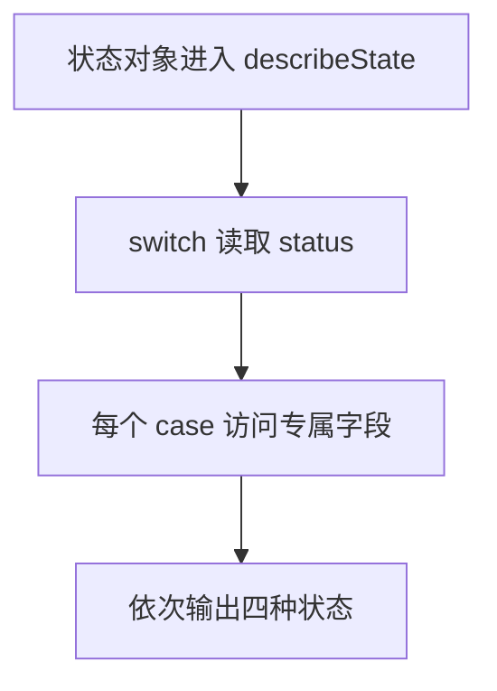

# Day 11：判别联合、switch 与完整分支

预计用时：75–90 分钟。

今天用“页面正在等待、加载成功或加载失败”来理解状态。一个状态对象在同一时间只会是其中一种情况：成功时带数据，失败时带错误信息，等待时不需要这两类内容。TypeScript 可以根据状态标签检查你有没有读错字段，也能提醒你漏写了哪种情况。

## 核心讲解

先看类型允许的数据形状。下面三种对象形状都有 `status`，但 `status` 的值不同，其他字段也跟着不同：

~~~ts
type LoadState =
  | { status: "idle" }
  | { status: "success"; items: string[] }
  | { status: "error"; message: string };
~~~

可以这样读：

| `status` 的值 | 这个对象一定有什么 | 此时可以读取 |
| --- | --- | --- |
| `"idle"` | 只有状态标签 | `status` |
| `"success"` | `items` 数组 | `status`、`items` |
| `"error"` | `message` 字符串 | `status`、`message` |

程序检查 `state.status` 后，就知道当前拿到的是表里的哪一行。这个过程叫类型收窄：进入 `success` 分支后才能读 `items`，进入 `error` 分支后才能读 `message`。

不要把 `items` 和 `message` 全部写成可选属性。那样 TypeScript 会接受“状态是成功，但没有 `items`”这种不完整对象，后面的代码还得反复猜字段到底在不在。

`switch` 会读取 `status`，然后只进入匹配的 `case`。为了确认每一种状态都有对应分支，可以在 `default` 中调用下面的检查函数：

~~~ts
function assertNever(value: never): never {
  throw new Error("未处理的状态：" + JSON.stringify(value));
}
~~~

这里的 `never` 可以先理解成“前面的 `case` 已经处理完所有可能，所以不应该还有值来到这里”。

假设以后增加 `"paused"` 状态，却忘了增加对应的 `case`：

1. `"paused"` 会落到 `default`。
2. 传入 `assertNever` 的就不再是“不可能出现的值”。
3. TypeScript 会在这里报错，提醒你补上 `"paused"` 分支。

这叫完整分支检查，也叫穷尽检查。它只能确认状态分支没有遗漏；某个分支内部如果还有可选字段，仍要单独处理。例如 `score` 可能缺失时，可以用 `??` 显示“待评分”。

## 阅读示例

打开 `example.ts`，按项目根目录 README 介绍的右键方式运行。阅读每个 `case`，指出该分支里的 `state` 具体是哪一种类型。

## 函数变量追踪

把一次函数调用按顺序看：

1. 外部把一个状态对象传进来，它成为函数参数。
2. `switch` 读取这个对象的 `status`。
3. 程序只进入一个匹配的 `case`，TypeScript 也在这里确定对象的具体类型。
4. 该分支读取自己拥有的字段。
5. `return` 结束这次调用，把描述文字交回调用函数的地方。

## Example 实际输出

运行 `example.ts` 后，终端会按下面的顺序显示。先用代码推测结果，再逐行对照：

```text
等待开始
正在加载
已加载 2 项：变量、联合
加载失败：网络不可用
```

## Example 代码流程图

上面的 `LoadState` 先用 idle、success、error 三种状态讲规则；`example.ts` 换成四种学习任务状态，但 `switch` 收窄和穷尽检查的方法相同。运行前先沿图预测执行顺序，运行后再把每个节点对应到代码行。



## 独立练习导航

本日共有 2 道独立练习。每道题都有单独目录、说明、作答文件和解题结构；题目之间不共享代码。

| 目录 | 场景 | 类型 |
| --- | --- | --- |
| [practice01](./practice01/README.md) | 判别联合、switch 与完整分支 | 主任务 |
| [practice02](./practice02/README.md) | 加载状态渲染器 | 闭卷迁移 |

右击任意练习目录中的 `practice.ts` 即可单独检查；命令行也可运行 `npm run beginner -- day11 practice02`。

## 容易出错的地方

- 在收窄前读取 `score` 或 `reason`。
- 用一个宽泛对象加许多可选属性代替判别联合。
- `default` 直接返回“未知”，让新状态悄悄漏掉。
- 忘记 `case` 中的 `return`。
- 用非空断言掩盖可选的 `score`。

### 错误代码示例

```ts
function describeTask(task: StudyTask): string {
  // ❌ 联合类型尚未按 status 收窄，并非每一种任务都有 score。
  return `${task.title}：${task.score} 分`;
}
```

### 正确写法

```ts
function describeTask(task: StudyTask): string {
  switch (task.status) {
    case "completed":
      // ✅ 进入 completed 分支后才能读取 score；它仍是可选值，所以用 ?? 处理缺席。
      return `${task.title}：${task.score ?? "待评分"}`;
    case "waiting":
      return `${task.title}：待开始`;
    case "studying":
      return `${task.title}：已学习 ${task.minutes} 分钟`;
    case "failed":
      return `${task.title}：${task.reason}`;
    default:
      return assertNever(task);
  }
}
```

## 拓展思考（不要求写代码）

如果以后加入 `{ status: "paused"; title: string; reason: string }`，哪些位置应该发生类型错误？为什么这些错误是在帮助你，而不是阻碍你？

## 官方资料

- [Narrowing：Discriminated unions](https://www.typescriptlang.org/docs/handbook/2/narrowing.html#discriminated-unions)
- [Narrowing：The never type](https://www.typescriptlang.org/docs/handbook/2/narrowing.html#the-never-type)
