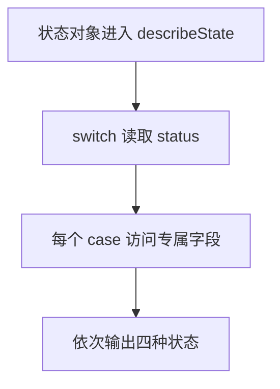

# DAY11 · Practice 02：加载状态渲染器

[返回当天课程](../README.md)

## 文件位置

- 作答文件：[practice.ts](../../../day11/practice02/practice.ts)
- 结构提示代码：[solution.ts](../../../day11/practice02/solution.ts)
- 方案说明：[SOLUTION.md](./SOLUTION.md)

## 场景背景

你在实现课程页面的加载提示区域，页面可能正在等待、加载中、加载成功或加载失败。程序会收到四种结构不同的状态对象，并需要读取各状态自己的数据。最终要为用户生成准确的界面提示，让成功内容和失败原因都清楚可见。

这是一道与 Practice 01 文件完全分开的闭卷迁移题。先理解并运行当天 `example.ts`，然后关闭它；不要复制代码，仅根据下面的流程与输出从空白重新实现。

## 代码流程图



## 必须练到的能力

使用判别联合与 switch 覆盖每一种状态。

- 不得导入 `practice01` 或直接调用其他练习的实现。
- 输出必须由变量、计算或函数返回值产生，不把整行结果写死。
- 每个参数、局部变量和返回值都应能在流程图中找到位置。

## 精确期望输出

```text
等待开始
正在加载
已加载 2 项：变量、联合
加载失败：网络不可用
```

## 文件

在上方链接的 `practice.ts` 作答；独立完成后再查看 `solution.ts` 的 TODO 解题结构。
