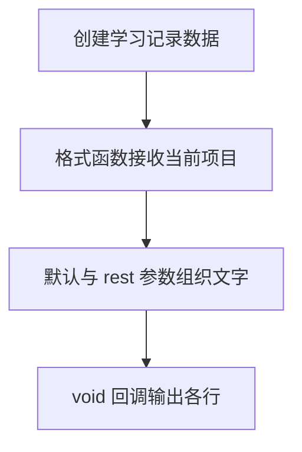

# Day 12：函数类型、箭头函数与回调

预计用时：75–90 分钟。

今天把函数当成一种可以传递的“处理规则”。例如，成绩报告函数不必自己决定分数怎么显示；外部可以把一个格式化函数传进去，让报告函数在需要时调用它。你会看到数据如何进入普通参数、如何进入回调，以及每一层 `return` 把结果交给谁。

## 核心讲解

先看一个函数类型。它不写具体实现，只说明“调用时要给什么，调用后会拿到什么”：

~~~ts
type Formatter = (value: number) => string;
~~~

把 `Formatter` 从左向右读：调用这个函数时，要传入一个 `number`；函数处理完后，要交回一个 `string`。这里的参数名 `value` 用来说明这个输入的含义，真正实现函数时可以使用别的参数名。

箭头函数右侧如果直接写一个表达式，表达式的结果会自动返回。右侧一旦使用 `{}`，花括号里就是多条语句，必须自己写 `return`：

~~~ts
const double = (value: number): number => {
  return value * 2;
};
~~~

上面的调用过程是：外部传入数字，数字进入 `value`，`value * 2` 算出新数字，`return` 再把新数字交回调用处。

`map` 也是同样的规则。它把数组当前项传给回调，并把回调 `return` 的值放进新数组。回调使用 `{}` 却没有写 `return` 时，每次调用都没有交回结果，所以新数组对应位置会是 `undefined`；原数组不会因此改变。

再看三种参数写法。区别都发生在“调用者有没有传值”这一步：

- `title?: string`：调用者可以不传。没传时，函数里的 `title` 就是 `undefined`，因此它在函数内的类型是 `string | undefined`，使用前要检查或提供默认文字。
- `punctuation = "!"`：调用者没传时，函数自动把 `"!"` 放进 `punctuation`；传了就使用传入值。
- `...values: number[]`：调用者可以继续传多个数字，函数把这些数字收进 `values` 数组。

`void` 回调常用于打印报告、记录日志或响应点击。它表示“调用这段函数是为了让它完成动作，外部不使用它的返回值”，并不是说函数内部什么都不能做。例如回调可以输出每行报告；调用回调的外层函数仍然可以自己 `return` 及格人数。

## 阅读示例

打开并右键运行 `example.ts`。找出 `Formatter`、默认参数、rest 参数和 `void` 行为分别出现在哪里。

## 函数变量追踪

把高阶函数的一次调用拆成五步：

1. 外部先准备一个函数，并把这个函数当作实参传入。
2. 这个函数值进入高阶函数的回调参数。此时还不一定执行。
3. 高阶函数处理到某个数据时，才调用回调，并把当前数据传给回调自己的参数。
4. 回调里的 `return` 把处理结果交回高阶函数。
5. 高阶函数可以继续使用这个结果，最后再用自己的 `return` 把统计值交回最外层调用处。

看到两个 `return` 时，先看它们分别属于哪一层函数，不要把回调的返回值和外层函数的返回值混在一起。

## Example 实际输出

运行 `example.ts` 后，终端会按下面的顺序显示。先用代码推测结果，再逐行对照：

```text
学习记录
第 1 项：30 分钟
第 2 项：45 分钟
主题：函数 / 回调 / void
```

## Example 代码流程图

运行 `example.ts` 前先沿图预测执行顺序；运行后再把每个节点对应到代码行。



## 独立练习导航

本日共有 2 道独立练习。每道题都有单独目录、说明、作答文件和解题结构；题目之间不共享代码。

| 目录 | 场景 | 类型 |
| --- | --- | --- |
| [practice01](./practice01/README.md) | 函数类型、箭头函数与回调 | 主任务 |
| [practice02](./practice02/README.md) | 学习记录格式器 | 闭卷迁移 |

右击任意练习目录中的 `practice.ts` 即可单独检查；命令行也可运行 `npm run beginner -- day12 practice02`。

## 容易出错的地方

- 写成 `(value) => { value * 2 }`，忘记 `return`。
- 把 `void` 理解成不能执行输出。
- 直接对可选参数调用字符串方法，没处理 `undefined`。
- 把 rest 参数当作单个数字。
- 在回调里打印正确文字，却忘记返回及格数量。

### 错误代码示例

```ts
const double = (value: number): number => {
  value * 2; // ❌ 使用花括号后不会自动返回，函数实际得到 undefined。
};

function greet(title?: string): string {
  return title.toUpperCase(); // ❌ 可选参数可能是 undefined。
}
```

### 正确写法

```ts
const double = (value: number): number => {
  return value * 2; // ✅ 花括号函数体要明确 return。
};

function greet(title?: string): string {
  return (title ?? "同学").toUpperCase(); // ✅ 先提供默认值，再调用字符串方法。
}
```

## 拓展思考（不要求写代码）

如果 `Reporter` 需要把每条报告异步保存到服务器，它的返回类型和 `reportScores` 的实现应怎样变化，调用者又应等待什么？

## 官方资料

- [More on Functions：Function Type Expressions](https://www.typescriptlang.org/docs/handbook/2/functions.html#function-type-expressions)
- [More on Functions：Optional Parameters](https://www.typescriptlang.org/docs/handbook/2/functions.html#optional-parameters)
- [More on Functions：Rest Parameters](https://www.typescriptlang.org/docs/handbook/2/functions.html#rest-parameters-and-arguments)
- [More on Functions：void](https://www.typescriptlang.org/docs/handbook/2/functions.html#void)
